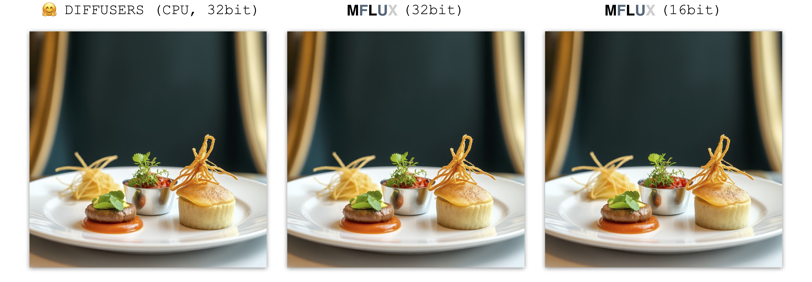
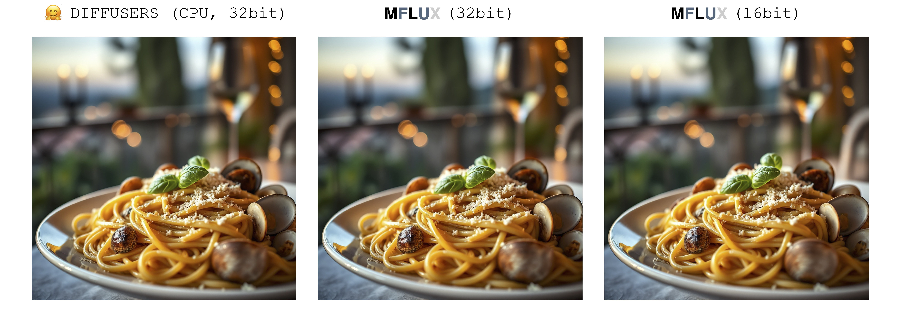
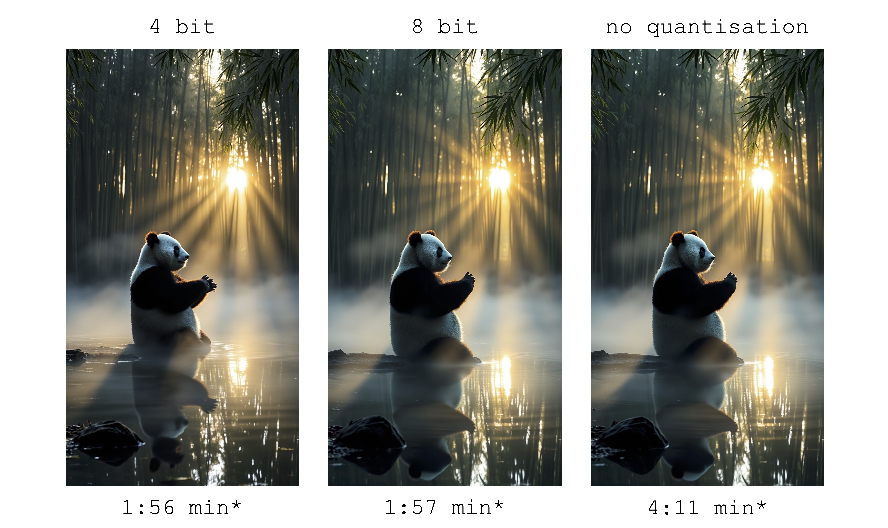
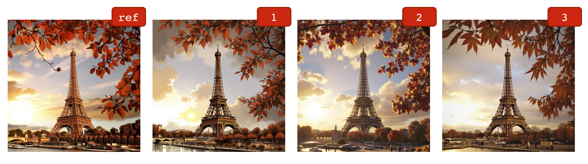
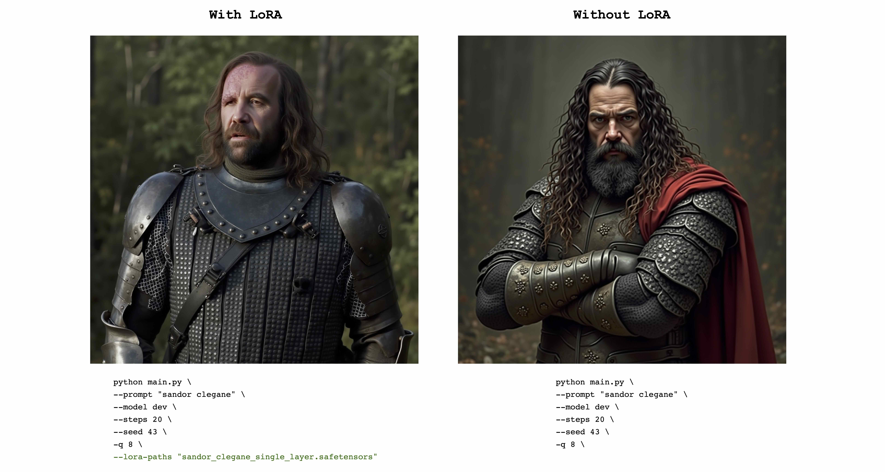
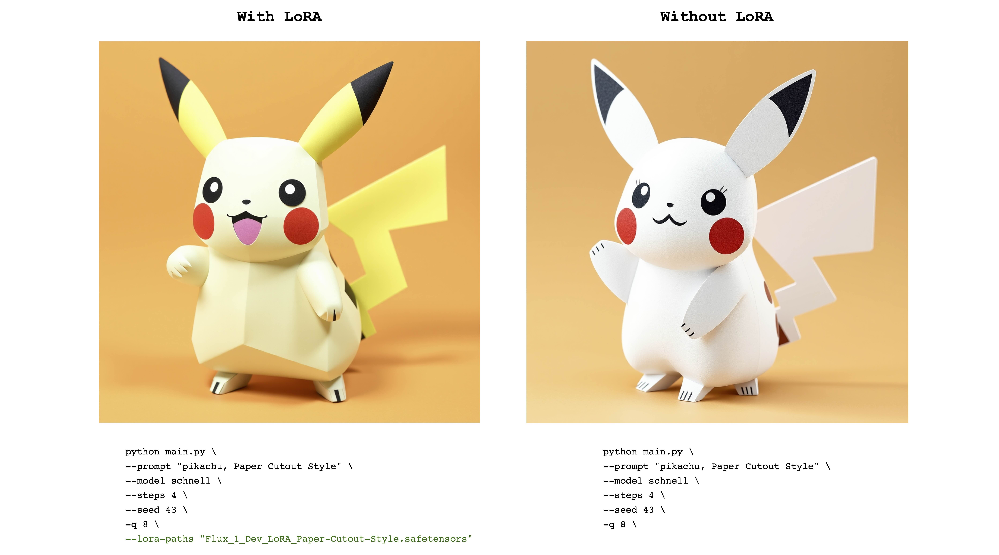
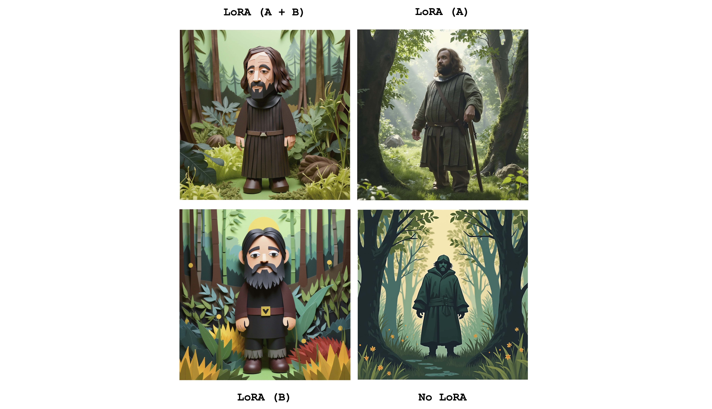

*A MLX port of FLUX based on the Huggingface Diffusers implementation.*


### About

Run the powerful [FLUX](https://blackforestlabs.ai/#get-flux) models from [Black Forest Labs](https://blackforestlabs.ai) locally on your Mac!

### Table of contents

<!-- TOC start (generated with https://github.com/derlin/bitdowntoc) -->

- [Philosophy](#philosophy)
- [💿 Installation](#-installation)
- [🖼️ Generating an image](#%EF%B8%8F-generating-an-image)
  * [📜 Full list of Command-Line Arguments](#-full-list-of-command-line-arguments)
- [⏱️ Image generation speed (updated)](#%EF%B8%8F-image-generation-speed-updated)
- [↔️ Equivalent to Diffusers implementation](#%EF%B8%8F-equivalent-to-diffusers-implementation)
- [🗜️ Quantization](#%EF%B8%8F-quantization)
  * [📊 Size comparisons for quantized models](#-size-comparisons-for-quantized-models)
  * [💾 Saving a quantized version to disk](#-saving-a-quantized-version-to-disk)
  * [💽 Loading and running a quantized version from disk](#-loading-and-running-a-quantized-version-from-disk)
- [💽 Running a non-quantized model directly from disk](#-running-a-non-quantized-model-directly-from-disk)
- [🎨 Image-to-Image](#-image-to-image)
- [🔌 LoRA](#-lora)
  * [Multi-LoRA](#multi-lora)
  * [Supported LoRA formats (updated)](#supported-lora-formats-updated)
- [🕹️ Controlnet](#%EF%B8%8F-controlnet)
- [🚧 Current limitations](#-current-limitations)
- [💡Workflow tips](#workflow-tips)
- [✅ TODO](#-todo)
- [License](#license)

<!-- TOC end -->

### Philosophy

MFLUX is a line-by-line port of the FLUX implementation in the [Huggingface Diffusers](https://github.com/huggingface/diffusers) library to [Apple MLX](https://github.com/ml-explore/mlx).
MFLUX is purposefully kept minimal and explicit - Network architectures are hardcoded and no config files are used
except for the tokenizers. The aim is to have a tiny codebase with the single purpose of expressing these models
(thereby avoiding too many abstractions). While MFLUX priorities readability over generality and performance, [it can still be quite fast](#%EF%B8%8F-image-generation-speed-updated), [and even faster quantized](#%EF%B8%8F-quantization).

All models are implemented from scratch in MLX and only the tokenizers are used via the
[Huggingface Transformers](https://github.com/huggingface/transformers) library. Other than that, there are only minimal dependencies
like [Numpy](https://numpy.org) and [Pillow](https://pypi.org/project/pillow/) for simple image post-processing.


### 💿 Installation
For users, the easiest way to install MFLUX is to use `uv tool`: If you have [installed `uv`](https://github.com/astral-sh/uv?tab=readme-ov-file#installation), simply:

```sh
uv tool install --upgrade mflux
```

to get the `mflux-generate` and related command line executables. You can skip to the usage guides below.

<details>
<summary>For the classic way to create a user virtual environment:</summary>

```
mkdir -p mflux && cd mflux && python3 -m venv .venv && source .venv/bin/activate
```

This creates and activates a virtual environment in the `mflux` folder. After that, install MFLUX via pip:

```
pip install -U mflux
```

</details>

<details>
<summary>For contributors (click to expand)</summary>

1. Clone the repo:
```sh
 git clone git@github.com:filipstrand/mflux.git
 ```
2. Install the application

```sh
 make install
 ```
3. To run the test suite
```sh
 make test
 ```
4. Follow format and lint checks prior to submitting Pull Requests. The recommended `make lint` and `make format` installs and uses [`ruff`](https://github.com/astral-sh/ruff). You can setup your editor/IDE to lint/format automatically, or use our provided `make` helpers:
  - `make format` - formats your code
  - `make lint` - shows your lint errors and warnings, but does not auto fix
  - `make check` - via `pre-commit` hooks, formats your code **and** attempts to auto fix lint errors
  - consult official [`ruff` documentation](https://docs.astral.sh/ruff/) on advanced usages

</details>

### 🖼️ Generating an image

Run the command `mflux-generate` by specifying a prompt and the model and some optional arguments. For example, here we use a quantized version of the `schnell` model for 2 steps:

```sh
mflux-generate --model schnell --prompt "Luxury food photograph" --steps 2 --seed 2 -q 8
```

This example uses the more powerful `dev` model with 25 time steps:

```sh
mflux-generate --model dev --prompt "Luxury food photograph" --steps 25 --seed 2 -q 8
```

⚠️ *If the specific model is not already downloaded on your machine, it will start the download process and fetch the model weights (~34GB in size for the Schnell or Dev model respectively). See the [quantization](#%EF%B8%8F-quantization) section for running compressed versions of the model.* ⚠️

*By default, model files are downloaded to the `.cache` folder within your home directory. For example, in my setup, the path looks like this:*

```
/Users/filipstrand/.cache/huggingface/hub/models--black-forest-labs--FLUX.1-dev
```

*To change this default behavior, you can do so by modifying the `HF_HOME` environment variable. For more details on how to adjust this setting, please refer to the [Hugging Face documentation](https://huggingface.co/docs/huggingface_hub/en/package_reference/environment_variables)*.

🔒 [FLUX.1-dev currently requires granted access to its Huggingface repo. For troubleshooting, see the issue tracker](https://github.com/filipstrand/mflux/issues/14) 🔒

#### 📜 Full list of Command-Line Arguments

- **`--prompt`** (required, `str`): Text description of the image to generate.

- **`--model`** or **`-m`** (required, `str`): Model to use for generation (`"schnell"` or `"dev"`).

- **`--output`** (optional, `str`, default: `"image.png"`): Output image filename.

- **`--seed`** (optional, `int`, default: `None`): Seed for random number generation. Default is time-based.

- **`--height`** (optional, `int`, default: `1024`): Height of the output image in pixels.

- **`--width`** (optional, `int`, default: `1024`): Width of the output image in pixels.

- **`--steps`** (optional, `int`, default: `4`): Number of inference steps.

- **`--guidance`** (optional, `float`, default: `3.5`): Guidance scale (only used for `"dev"` model).

- **`--path`** (optional, `str`, default: `None`): Path to a local model on disk.

- **`--quantize`** or **`-q`** (optional, `int`, default: `None`): [Quantization](#%EF%B8%8F-quantization) (choose between `4` or `8`).

- **`--lora-paths`** (optional, `[str]`, default: `None`): The paths to the [LoRA](#-LoRA) weights.

- **`--lora-scales`** (optional, `[float]`, default: `None`): The scale for each respective [LoRA](#-LoRA) (will default to `1.0` if not specified and only one LoRA weight is loaded.)

- **`--metadata`** (optional): Exports a `.json` file containing the metadata for the image with the same name. (Even without this flag, the image metadata is saved and can be viewed using `exiftool image.png`)

- **`--controlnet-image-path`** (required, `str`): Path to the local image used by ControlNet to guide output generation.

- **`--controlnet-strength`** (optional, `float`, default: `0.4`): Degree of influence the control image has on the output. Ranges from `0.0` (no influence) to `1.0` (full influence).

- **`--controlnet-save-canny`** (optional, bool, default: False): If set, saves the Canny edge detection reference image used by ControlNet.

- **`--init-image-path`** (optional, `str`, default: `None`): Local path to the initial image for image-to-image generation.

- **`--init-image-strength`** (optional, `float`, default: `0.4`): Controls how strongly the initial image influences the output image. A value of `0.0` means no influence. (Default is `0.4`)

- **`--config-from-metadata`** or **`-C`** (optional, `str`): [EXPERIMENTAL] Path to a prior file saved via `--metadata`, or a compatible handcrafted config file adhering to the expected args schema.

<details>
<summary>parameters supported by config files</summary>

#### How configs are used

- all config properties are optional and applied to the image generation if applicable
- invalid or incompatible properties will be ignored

#### Config schema

```json
{
  "$schema": "http://json-schema.org/draft-07/schema#",
  "type": "object",
  "properties": {
    "seed": {
      "type": ["integer", "null"]
    },
    "steps": {
      "type": ["integer", "null"]
    },
    "guidance": {
      "type": ["number", "null"]
    },
    "quantize": {
      "type": ["null", "string"]
    },
    "lora_paths": {
      "type": ["array", "null"],
      "items": {
        "type": "string"
      }
    },
    "lora_scales": {
      "type": ["array", "null"],
      "items": {
        "type": "number"
      }
    },
    "prompt": {
      "type": ["string", "null"]
    }
  }
}
```

#### Example

```json
{
  "model": "dev",
  "seed": 42,
  "steps": 8,
  "guidance": 3.0,
  "quantize": 4,
  "lora_paths": [
    "/some/path1/to/subject.safetensors",
    "/some/path2/to/style.safetensors"
  ],
  "lora_scales": [
    0.8,
    0.4
  ],
  "prompt": "award winning modern art, MOMA"
}
```
</details>

Or, with the correct python environment active, create and run a separate script like the following:

```python
from mflux import Flux1, Config

# Load the model
flux = Flux1.from_alias(
   alias="schnell",  # "schnell" or "dev"
   quantize=8,       # 4 or 8
)

# Generate an image
image = flux.generate_image(
   seed=2,
   prompt="Luxury food photograph",
   config=Config(
      num_inference_steps=2,  # "schnell" works well with 2-4 steps, "dev" works well with 20-25 steps
      height=1024,
      width=1024,
   )
)

image.save(path="image.png")
```

For more options on how to configure MFLUX, please see [generate.py](src/mflux/generate.py).

### ⏱️ Image generation speed (updated)

These numbers are based on the non-quantized `schnell` model, with the configuration provided in the code snippet below.
To time your machine, run the following:
```sh
time mflux-generate \
--prompt "Luxury food photograph" \
--model schnell \
--steps 2 \
--seed 2 \
--height 1024 \
--width 1024
```

| Device             | User                                                                                                                         | Reported Time | Notes                     |
|--------------------|------------------------------------------------------------------------------------------------------------------------------|---------------|---------------------------|
| M3 Max             | [@karpathy](https://gist.github.com/awni/a67d16d50f0f492d94a10418e0592bde?permalink_comment_id=5153531#gistcomment-5153531)  | ~20s          |                           |
| M2 Ultra           | [@awni](https://x.com/awnihannun/status/1823515121827897385)                                                                 | <15s          |                           |
| 2023 M2 Max (96GB) | [@explorigin](https://github.com/filipstrand/mflux/issues/6)                                                                 | ~25s          |                           |
| 2021 M1 Pro (16GB) | [@qw-in](https://github.com/filipstrand/mflux/issues/7)                                                                      | ~175s         | Might freeze your mac     |
| 2023 M3 Pro (36GB) | [@kush-gupt](https://github.com/filipstrand/mflux/issues/11)                                                                 | ~80s          |                           |
| 2020 M1 (8GB)      | [@mbvillaverde](https://github.com/filipstrand/mflux/issues/13)                                                              | ~335s         | With resolution 512 x 512 |
| 2022 M1 MAX (64GB) | [@BosseParra](https://x.com/BosseParra/status/1826191780812877968)                                                           | ~55s          |                           |
| 2023 M2 Pro (32GB) | [@leekichko](https://github.com/filipstrand/mflux/issues/85)                                                                 | ~54s          |                           |
| 2021 M1 Pro (32GB) | @filipstrand                                                                                                                 | ~160s         |                           |
| 2023 M2 Max (32GB) | @filipstrand                                                                                                                 | ~70s          |                           |

*Note that these numbers includes starting the application from scratch, which means doing model i/o, setting/quantizing weights etc.
If we assume that the model is already loaded, you can inspect the image metadata using `exiftool image.png` and see the total duration of the denoising loop (excluding text embedding).*

### ↔️ Equivalent to Diffusers implementation

There is only a single source of randomness when generating an image: The initial latent array.
In this implementation, this initial latent is fully deterministically controlled by the input `seed` parameter.
However, if we were to import a fixed instance of this latent array saved from the Diffusers implementation, then MFLUX will produce an identical image to the Diffusers implementation (assuming a fixed prompt and using the default parameter settings in the Diffusers setup).


The images below illustrate this equivalence.
In all cases the Schnell model was run for 2 time steps.
The Diffusers implementation ran in CPU mode.
The precision for MFLUX can be set in the [Config](src/mflux/config/config.py) class.
There is typically a noticeable but very small difference in the final image when switching between 16bit and 32bit precision.

---
```
Luxury food photograph
```


---
```
detailed cinematic dof render of an old dusty detailed CRT monitor on a wooden desk in a dim room with items around, messy dirty room. On the screen are the letters "FLUX" glowing softly. High detail hard surface render
```


---

```
photorealistic, lotr, A tiny red dragon curled up asleep inside a nest, (Soft Focus) , (f_stop 2.8) , (focal_length 50mm) macro lens f/2. 8, medieval wizard table, (pastel) colors, (cozy) morning light filtering through a nearby window, (whimsical) steam shapes, captured with a (Canon EOS R5) , highlighting (serene) comfort, medieval, dnd, rpg, 3d, 16K, 8K
```


---


```
A weathered fisherman in his early 60s stands on the deck of his boat, gazing out at a stormy sea. He has a thick, salt-and-pepper beard, deep-set blue eyes, and skin tanned and creased from years of sun exposure. He's wearing a yellow raincoat and hat, with water droplets clinging to the fabric. Behind him, dark clouds loom ominously, and waves crash against the side of the boat. The overall atmosphere is one of tension and respect for the power of nature.
```


---

```
Luxury food photograph of an italian Linguine pasta alle vongole dish with lots of clams. It has perfect lighting and a cozy background with big bokeh and shallow depth of field. The mood is a sunset balcony in tuscany.  The photo is taken from the side of the plate. The pasta is shiny with sprinkled parmesan cheese and basil leaves on top. The scene is complemented by a warm, inviting light that highlights the textures and colors of the ingredients, giving it an appetizing and elegant look.
```


---

### 🗜️ Quantization

MFLUX supports running FLUX in 4-bit or 8-bit quantized mode. Running a quantized version can greatly speed up the
generation process and reduce the memory consumption by several gigabytes. [Quantized models also take up less disk space](#-size-comparisons-for-quantized-models).

```sh
mflux-generate \
    --model schnell \
    --steps 2 \
    --seed 2 \
    --quantize 8 \
    --height 1920 \
    --width 1024 \
    --prompt "Tranquil pond in a bamboo forest at dawn, the sun is barely starting to peak over the horizon, panda practices Tai Chi near the edge of the pond, atmospheric perspective through the mist of morning dew, sunbeams, its movements are graceful and fluid — creating a sense of harmony and balance, the pond’s calm waters reflecting the scene, inviting a sense of meditation and connection with nature, style of Howard Terpning and Jessica Rossier"
```


*In this example, weights are quantized at **runtime** - this is convenient if you don't want to [save a quantized copy of the weights to disk](#-saving-a-quantized-version-to-disk), but still want to benefit from the potential speedup and RAM reduction quantization might bring.*


By selecting the `--quantize` or `-q` flag to be `4`, `8`, or removing it entirely, we get all 3 images above. As can be seen, there is very little difference between the images (especially between the 8-bit, and the non-quantized result).
Image generation times in this example are based on a 2021 M1 Pro (32GB) machine. Even though the images are almost identical, there is a ~2x speedup by
running the 8-bit quantized version on this particular machine. Unlike the non-quantized version, for the 8-bit version the swap memory usage is drastically reduced and GPU utilization is close to 100% during the whole generation. Results here can vary across different machines.

#### 📊 Size comparisons for quantized models

The model sizes for both `schnell` and `dev` at various quantization levels are as follows:

| 4 bit  | 8 bit   | Original (16 bit) |
|--------|---------|-------------------|
| 9.85GB | 18.16GB | 33.73GB           |

The reason weights sizes are not fully cut in half is because a small number of weights are not quantized and kept at full precision.

#### 💾 Saving a quantized version to disk

To save a local copy of the quantized weights, run the `mflux-save` command like so:

```sh
mflux-save \
    --path "/Users/filipstrand/Desktop/schnell_8bit" \
    --model schnell \
    --quantize 8
```

*Note that when saving a quantized version, you will need the original huggingface weights.*

It is also possible to specify [LoRA](#-lora) adapters when saving the model, e.g

```sh
mflux-save \
    --path "/Users/filipstrand/Desktop/schnell_8bit" \
    --model schnell \
    --quantize 8 \
    --lora-paths "/path/to/lora.safetensors" \
    --lora-scales 0.7
```

When generating images with a model like this, no LoRA adapter is needed to be specified since
it is already baked into the saved quantized weights.

#### 💽 Loading and running a quantized version from disk

To generate a new image from the quantized model, simply provide a `--path` to where it was saved:

```sh
mflux-generate \
    --path "/Users/filipstrand/Desktop/schnell_8bit" \
    --model schnell \
    --steps 2 \
    --seed 2 \
    --height 1920 \
    --width 1024 \
    --prompt "Tranquil pond in a bamboo forest at dawn, the sun is barely starting to peak over the horizon, panda practices Tai Chi near the edge of the pond, atmospheric perspective through the mist of morning dew, sunbeams, its movements are graceful and fluid — creating a sense of harmony and balance, the pond’s calm waters reflecting the scene, inviting a sense of meditation and connection with nature, style of Howard Terpning and Jessica Rossier"
```

*Note: When loading a quantized model from disk, there is no need to pass in `-q` flag, since we can infer this from the weight metadata.*

*Also Note: Once we have a local model (quantized [or not](#-running-a-non-quantized-model-directly-from-disk)) specified via the `--path` argument, the huggingface cache models are not required to launch the model.
In other words, you can reclaim the 34GB diskspace (per model) by deleting the full 16-bit model from the [Huggingface cache](#%EF%B8%8F-generating-an-image) if you choose.*

*If you don't want to download the full models and quantize them yourself, the 4-bit weights are available here for a direct download:*
- [madroid/flux.1-schnell-mflux-4bit](https://huggingface.co/madroid/flux.1-schnell-mflux-4bit)
- [madroid/flux.1-dev-mflux-4bit](https://huggingface.co/madroid/flux.1-dev-mflux-4bit)

### 💽 Running a non-quantized model directly from disk

MFLUX also supports running a non-quantized model directly from a custom location.
In the example below, the model is placed in `/Users/filipstrand/Desktop/schnell`:

```sh
mflux-generate \
    --path "/Users/filipstrand/Desktop/schnell" \
    --model schnell \
    --steps 2 \
    --seed 2 \
    --prompt "Luxury food photograph"
```

Note that the `--model` flag must be set when loading a model from disk.

Also note that unlike when using the typical `alias` way of initializing the model (which internally handles that the required resources are downloaded),
when loading a model directly from disk, we require the downloaded models to look like the following:

```
.
├── text_encoder
│   └── model.safetensors
├── text_encoder_2
│   ├── model-00001-of-00002.safetensors
│   └── model-00002-of-00002.safetensors
├── tokenizer
│   ├── merges.txt
│   ├── special_tokens_map.json
│   ├── tokenizer_config.json
│   └── vocab.json
├── tokenizer_2
│   ├── special_tokens_map.json
│   ├── spiece.model
│   ├── tokenizer.json
│   └── tokenizer_config.json
├── transformer
│   ├── diffusion_pytorch_model-00001-of-00003.safetensors
│   ├── diffusion_pytorch_model-00002-of-00003.safetensors
│   └── diffusion_pytorch_model-00003-of-00003.safetensors
└── vae
    └── diffusion_pytorch_model.safetensors
```
This mirrors how the resources are placed in the [HuggingFace Repo](https://huggingface.co/black-forest-labs/FLUX.1-schnell/tree/main) for FLUX.1.
*Huggingface weights, unlike quantized ones exported directly from this project, have to be
processed a bit differently, which is why we require this structure above.*

---

### 🎨 Image-to-Image

One way to condition the image generation is by starting from an existing image and let MFLUX produce new variations.
Use the `--init-image-path` flag to specify the reference image, and the `--init-image-strength` to control how much the reference 
image should guide the generation. For example, given the reference image below, the following command produced the first
image using the  [Sketching](https://civitai.com/models/803456/sketching?modelVersionId=898364) LoRA: 

```sh
mflux-generate \
--prompt "sketching of an Eiffel architecture, masterpiece, best quality. The site is lit by lighting professionals, creating a subtle illumination effect. Ink on paper with very fine touches with colored markers, (shadings:1.1), loose lines, Schematic, Conceptual, Abstract, Gestural. Quick sketches to explore ideas and concepts." \
--init-image-path "reference.png" \
--init-image-strength 0.3 \
--lora-paths Architectural_Sketching.safetensors \
--lora-scales 1.0 \
--model dev \
--steps 20 \
--seed 43 \
--guidance 4.0 \
--quantize 8 \
--height 1024 \
--width 1024
```

Like with [Controlnet](#-controlnet), this technique combines well with [LoRA](#-lora) adapters:



In the examples above the following LoRAs are used [Sketching](https://civitai.com/models/803456/sketching?modelVersionId=898364), [Animation Shot](https://civitai.com/models/883914/animation-shot-flux-xl-ponyrealism) and [flux-film-camera](https://civitai.com/models/874708?modelVersionId=979175) are used.

---

### 🔌 LoRA

MFLUX support loading trained [LoRA](https://huggingface.co/docs/diffusers/en/training/lora) adapters (actual training support is coming).

The following example [The_Hound](https://huggingface.co/TheLastBen/The_Hound) LoRA from [@TheLastBen](https://github.com/TheLastBen):

```sh
mflux-generate --prompt "sandor clegane" --model dev --steps 20 --seed 43 -q 8 --lora-paths "sandor_clegane_single_layer.safetensors"
```


---

The following example is [Flux_1_Dev_LoRA_Paper-Cutout-Style](https://huggingface.co/Norod78/Flux_1_Dev_LoRA_Paper-Cutout-Style) LoRA from [@Norod78](https://huggingface.co/Norod78):

```sh
mflux-generate --prompt "pikachu, Paper Cutout Style" --model schnell --steps 4 --seed 43 -q 8 --lora-paths "Flux_1_Dev_LoRA_Paper-Cutout-Style.safetensors"
```


*Note that LoRA trained weights are typically trained with a **trigger word or phrase**. For example, in the latter case, the sentence should include the phrase **"Paper Cutout Style"**.*

*Also note that the same LoRA weights can work well with both the `schnell` and `dev` models. Refer to the original LoRA repository to see what mode it was trained for.*

#### Multi-LoRA

Multiple LoRAs can be sent in to combine the effects of the individual adapters. The following example combines both of the above LoRAs:

```sh
mflux-generate \
   --prompt "sandor clegane in a forest, Paper Cutout Style" \
   --model dev \
   --steps 20 \
   --seed 43 \
   --lora-paths sandor_clegane_single_layer.safetensors Flux_1_Dev_LoRA_Paper-Cutout-Style.safetensors \
   --lora-scales 1.0 1.0 \
   -q 8
```


Just to see the difference, this image displays the four cases: One of having both adapters fully active, partially active and no LoRA at all.
The example above also show the usage of `--lora-scales` flag.

#### Supported LoRA formats (updated)

Since different fine-tuning services can use different implementations of FLUX, the corresponding
LoRA weights trained on these services can be different from one another. The aim of MFLUX is to support the most common ones.
The following table show the current supported formats:

| Supported | Name      | Example                                                                                                  | Notes                               |
|-----------|-----------|----------------------------------------------------------------------------------------------------------|-------------------------------------|
| ✅        | BFL       | [civitai - Impressionism](https://civitai.com/models/545264/impressionism-sdxl-pony-flux)                | Many things on civitai seem to work |
| ✅        | Diffusers | [Flux_1_Dev_LoRA_Paper-Cutout-Style](https://huggingface.co/Norod78/Flux_1_Dev_LoRA_Paper-Cutout-Style/) |                                     |
| ❌        | XLabs-AI  | [flux-RealismLora](https://huggingface.co/XLabs-AI/flux-RealismLora/tree/main)                           |                                     |

To report additional formats, examples or other any suggestions related to LoRA format support, please see [issue #47](https://github.com/filipstrand/mflux/issues/47).

---

### 🕹️ Controlnet

MFLUX has [Controlnet](https://huggingface.co/docs/diffusers/en/using-diffusers/controlnet) support for an even more fine-grained control
of the image generation. By providing a reference image via `--controlnet-image-path` and a strength parameter via `--controlnet-strength`, you can guide the generation toward the reference image.

```sh
mflux-generate-controlnet \
  --prompt "A comic strip with a joker in a purple suit" \
  --model dev \
  --steps 20 \
  --seed 1727047657 \
  --height 1066 \
  --width 692 \
  -q 8 \
  --lora-paths "Dark Comic - s0_8 g4.safetensors" \
  --controlnet-image-path "reference.png" \
  --controlnet-strength 0.5 \
  --controlnet-save-canny
```


*This example combines the controlnet reference image with the LoRA [Dark Comic Flux](https://civitai.com/models/742916/dark-comic-flux)*.

⚠️ *Note: Controlnet requires an additional one-time download of ~3.58GB of weights from Huggingface. This happens automatically the first time you run the `generate-controlnet` command.
At the moment, the Controlnet used is [InstantX/FLUX.1-dev-Controlnet-Canny](https://huggingface.co/InstantX/FLUX.1-dev-Controlnet-Canny), which was trained for the `dev` model.
It can work well with `schnell`, but performance is not guaranteed.*

⚠️ *Note: The output can be highly sensitive to the controlnet strength and is very much dependent on the reference image.
Too high settings will corrupt the image. A recommended starting point a value like 0.4 and to play around with the strength.*


Controlnet can also work well together with [LoRA adapters](#-lora). In the example below the same reference image is used as a controlnet input
with different prompts and LoRA adapters active.


### 🚧 Current limitations

- Images are generated one by one.
- Negative prompts not supported.
- LoRA weights are only supported for the transformer part of the network.
- Some LoRA adapters does not work.
- Currently, the supported controlnet is the [canny-only version](https://huggingface.co/InstantX/FLUX.1-dev-Controlnet-Canny).

### 💡Workflow Tips

- To hide the model fetching status progress bars, `export HF_HUB_DISABLE_PROGRESS_BARS=1`
- Use config files to save complex job parameters in a file instead of passing many `--args`
- Set up shell aliases for required args examples:
  - shortcut for dev model: `alias mflux-dev='mflux-generate --model dev'`
  - shortcut for schnell model *and* always save metadata: `alias mflux-schnell='mflux-generate --model schnell --metadata'`

### ✅ TODO

- [ ] LoRA fine-tuning (now also in [mlx-examples](https://github.com/ml-explore/mlx-examples/pull/1028) for reference)
- [ ] Frontend support (Gradio/Streamlit/Other?)
- [ ] [ComfyUI](https://github.com/filipstrand/mflux/issues/56) support?
- [ ] [Image2Image](https://github.com/filipstrand/mflux/pull/16) support (upcoming)
- [ ] Support for [PuLID](https://github.com/ToTheBeginning/PuLID)
- [ ] Support for [depth based controlnet](https://huggingface.co/InstantX/SD3-Controlnet-Depth) via [ml-depth-pro](https://github.com/apple/ml-depth-pro) or similar?

### License

This project is licensed under the [MIT License](LICENSE).
