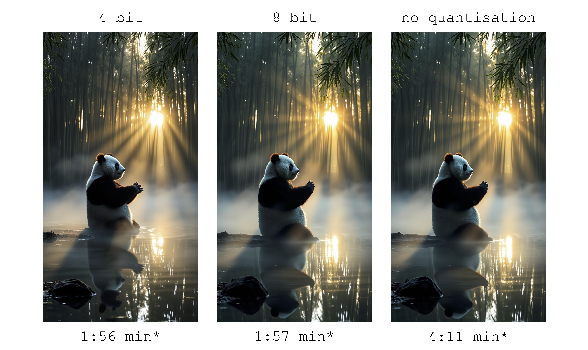
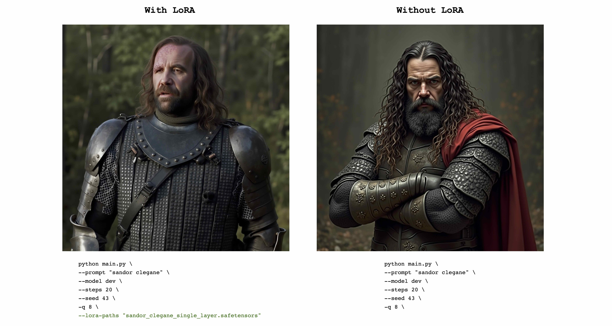
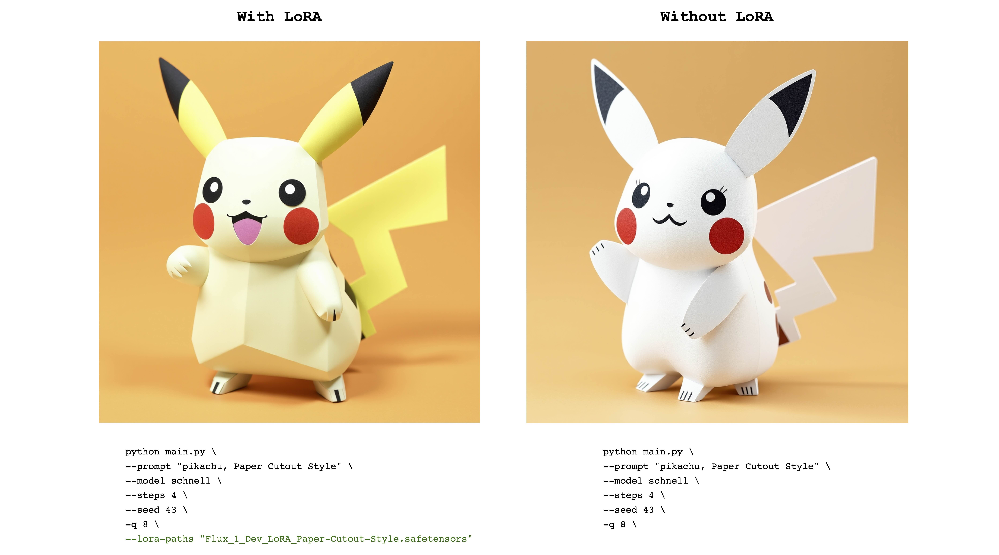
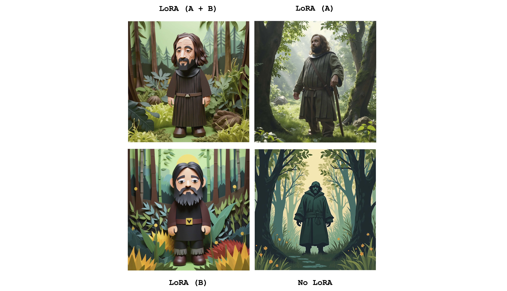

*A MLX port of FLUX based on the Huggingface Diffusers implementation.*

### About

Run the powerful [FLUX](https://blackforestlabs.ai/#get-flux) models from [Black Forest Labs](https://blackforestlabs.ai) locally on your Mac!

### Philosophy

MFLUX is a line-by-line port of the FLUX implementation in the [Huggingface Diffusers](https://github.com/huggingface/diffusers) library to [Apple MLX](https://github.com/ml-explore/mlx). 
MFLUX is purposefully kept minimal and explicit - Network architectures are hardcoded and no config files are used
except for the tokenizers. The aim is to have a tiny codebase with the single purpose of expressing these models 
(thereby avoiding too many abstractions). While MFLUX priorities readability over generality and performance, [it can still be quite fast](#image-generation-speed-updated), [and even faster quantized](#quantization).

All models are implemented from scratch in MLX and only the tokenizers are used via the 
[Huggingface Transformers](https://github.com/huggingface/transformers) library. Other than that, there are only minimal dependencies 
like [Numpy](https://numpy.org) and [Pillow](https://pypi.org/project/pillow/) for simple image post-processing.

### Models

- [x] FLUX.1-Scnhell
- [x] FLUX.1-Dev

### Installation
1. Clone the repo:
    ```
    git clone git@github.com:filipstrand/mflux.git
    ```
2. Navigate to the project and set up a virtual environment:
   ```
   cd mflux && python3 -m venv .venv && source .venv/bin/activate
   ``` 
3. Install the required dependencies:
    ```
   pip install -r requirements.txt
   ```
### Generating an image

Run the provided [main.py](main.py) by specifying a prompt and some optional arguments like so using the `schnell` model:

```
python main.py --model schnell --prompt "Luxury food photograph" --steps 2 --seed 2 -q 8
```

or use the slower, but more powerful `dev` model and run it with more time steps:

```
python main.py --model dev --prompt "Luxury food photograph" --steps 25 --seed 2 -q 8
```

⚠️ *If the specific model is not already downloaded on your machine, it will start the download process and fetch the model weights (~34GB in size for the Schnell or Dev model respectively). See the [quantization](#quantization) section for running compressed versions of the model.* ⚠️

*By default, model files are downloaded to the `.cache` folder within your home directory. For example, in my setup, the path looks like this:* 

```
/Users/filipstrand/.cache/huggingface/hub/models--black-forest-labs--FLUX.1-dev
```

*To change this default behavior, you can do so by modifying the `HF_HOME` environment variable. For more details on how to adjust this setting, please refer to the [Hugging Face documentation](https://huggingface.co/docs/huggingface_hub/en/package_reference/environment_variables)*.

🔒 [FLUX.1-dev currently requires granted access to its Huggingface repo. For troubleshooting, see the issue tracker](https://github.com/filipstrand/mflux/issues/14) 🔒 

#### Full list of Command-Line Arguments 

- **`--prompt`** (required, `str`): Text description of the image to generate.

- **`--model`** or **`-m`** (required, `str`): Model to use for generation (`"schnell"` or `"dev"`).

- **`--output`** (optional, `str`, default: `"image.png"`): Output image filename.

- **`--seed`** (optional, `int`, default: `None`): Seed for random number generation. Default is time-based.

- **`--height`** (optional, `int`, default: `1024`): Height of the output image in pixels.

- **`--width`** (optional, `int`, default: `1024`): Width of the output image in pixels.

- **`--steps`** (optional, `int`, default: `4`): Number of inference steps.

- **`--guidance`** (optional, `float`, default: `3.5`): Guidance scale (only used for `"dev"` model).

- **`--path`** (optional, `str`, default: `None`): Path to a local model on disk.

- **`--quantize`** or **`-q`** (optional, `int`, default: `None`): [Quantization](#quantization) (choose between `4` or `8`).

- **`--lora-paths`** (optional, `[str]`, default: `None`): The paths to the [LoRA](#LoRA) weights.

- **`--lora-scales`** (optional, `[float]`, default: `None`): The scale for each respective [LoRA](#LoRA) (will default to `1.0` if not specified and only one LoRA weight is loaded.)
 
- **`--metadata`** (optional): Exports a `.json` file containing the metadata for the image with the same name. (Even without this flag, the image metadata is saved and can be viewed using `exiftool image.png`)

Or, with the correct python environment active, make a new separate script like the following:

```python
import sys

sys.path.append("/path/to/mflux/src")

from flux_1.config.config import Config
from flux_1.flux import Flux1

# Load the model
flux = Flux1.from_alias(alias="schnell")  # "schnell" or "dev"

# Generate an image
image = flux.generate_image(
   seed=2,
   prompt="Luxury food photograph",
   config=Config(
      num_inference_steps=2,  # "schnell" works well with 2-4 steps, "dev" works well with 20-25 steps
      height=1024,
      width=1024,
   )
)

image.save(path="image.png")
```

For more options on how to configure MFLUX, please see [main.py](main.py).

### Image generation speed (updated)

These numbers are based on the non-quantized `schnell` model, with the configuration provided in the code snippet below. 
To time your machine, run the following:
```
time python main.py \
--prompt "Luxury food photograph" \
--model schnell \
--steps 2 \
--seed 2 \
--height 1024 \
--width 1024
```

| Device             | User                                                                                                                        | Reported Time | Notes                     |
|--------------------|-----------------------------------------------------------------------------------------------------------------------------|---------------|---------------------------|
| M3 Max             | [@karpathy](https://gist.github.com/awni/a67d16d50f0f492d94a10418e0592bde?permalink_comment_id=5153531#gistcomment-5153531) | ~20s          |                           |
| M2 Ultra           | [@awni](https://x.com/awnihannun/status/1823515121827897385)                                                                | <15s          |                           |
| 2023 M2 Max (96GB) | [@explorigin](https://github.com/filipstrand/mflux/issues/6)                                                                | ~25s          |                           |
| 2021 M1 Pro (16GB) | [@qw-in](https://github.com/filipstrand/mflux/issues/7)                                                                     | ~175s         | Might freeze your mac     |
| 2023 M3 Pro (36GB) | [@kush-gupt](https://github.com/filipstrand/mflux/issues/11)                                                                | ~80s          |                           |
| 2020 M1 (8GB)      | [@mbvillaverde](https://github.com/filipstrand/mflux/issues/13)                                                             | ~335s         | With resolution 512 x 512 |
| 2022 M1 MAX (64GB) | [@BosseParra](https://x.com/BosseParra/status/1826191780812877968)                                                          | ~55s          |                           |
| 2021 M1 Pro (32GB) | @filipstrand                                                                                                                | ~160s         |                           |
| 2023 M2 Max (32GB) | @filipstrand                                                                                                                | ~70s          |                           |

*Note that these numbers includes starting the application from scratch, which means doing model i/o, setting/quantizing weights etc. 
If we assume that the model is already loaded, you can inspect the image metadata using `exiftool image.png` and see the total duration of the denoising loop (excluding text embedding).*

### Equivalent to Diffusers implementation 

There is only a single source of randomness when generating an image: The initial latent array. 
In this implementation, this initial latent is fully deterministically controlled by the input `seed` parameter. 
However, if we were to import a fixed instance of this latent array saved from the Diffusers implementation, then MFLUX will produce an identical image to the Diffusers implementation (assuming a fixed prompt and using the default parameter settings in the Diffusers setup).


The images below illustrate this equivalence. 
In all cases the Schnell model was run for 2 time steps. 
The Diffusers implementation ran in CPU mode. 
The precision for MFLUX can be set in the [Config](src/flux_1/config/config.py) class. 
There is typically a noticeable but very small difference in the final image when switching between 16bit and 32bit precision.

---
```
Luxury food photograph
```


---
```
detailed cinematic dof render of an old dusty detailed CRT monitor on a wooden desk in a dim room with items around, messy dirty room. On the screen are the letters "FLUX" glowing softly. High detail hard surface render
```


---

```
photorealistic, lotr, A tiny red dragon curled up asleep inside a nest, (Soft Focus) , (f_stop 2.8) , (focal_length 50mm) macro lens f/2. 8, medieval wizard table, (pastel) colors, (cozy) morning light filtering through a nearby window, (whimsical) steam shapes, captured with a (Canon EOS R5) , highlighting (serene) comfort, medieval, dnd, rpg, 3d, 16K, 8K
```


---


```
A weathered fisherman in his early 60s stands on the deck of his boat, gazing out at a stormy sea. He has a thick, salt-and-pepper beard, deep-set blue eyes, and skin tanned and creased from years of sun exposure. He's wearing a yellow raincoat and hat, with water droplets clinging to the fabric. Behind him, dark clouds loom ominously, and waves crash against the side of the boat. The overall atmosphere is one of tension and respect for the power of nature.
```


---

```
Luxury food photograph of an italian Linguine pasta alle vongole dish with lots of clams. It has perfect lighting and a cozy background with big bokeh and shallow depth of field. The mood is a sunset balcony in tuscany.  The photo is taken from the side of the plate. The pasta is shiny with sprinkled parmesan cheese and basil leaves on top. The scene is complemented by a warm, inviting light that highlights the textures and colors of the ingredients, giving it an appetizing and elegant look.
```


---

### Quantization 

MFLUX supports running FLUX in 4-bit or 8-bit quantized mode. Running a quantized version can greatly speed up the
generation process and reduce the memory consumption by several gigabytes. [Quantized models also take up less disk space](#size-comparisons-for-quantized-models). 

```
python main.py \
    --model schnell \
    --steps 2 \
    --seed 2 \
    --quantize 8 \
    --height 1920 \
    --width 1024 \
    --prompt "Tranquil pond in a bamboo forest at dawn, the sun is barely starting to peak over the horizon, panda practices Tai Chi near the edge of the pond, atmospheric perspective through the mist of morning dew, sunbeams, its movements are graceful and fluid — creating a sense of harmony and balance, the pond’s calm waters reflecting the scene, inviting a sense of meditation and connection with nature, style of Howard Terpning and Jessica Rossier" 
```


*In this example, weights are quantized at **runtime** - this is convenient if you don't want to [save a quantized copy of the weights to disk](#saving-a-quantized-version-to-disk), but still want to benefit from the potential speedup and RAM reduction quantization might bring.*


By selecting the `--quantize` or `-q` flag to be `4`, `8`, or removing it entirely, we get all 3 images above. As can be seen, there is very little difference between the images (especially between the 8-bit, and the non-quantized result).
Image generation times in this example are based on a 2021 M1 Pro (32GB) machine. Even though the images are almost identical, there is a ~2x speedup by
running the 8-bit quantized version on this particular machine. Unlike the non-quantized version, for the 8-bit version the swap memory usage is drastically reduced and GPU utilization is close to 100% during the whole generation. Results here can vary across different machines.

#### Size comparisons for quantized models 

The model sizes for both `schnell` and `dev` at various quantization levels are as follows:

| 4 bit  | 8 bit   | Original (16 bit) |
|--------|---------|-------------------|
| 9.85GB | 18.16GB | 33.73GB           |

The reason weights sizes are not fully cut in half is because a small number of weights are not quantized and kept at full precision.

#### Saving a quantized version to disk

To save a local copy of the quantized weights, run the `save.py` script like so:

```
python save.py \
    --path "/Users/filipstrand/Desktop/schnell_8bit" \
    --model schnell \
    --quantize 8
```

*Note that when saving a quantized version, you will need the original huggingface weights.*

#### Loading and running a quantized version from disk

To generate a new image from the quantized model, simply provide a `--path` to where it was saved: 

```
python main.py \
    --path "/Users/filipstrand/Desktop/schnell_8bit" \
    --model schnell \
    --steps 2 \
    --seed 2 \
    --height 1920 \
    --width 1024 \
    --prompt "Tranquil pond in a bamboo forest at dawn, the sun is barely starting to peak over the horizon, panda practices Tai Chi near the edge of the pond, atmospheric perspective through the mist of morning dew, sunbeams, its movements are graceful and fluid — creating a sense of harmony and balance, the pond’s calm waters reflecting the scene, inviting a sense of meditation and connection with nature, style of Howard Terpning and Jessica Rossier" 
```

*Note: When loading a quantized model from disk, there is no need to pass in `-q` flag, since we can infer this from the weight metadata.*

*Also Note: Once we have a local model (quantized [or not](#running-a-non-quantized-model-directly-from-disk)) specified via the `--path` argument, the huggingface cache models are not required to launch the model*. 

### Running a non-quantized model directly from disk

MFLUX also supports running a non-quantized model directly from a custom location.  
In the example below, the model is placed in `/Users/filipstrand/Desktop/schnell`:

```
python main.py \
    --path "/Users/filipstrand/Desktop/schnell" \
    --model schnell \
    --steps 2 \
    --seed 2 \
    --prompt "Luxury food photograph" 
```

Note that the `--model` flag must be set when loading a model from disk. 

Also note that unlike when using the typical `alias` way of initializing the model (which internally handles that the required resources are downloaded),
when loading a model directly from disk, we require the downloaded models to look like the following:

```
.
├── text_encoder
│   └── model.safetensors
├── text_encoder_2
│   ├── model-00001-of-00002.safetensors
│   └── model-00002-of-00002.safetensors
├── tokenizer
│   ├── merges.txt
│   ├── special_tokens_map.json
│   ├── tokenizer_config.json
│   └── vocab.json
├── tokenizer_2
│   ├── special_tokens_map.json
│   ├── spiece.model
│   ├── tokenizer.json
│   └── tokenizer_config.json
├── transformer
│   ├── diffusion_pytorch_model-00001-of-00003.safetensors
│   ├── diffusion_pytorch_model-00002-of-00003.safetensors
│   └── diffusion_pytorch_model-00003-of-00003.safetensors
└── vae
    └── diffusion_pytorch_model.safetensors
```
This mirrors how the resources are placed in the [HuggingFace Repo](https://huggingface.co/black-forest-labs/FLUX.1-schnell/tree/main) for FLUX.1.
*Huggingface weights, unlike quantized ones exported directly from this project, have to be
processed a bit differently, which is why we require this structure above.* 


### LoRA

MFLUX support loading trained [LoRA](https://huggingface.co/docs/diffusers/en/training/lora) adapters (actual training support is coming).

The following example [The_Hound](https://huggingface.co/TheLastBen/The_Hound) LoRA from [@TheLastBen](https://github.com/TheLastBen): 

```
python main.py --prompt "sandor clegane" --model dev --steps 20 --seed 43 -q 8 --lora-paths "sandor_clegane_single_layer.safetensors"
```


---

The following example is [Flux_1_Dev_LoRA_Paper-Cutout-Style](https://huggingface.co/Norod78/Flux_1_Dev_LoRA_Paper-Cutout-Style) LoRA from [@Norod78](https://huggingface.co/Norod78):

```
python main.py --prompt "pikachu, Paper Cutout Style" --model schnell --steps 4 --seed 43 -q 8 --lora-paths "Flux_1_Dev_LoRA_Paper-Cutout-Style.safetensors"
```


*Note that LoRA trained weights are typically trained with a **trigger word or phrase**. For example, in the latter case, the sentence should include the phrase **"Paper Cutout Style"**.*

*Also note that the same LoRA weights can work well with both the `schnell` and `dev` models. Refer to the original LoRA repository to see what mode it was trained for.*

#### Multi-LoRA

Multiple LoRAs can be sent in to combine the effects of the individual adapters. The following example combines both of the above LoRAs:

```
python main.py \
--prompt "sandor clegane in a forest, Paper Cutout Style" \ 
--model dev \
--steps 20 \
--seed 43 \
--lora-paths sandor.safetensors paper.safetensors \ 
--lora-scales 1.0 1.0 \ 
-q 8
```


Just to see the difference, this image displays the four cases: One of having both adapters fully active, partially active and no LoRA at all. 
The example above also show the usage of `--lora-scales` flag. 

### Current limitations

- Images are generated one by one.
- Negative prompts not supported.
- LoRA weights are only supported for the transformer part of the network.

### TODO

- [ ] LoRA fine-tuning
- [ ] Frontend support (Gradio/Streamlit/Other?)