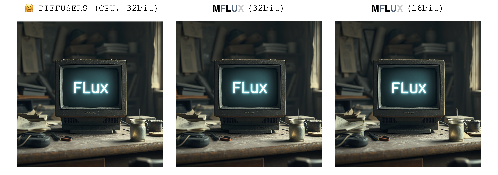
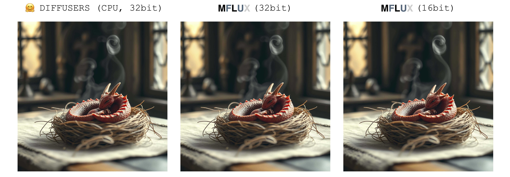
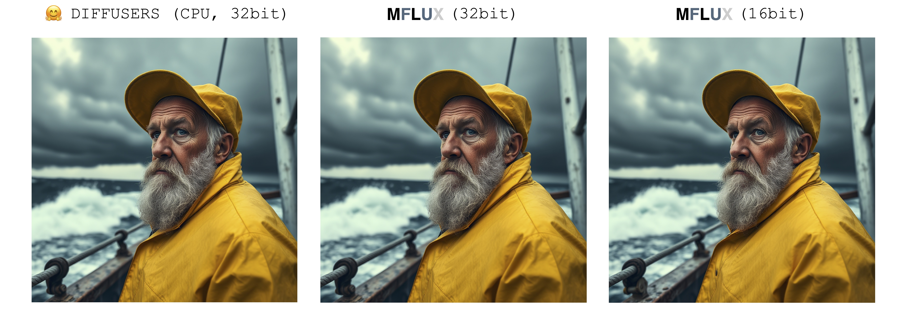

*A MLX port of FLUX based on the Huggingface Diffusers implementation.*

### About

Run the powerful [FLUX](https://blackforestlabs.ai/#get-flux) models from [Black Forest Labs](https://blackforestlabs.ai) locally on your Mac!

### Philosophy

MFLUX (MacFLUX) is a line-by-line port of the FLUX implementation in the [Huggingface Diffusers](https://github.com/huggingface/diffusers) library to [Apple MLX](https://github.com/ml-explore/mlx). 
MFLUX is purposefully kept minimal and explicit - Network architectures are hardcoded and no config files are used
except for the tokenizers. The aim is to have a tiny codebase with the single purpose of expressing these models 
(thereby avoiding too many abstractions). MFLUX priorities readability over generality and performance.

All models are implemented from scratch in MLX and only the tokenizers are used via the 
[Huggingface Transformers](https://github.com/huggingface/transformers) library. Other than that, there are only minimal dependencies 
like [Numpy](https://numpy.org) and [Pillow](https://pypi.org/project/pillow/) for simple image post-processing.

### Models

- [x] FLUX.1-Scnhell
- [ ] FLUX.1-Dev

### Prerequisites

- The required libraries are listed in [requirements.txt](requirements.txt). 
- Development and testing was done with Python 3.12
- Download the weights and tokenizers at [Huggingface/black-forest-labs](https://huggingface.co/black-forest-labs/FLUX.1-schnell/tree/main).
    Point to the location of the root folder as shown in the example below:

### Generating an image

Run [main.py](/src/flux_1_schnell/main.py) or make a new script like the following
(make sure to correctly define the root path to wherever the model is saved and where you want the images to be stored).

```python
from flux_1_schnell.config.config import Config
from flux_1_schnell.models.flux import Flux1Schnell

flux = Flux1Schnell("/Users/filipstrand/.cache/FLUX.1-schnell/")

image = flux.generate_image(
    seed=3,
    prompt="Luxury food photograph of a birthday cake. In the middle it has three candles shaped like letters spelling the word 'MLX'. It has perfect lighting and a cozy background with big bokeh and shallow depth of field. The mood is a sunset balcony in tuscany. The photo is taken from the side of the cake. The scene is complemented by a warm, inviting light that highlights the textures and colors of the ingredients, giving it an appetizing and elegant look.",
    config=Config(
        num_inference_steps=2,
    )
)

image.save(f"/Users/filipstrand/Desktop/image.png")
```

Generating a single image (with 2 inference steps, Schnell model) takes between 2 and 3 minutes. This implementation has been tested on two Macbook Pro machines: 
- 2021 M1 Pro (32 GB) 
- 2023 M2 Max (32 GB)

### Equivalent to Diffusers implementation 

There is only a single source of randomness when generating an image: The initial latent array. 
In this implementation, this initial latent is fully deterministically controlled by the input `seed` parameter. 
However, if we were to import a fixed instance of this latent array saved from the Diffusers implementation, then MFLUX will produce an identical image to the Diffusers implementation (assuming a fixed prompt and using the default parameter settings in the Diffusers setup).


The images below illustrate this equivalence. 
In all cases the Schnell model was run for 2 time steps. 
The Diffusers implementation ran in CPU mode. 
The precision for MFLUX can be set in the [Config](src/flux_1_schnell/config/config.py) class. 
There is typically a noticeable but very small difference in the final image when switching between 16bit and 32bit precision.

---
```
Luxury food photograph
```


---
```
detailed cinematic dof render of an old dusty detailed CRT monitor on a wooden desk in a dim room with items around, messy dirty room. On the screen are the letters "FLUX" glowing softly. High detail hard surface render
```


---

```
photorealistic, lotr, A tiny red dragon curled up asleep inside a nest, (Soft Focus) , (f_stop 2.8) , (focal_length 50mm) macro lens f/2. 8, medieval wizard table, (pastel) colors, (cozy) morning light filtering through a nearby window, (whimsical) steam shapes, captured with a (Canon EOS R5) , highlighting (serene) comfort, medieval, dnd, rpg, 3d, 16K, 8K
```


---


```
A weathered fisherman in his early 60s stands on the deck of his boat, gazing out at a stormy sea. He has a thick, salt-and-pepper beard, deep-set blue eyes, and skin tanned and creased from years of sun exposure. He's wearing a yellow raincoat and hat, with water droplets clinging to the fabric. Behind him, dark clouds loom ominously, and waves crash against the side of the boat. The overall atmosphere is one of tension and respect for the power of nature.
```


---

```
Luxury food photograph of an italian Linguine pasta alle vongole dish with lots of clams. It has perfect lighting and a cozy background with big bokeh and shallow depth of field. The mood is a sunset balcony in tuscany.  The photo is taken from the side of the plate. The pasta is shiny with sprinkled parmesan cheese and basil leaves on top. The scene is complemented by a warm, inviting light that highlights the textures and colors of the ingredients, giving it an appetizing and elegant look.
```


---


### Current limitations

- Images are generated one by one.
- Negative prompts not supported.
- Image resolution is (1024, 1024)

### TODO

- FLUX Dev implementation
- LoRA adapters
- Command line args