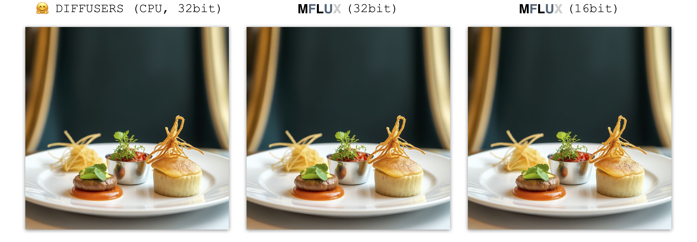
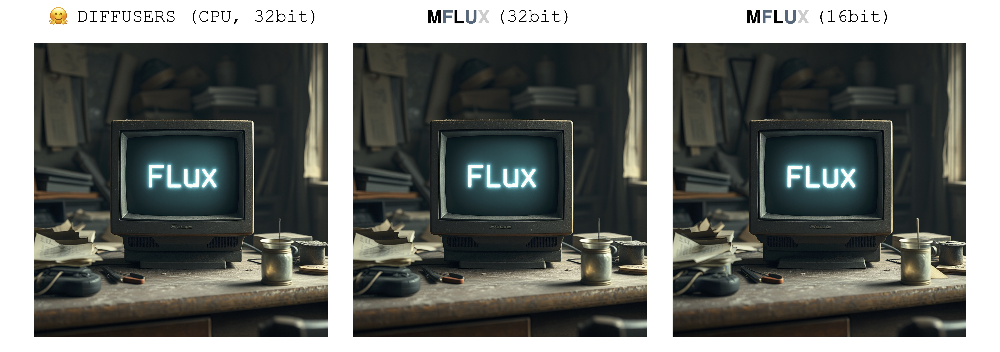
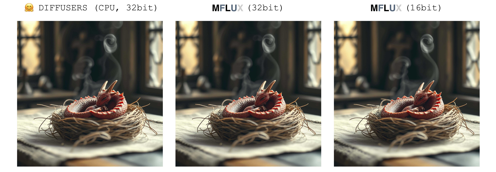
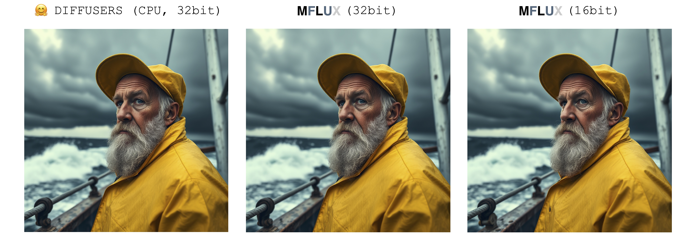
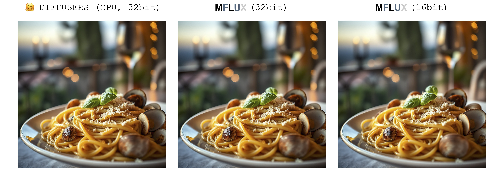

*A MLX port of FLUX based on the Huggingface Diffusers implementation.*

### About

Run the powerful [FLUX](https://blackforestlabs.ai/#get-flux) models from [Black Forest Labs](https://blackforestlabs.ai) locally on your Mac!

### Philosophy

MFLUX (MacFLUX) is a line-by-line port of the FLUX implementation in the [Huggingface Diffusers](https://github.com/huggingface/diffusers) library to [Apple MLX](https://github.com/ml-explore/mlx). 
MFLUX is purposefully kept minimal and explicit - Network architectures are hardcoded and no config files are used
except for the tokenizers. The aim is to have a tiny codebase with the single purpose of expressing these models 
(thereby avoiding too many abstractions). MFLUX priorities readability over generality and performance.

All models are implemented from scratch in MLX and only the tokenizers are used via the 
[Huggingface Transformers](https://github.com/huggingface/transformers) library. Other than that, there are only minimal dependencies 
like [Numpy](https://numpy.org) and [Pillow](https://pypi.org/project/pillow/) for simple image post-processing.

### Models

- [x] FLUX.1-Scnhell
- [x] FLUX.1-Dev

### Installation
1. Clone the repo:
    ```
    git clone git@github.com:filipstrand/mflux.git
    ```
2. Navigate to the project and set up a virtual environment:
   ```
   cd mflux && python3 -m venv .venv && source .venv/bin/activate
   ``` 
3. Install the required dependencies:
    ```
   pip install -r requirements.txt
   ```
### Generating an image

Run the provided [main.py](main.py) by specifying a prompt and some optional arguments like so using the default `Schnell` model:

```
python main.py --prompt "Luxury food photograph" --steps 2 --seed 2
```

or use the slower, but more powerful `Dev` model and run it with more time steps:

```
python main.py --model dev --prompt "Luxury food photograph" --steps 25 --seed 2
```

⚠️ *If the specific model is not already downloaded on your machine, it will start the download process and fetch the model weights (~34GB in size for the Schnell or Dev model respectively).* ⚠️

🔒 [FLUX.1-dev currently requires granted access to its Huggingface repo. For troubleshooting, see the issue tracker](https://github.com/filipstrand/mflux/issues/14) 🔒 

#### Full list of Command-Line Arguments 

- **`--prompt`** (required, `str`): Text description of the image to generate.

- **`--output`** (optional, `str`, default: `"image.png"`): Output image filename.

- **`--model`** (optional, `str`, default: `"schnell"`): Model to use for generation (`"schnell"` or `"dev"`).

- **`--seed`** (optional, `int`, default: `0`): Seed for random number generation. Default is time-based.

- **`--height`** (optional, `int`, default: `1024`): Height of the output image in pixels.

- **`--width`** (optional, `int`, default: `1024`): Width of the output image in pixels.

- **`--steps`** (optional, `int`, default: `4`): Number of inference steps.

- **`--guidance`** (optional, `float`, default: `3.5`): Guidance scale (only used for `"dev"` model).

Or make a new separate script like the following

```python
import sys

sys.path.append("/path/to/mflux/src")

from flux_1.config.config import Config
from flux_1.flux import Flux1
from flux_1.post_processing.image_util import ImageUtil

flux = Flux1.from_alias("schnell")  # "schnell" or "dev"

image = flux.generate_image(
   seed=3,
   prompt="Luxury food photograph of a birthday cake. In the middle it has three candles shaped like letters spelling the word 'MLX'. It has perfect lighting and a cozy background with big bokeh and shallow depth of field. The mood is a sunset balcony in tuscany. The photo is taken from the side of the cake. The scene is complemented by a warm, inviting light that highlights the textures and colors of the ingredients, giving it an appetizing and elegant look.",
   config=Config(
      num_inference_steps=2,  # Schnell works well with 2-4 steps, Dev works well with 20-25 steps
      height=768,
      width=1360,
   )
)

ImageUtil.save_image(image, "image.png")
```


### Image generation speed (updated)

These numbers are based on the Schnell model, with the configuration provided in the code snippet below. 
To time your machine, run the following:
```
time python main.py \
--prompt "Luxury food photograph" \
--steps 2 \
--seed 2 \
--height 1024 \
--width 1024
```

| Device             | User                                                                                                                        | Reported Time | Notes                     |
|--------------------|-----------------------------------------------------------------------------------------------------------------------------|---------------|---------------------------|
| M3 Max             | [@karpathy](https://gist.github.com/awni/a67d16d50f0f492d94a10418e0592bde?permalink_comment_id=5153531#gistcomment-5153531) | ~20s          |                           |
| M2 Ultra           | [@awni](https://x.com/awnihannun/status/1823515121827897385)                                                                | <15s          |                           |
| 2023 M2 Max (96GB) | [@explorigin](https://github.com/filipstrand/mflux/issues/6)                                                                | ~25s          |                           |
| 2021 M1 Pro (16GB) | [@qw-in](https://github.com/filipstrand/mflux/issues/7)                                                                     | ~175s         | Might freeze your mac     |
| 2023 M3 Pro (36GB) | [@kush-gupt](https://github.com/filipstrand/mflux/issues/11)                                                                | ~80s          |                           |
| 2020 M1 (8GB)      | [@mbvillaverde](https://github.com/filipstrand/mflux/issues/13)                                                             | ~335s         | With resolution 512 x 512 |
| 2022 M1 MAX (64GB) | [@BosseParra](https://x.com/BosseParra/status/1826191780812877968)                                                          | ~55s          |                           |
| 2021 M1 Pro (32GB) | @filipstrand                                                                                                                | ~160s         |                           |
| 2023 M2 Max (32GB) | @filipstrand                                                                                                                | ~70s          |                           |

### Equivalent to Diffusers implementation 

There is only a single source of randomness when generating an image: The initial latent array. 
In this implementation, this initial latent is fully deterministically controlled by the input `seed` parameter. 
However, if we were to import a fixed instance of this latent array saved from the Diffusers implementation, then MFLUX will produce an identical image to the Diffusers implementation (assuming a fixed prompt and using the default parameter settings in the Diffusers setup).


The images below illustrate this equivalence. 
In all cases the Schnell model was run for 2 time steps. 
The Diffusers implementation ran in CPU mode. 
The precision for MFLUX can be set in the [Config](src/flux_1/config/config.py) class. 
There is typically a noticeable but very small difference in the final image when switching between 16bit and 32bit precision.

---
```
Luxury food photograph
```


---
```
detailed cinematic dof render of an old dusty detailed CRT monitor on a wooden desk in a dim room with items around, messy dirty room. On the screen are the letters "FLUX" glowing softly. High detail hard surface render
```


---

```
photorealistic, lotr, A tiny red dragon curled up asleep inside a nest, (Soft Focus) , (f_stop 2.8) , (focal_length 50mm) macro lens f/2. 8, medieval wizard table, (pastel) colors, (cozy) morning light filtering through a nearby window, (whimsical) steam shapes, captured with a (Canon EOS R5) , highlighting (serene) comfort, medieval, dnd, rpg, 3d, 16K, 8K
```


---


```
A weathered fisherman in his early 60s stands on the deck of his boat, gazing out at a stormy sea. He has a thick, salt-and-pepper beard, deep-set blue eyes, and skin tanned and creased from years of sun exposure. He's wearing a yellow raincoat and hat, with water droplets clinging to the fabric. Behind him, dark clouds loom ominously, and waves crash against the side of the boat. The overall atmosphere is one of tension and respect for the power of nature.
```


---

```
Luxury food photograph of an italian Linguine pasta alle vongole dish with lots of clams. It has perfect lighting and a cozy background with big bokeh and shallow depth of field. The mood is a sunset balcony in tuscany.  The photo is taken from the side of the plate. The pasta is shiny with sprinkled parmesan cheese and basil leaves on top. The scene is complemented by a warm, inviting light that highlights the textures and colors of the ingredients, giving it an appetizing and elegant look.
```


---


### Current limitations

- Images are generated one by one.
- Negative prompts not supported.

### TODO

- LoRA adapters
