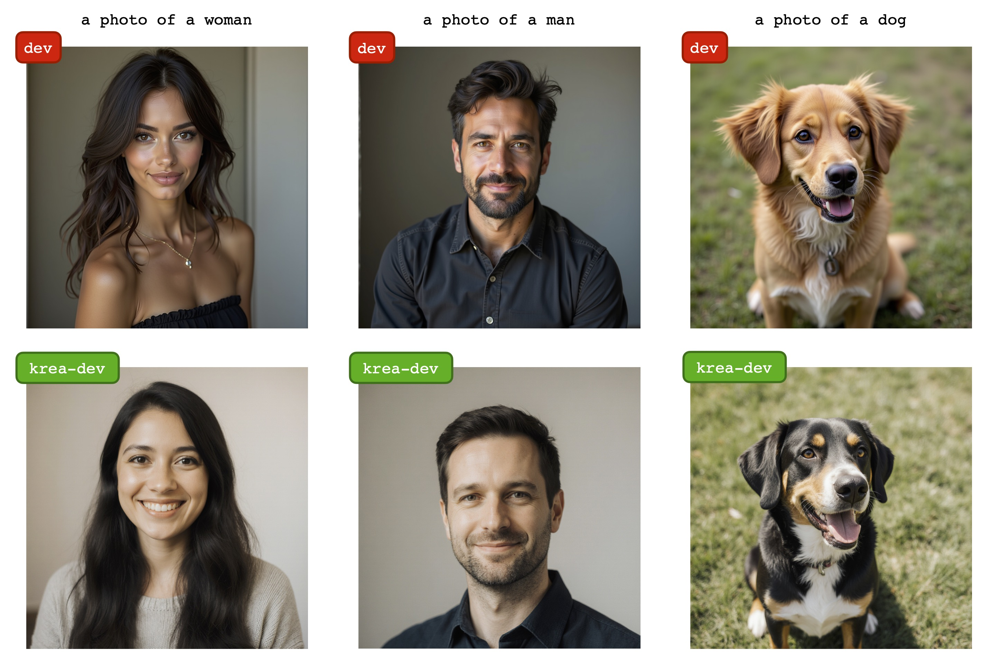
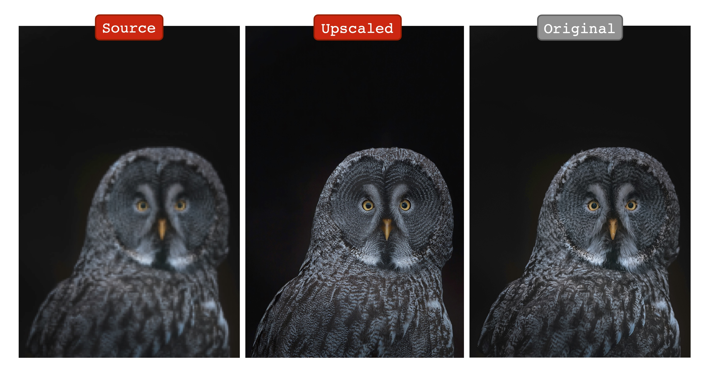
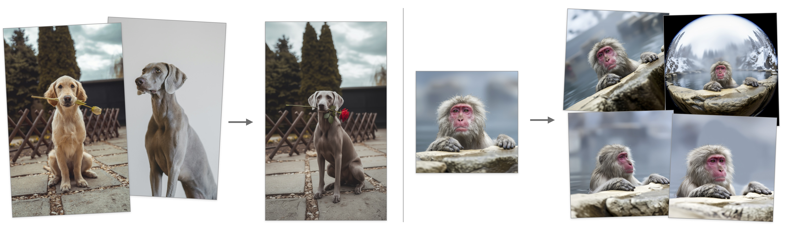
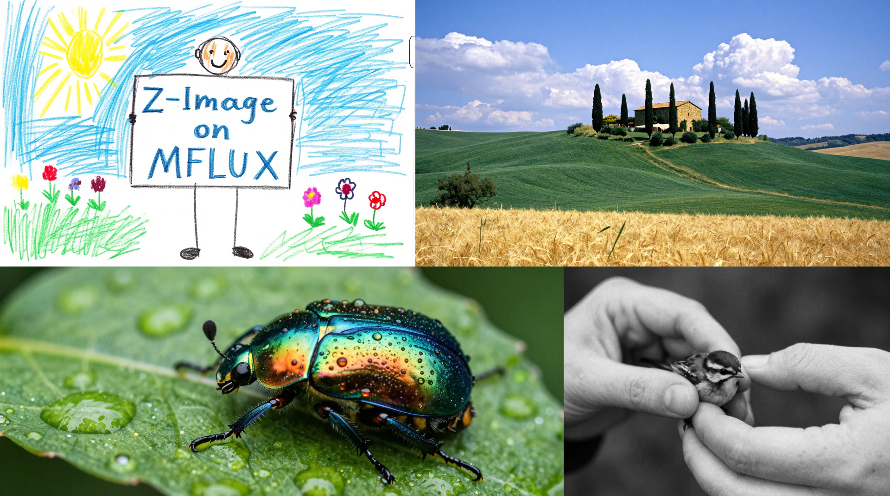
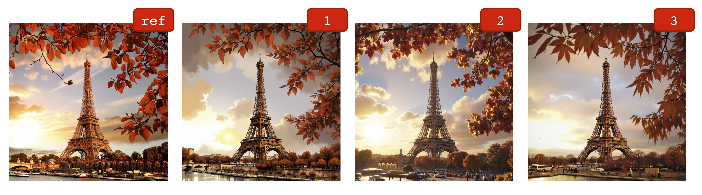
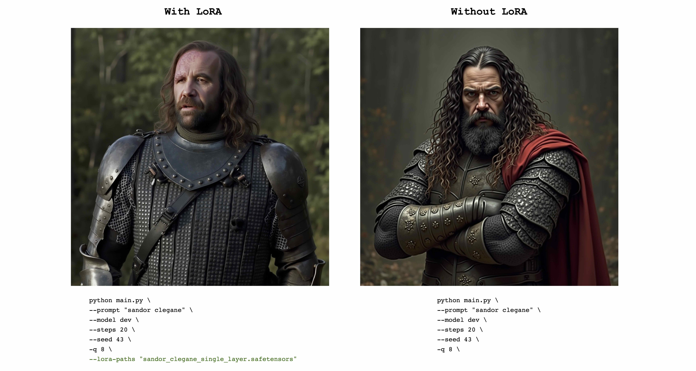
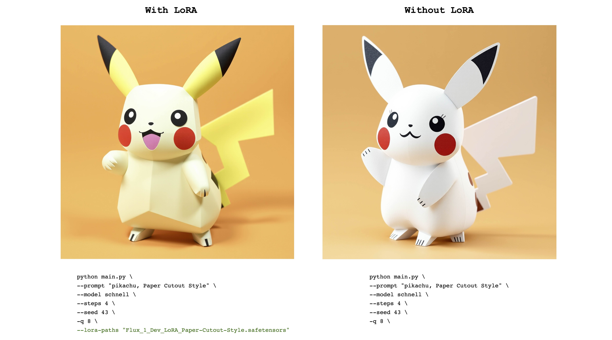
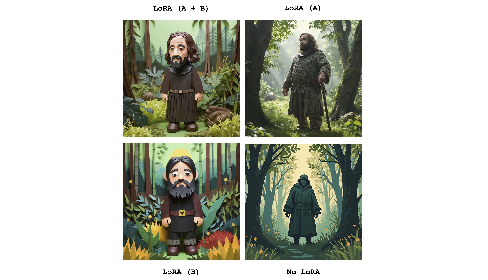

*A MLX port of FLUX based on the Huggingface Diffusers implementation.*


### About

Run the latest state-of-the-art generative image models locally on your Mac!

### Table of contents

<!-- TOC start -->

- [Philosophy](#philosophy)
- [💿 Installation](#-installation)
- [Models](#models)
  * [Z-Image Turbo](src/mflux/models/z_image/README.md)
  * [FLUX.2](src/mflux/models/flux2/README.md)
  * [SeedVR2](src/mflux/models/seedvr2/README.md)
  * [FIBO](src/mflux/models/fibo/README.md)
  * [Qwen Image](src/mflux/models/qwen/README.md)
  * [FLUX.1](src/mflux/models/flux/README.md)
  * [Depth Pro](src/mflux/models/depth_pro/README.md)
- [🗜️ Quantization](#%EF%B8%8F-quantization)
- [💽 Running a model directly from disk](#-running-a-model-directly-from-disk)
- [🌐 Third-Party HuggingFace Model Support](#-third-party-huggingface-model-support)
- [🌱‍ Related projects](#-related-projects)
- [🙏 Acknowledgements](#-acknowledgements)
- [⚖️ License](#%EF%B8%8F-license)

<!-- TOC end -->

---

### Philosophy

MFLUX is a line-by-line MLX port of several state-of-the-art generative image model implementations from the [Huggingface Diffusers](https://github.com/huggingface/diffusers) and [Huggingface Transformers](https://github.com/huggingface/transformers) libraries.
MFLUX is purposefully kept minimal and explicit - Network architectures are hardcoded and no config files are used
except for the tokenizers. The aim is to have a tiny codebase with the single purpose of expressing these models
(thereby avoiding too many abstractions). While MFLUX priorities readability over generality and performance, [it can still be quite fast](#%EF%B8%8F-image-generation-speed-updated), [and even faster quantized](#%EF%B8%8F-quantization).

All models are implemented from scratch in MLX and only the tokenizers are used via the [Huggingface Transformers](https://github.com/huggingface/transformers) library. Other than that, there are only minimal dependencies like [Numpy](https://numpy.org) and [Pillow](https://pypi.org/project/pillow/) for simple image post-processing.

---

### 💿 Installation
For users, the easiest way to install MFLUX is to use `uv tool`: If you have [installed `uv`](https://github.com/astral-sh/uv?tab=readme-ov-file#installation), simply:

```sh
uv tool install --upgrade mflux --prerelease=allow
```

to get the `mflux-generate` and related command line executables. You can skip to the usage guides below.

---

### Models

MFLUX supports the following models. They have different strengths and weaknesses; see each model’s README for full usage details.

| Model | Release date | Size | Type | Description |
| --- | --- | --- | --- | --- |
|[Z-Image Turbo](src/mflux/models/z_image/README.md) | Nov 2025 | 6B | Distilled | Best all-rounder: fast, small, good realism. |
|[FLUX.2](src/mflux/models/flux2/README.md) | Jan 2026 | 4B & 9B | Distilled | Fastest + smallest, with edit capabilities. |
|[SeedVR2](src/mflux/models/seedvr2/README.md) | Jun 2025 | 3B | — | Best upscaling model. |
|[FIBO](src/mflux/models/fibo/README.md) | Oct 2025 | 8B | Base | Good quality; very good prompt understanding and editability. |
|[Qwen Image / Qwen Image Edit](src/mflux/models/qwen/README.md) | Aug 2025+ | 20B | Base | Large model (slower); strong prompt understanding and world knowledge. Has edit capabilities |
|[Flux (FLUX.1)](src/mflux/models/flux/README.md) | Aug 2024 | 12B | Distilled & Base | Legacy option with decent quality. Has edit capabilities with 'Kontext' model and upscaling support with controlnet |
|[Depth Pro](src/mflux/models/depth_pro/README.md) | Oct 2024 | — | — | Depth estimation model. |

#### Flux Family

##### FLUX.2 (Klein)

Supported variants:
- `flux2-klein-4b` (default)
- `flux2-klein-9b`

Text-to-image:

```sh
mflux-generate-flux2 \
  --model flux2-klein-4b \
  --prompt "Luxury food photograph" \
  --steps 4 \
  --seed 2
```

Image-conditioned editing (requires one or more `--image-paths`):

```sh
mflux-generate-flux2-edit \
  --model flux2-klein-4b \
  --image-paths input.png \
  --prompt "Turn this into a luxury food photograph" \
  --steps 4 \
  --seed 2
```

Notes:
- FLUX.2 does not support `--negative-prompt` or CFG-style guidance. Use `--guidance 1.0`.

##### FLUX.1

Supported base models include `schnell`, `dev`, and `krea-dev` (alias `dev-krea`), typically run via `mflux-generate`.

###### 🎨 FLUX.1 Krea [dev]: Enhanced Photorealism

MFLUX now supports **FLUX.1 Krea [dev]**, an 'opinionated' text-to-image model developed in collaboration with [Krea AI](https://krea.ai). This model overcomes the oversaturated 'AI look' commonly found in generated images, achieving exceptional photorealism with distinctive aesthetics.
This model can be used where the `dev` model is used, and it is available as `krea-dev` in MFLUX (also supports the alias `dev-krea`), this includes dreambooth fine-tuning.



```sh
mflux-generate \
    --model krea-dev \
    --prompt "A photo of a dog" \
    --steps 25 \
    --seed 2674888 \
    -q 8 \
    --height 1024 \
    --width 1024
```

*Learn more about FLUX.1 Krea [dev] in the [official announcement](https://bfl.ai/announcements/flux-1-krea-dev).*

Legacy / older Flux workflows (kept for backwards compatibility): see [🎭 In-Context Generation](#-in-context-generation).

Other Flux-related tools and features: [🛠️ Flux Tools](#%EF%B8%8F-flux-tools), [🕹️ Controlnet](#%EF%B8%8F-controlnet), [🎛️ Dreambooth fine-tuning](#%EF%B8%8F-dreambooth-fine-tuning), [🧠 Concept Attention](#-concept-attention), and [🔌 LoRA](#-lora).

###### 🎨 ControlNet Upscale

The ControlNet upscaler uses a generative approach by leveraging a specialized Flux ControlNet model. This allows for more "creative" upscaling where the model can hallucinate fine details based on a prompt.

Under the hood, this is the [jasperai/Flux.1-dev-Controlnet-Upscaler](https://huggingface.co/jasperai/Flux.1-dev-Controlnet-Upscaler) model.


*Image credit: [Kevin Mueller on Unsplash](https://unsplash.com/photos/gray-owl-on-black-background-xvwZJNaiRNo)*

```sh
mflux-upscale-controlnet \
  --prompt "A gray owl on black background" \
  --controlnet-image-path "low_res_image.png" \
  --height 2x \
  --width 2x \
  --controlnet-strength 0.6
```

This will upscale your input image by a factor of 2x. The upscaler works best when increasing the resolution by a factor of 2-4x.

⚠️ *Note: Depending on the capability of your machine, you might run out of memory when trying to export the image. If that happens, try reducing output resolution, using `--low-ram`, or closing other memory-heavy apps.*

Other model families:
- [🌀 FIBO Family](#-fibo-family)
- [⚡ Z-Image Family](#-z-image-family)
- [SeedVR2 Family](#seedvr2-family)

#### 🦙 Qwen Family

MFLUX supports the [Qwen Image](https://github.com/QwenLM/Qwen-Image) family of vision-language models, providing both text-to-image generation and natural language image editing capabilities. Released approximately a year after FLUX, Qwen models achieve state-of-the-art performance in most areas, though they are comparatively heavier to run.

##### 🖼️ Qwen Image

**Qwen Image** is a powerful 20B parameter text-to-image model ([technical report](https://arxiv.org/abs/2508.02324)) that enables high-quality image generation from text prompts. It uses a vision-language architecture with a 7B text encoder (Qwen2.5-VL) to understand and generate images based on natural language descriptions.

The Qwen Image model has its own dedicated command `mflux-generate-qwen`. Qwen Image excels at multilingual prompts, including Chinese characters, and can render Chinese text as part of the image content (like signs, menus, and calligraphy).


**Example: Wildlife Portrait**

```sh
mflux-generate-qwen \
  --prompt "Close-up portrait of a majestic tiger in its natural habitat, detailed fur texture, piercing eyes, natural forest background, soft natural lighting, wildlife photography, photorealistic, high detail, professional wildlife shot" \
  --negative-prompt "blurry, low quality, distorted, deformed, ugly, bad anatomy, bad proportions, extra limbs, duplicate, watermark, signature, text, letters, cartoon, anime, painting, drawing, illustration, 3d render, cgi, zoo, cage, artificial" \
  --width 1920 \
  --height 816 \
  --steps 30 \
  --seed 42 \
  -q 8
```

<details>
<summary><strong>Click to expand additional example commands - These are the exact commands used to generate the images shown above</strong></summary>

**Chinese Calligraphy:**

```sh
mflux-generate-qwen \
  --prompt "Traditional Chinese calligraphy studio, ancient scrolls with beautiful Chinese characters, ink brushes, inkstone, traditional paper, warm natural lighting, peaceful atmosphere, photorealistic, high detail, cultural heritage" \
  --negative-prompt "blurry, low quality, distorted, deformed, ugly, bad anatomy, bad proportions, extra limbs, duplicate, watermark, signature, text, letters, cartoon, anime, painting, drawing, illustration, 3d render, cgi, modern, digital" \
  --width 1920 \
  --height 816 \
  --steps 30 \
  --seed 42 \
  -q 8
```

**Chinese Street Signs:**

```sh
mflux-generate-qwen \
  --prompt "Traditional Chinese street scene, old neighborhood with shop signs displaying Chinese characters (店铺, 餐厅, 书店), red lanterns, narrow alleys, traditional architecture, bustling street life, natural lighting, photorealistic, high detail, street photography" \
  --negative-prompt "blurry, low quality, distorted, deformed, ugly, bad anatomy, bad proportions, extra limbs, duplicate, watermark, signature, cartoon, anime, painting, drawing, illustration, 3d render, cgi, modern signs, English text only" \
  --width 1920 \
  --height 816 \
  --steps 30 \
  --seed 42 \
  -q 8
```

**Food Photography:**

```sh
mflux-generate-qwen \
  --prompt "Professional food photography, gourmet Chinese cuisine, steamed dumplings, colorful vegetables, traditional table setting, restaurant lighting, shallow depth of field, photorealistic, high detail, magazine quality" \
  --negative-prompt "blurry, low quality, distorted, deformed, ugly, bad anatomy, bad proportions, extra limbs, duplicate, watermark, signature, text, letters, cartoon, anime, painting, drawing, illustration, 3d render, cgi, fast food, unappetizing" \
  --width 1920 \
  --height 816 \
  --steps 30 \
  --seed 42 \
  -q 8
```

</details>

⚠️ *Note: The Qwen Image model requires downloading the `Qwen/Qwen-Image` model weights (~58GB for the full model, or use quantization for smaller sizes).*

##### ✏️ Qwen Image Edit

**Qwen Image Edit** enables precise natural language image editing, allowing you to modify images using text instructions while maintaining their original structure and context. The model uses a vision-language encoder to understand both the input image and your editing instructions, making it ideal for tasks like changing specific elements, adjusting poses, modifying clothing, or altering backgrounds while preserving the overall composition.

Qwen Image Edit supports natural language editing with descriptive text instructions, maintains original poses and body positions when requested, supports multiple images for complex compositions, and works seamlessly with LoRA adapters for specialized transformations like camera angles and styles. The model uses `Qwen/Qwen-Image-Edit-2509`.


*Examples showing dog replacement with two-image input and monkey camera angle transformations with LoRAs. Source images: [Golden Retriever](https://images.unsplash.com/photo-1552053831-71594a27632d), [Grey Dog](https://images.unsplash.com/photo-1566710582818-d673dc761201), and [Monkey](https://images.unsplash.com/photo-1578948610588-ffe24448f5ed).*

**Example 1: Two-Image Transformation (Dog Replacement)**

Qwen Image Edit excels at complex transformations using multiple reference images. This example replaces a golden retriever with a grey dog and changes the rose color from white to red:

```sh
mflux-generate-qwen-edit \
  --image-paths "dog1.png" "dog2.png" \
  --prompt "Replace the golden retriever (standing outside, holding white rose) in Image 1 with the grey dog from Image 2 (which is standing inside in a studio). The grey dog should hold a red rose in its mouth and stand outside in the same position as the golden retriever. Maintain the outside environment, background, lighting, and all surroundings completely unchanged." \
  --steps 30 \
  --guidance 2.5 \
  --width 624 \
  --height 1024
```

**Example 2: Single Image with LoRAs (Camera Angle Transformations)**

Qwen Image Edit works seamlessly with LoRA adapters for specialized transformations. This example uses two LoRAs to transform camera angles on a single image:

```sh
mflux-generate-qwen-edit \
  --image-paths "monkey.png" \
  --prompt "将镜头极度拉近，使用超长焦镜头进行极端特写拍摄，主体占据画面的大部分空间，背景完全虚化，营造出强烈的视觉冲击力和亲密感。Extreme zoom in with a super telephoto lens, creating an intense close-up where the subject dominates most of the frame, with the background completely blurred, creating a strong visual impact and sense of intimacy." \
  --steps 8 \
  --guidance 2.5 \
  --width 1024 \
  --height 1024 \
  --lora-paths "lightx2v/Qwen-Image-Lightning" "dx8152/Qwen-Edit-2509-Multiple-angles" \
  --lora-scales 0.5 1.0
```

*Uses [Qwen Image Lightning LoRA](https://huggingface.co/lightx2v/Qwen-Image-Lightning) for fast generation and [Camera Angle LoRA](https://huggingface.co/dx8152/Qwen-Edit-2509-Multiple-angles) for precise camera control.*

**Tips for Qwen Image Edit:**
1. **Detailed Prompts**: The model works best with detailed, specific editing instructions
2. **Pose Maintenance**: Explicitly mention maintaining poses, body positions, or overall stance when you want to preserve the original structure
3. **Single Focus**: Focus on one or a few related edits at a time for more predictable results
4. **LoRA Combinations**: Combine multiple LoRAs for complex effects (e.g., fast generation + camera control)
5. **Quantization**: 6-bit or below can degrade the image a lot more compared to Flux, use with caution
6. **Seed Variation**: Qwen models typically do not vary much with seed changes. If you want more variation, vary the prompt instead
7. **Image Quality**: Qwen images come out quite soft compared to Flux models

⚠️ *Note: The Qwen Image Edit model requires downloading the `Qwen/Qwen-Image-Edit-2509` model weights (~58GB for the full model, or use quantization for smaller sizes).*

---

#### 🌀 FIBO Family

MFLUX supports [FIBO](https://huggingface.co/briaai/FIBO) from [Bria.ai](https://bria.ai), the first open-source JSON-native text-to-image model trained on long structured captions. FIBO delivers high image quality, strong prompt adherence, and professional-grade control—trained exclusively on licensed data. ([Technical Paper](https://arxiv.org/abs/2511.06876))


FIBO is an 8B-parameter DiT-based, flow-matching model using **SmolLM3-3B** as the text encoder with a novel **DimFusion** conditioning architecture for efficient long-caption training, and **Wan 2.2** as the VAE. The VLM-assisted prompting uses a fine-tuned **Qwen3-VL** to expand short user intents, fill in missing details, and extract/edit structured prompts from images.

Most text-to-image models excel at imagination—but not control. FIBO is trained on structured JSON captions up to 1,000+ words, enabling precise, reproducible control over lighting, composition, color, and camera settings. The structured captions foster native disentanglement, allowing targeted, iterative refinement without prompt drift. 


##### Key Features

- **VLM-guided JSON-native prompting**: Transform short prompts into structured schemas with 1,000+ words (lighting, camera, composition, DoF)
- **Disentangled control**: Tweak a single attribute (e.g., camera angle) without breaking the scene
- **Strong prompt adherence**: High alignment on PRISM-style evaluations
- **Enterprise-grade**: 100% licensed data with governance, repeatability, and legal clarity

##### The three modes: ✨ Generate, 🔧 Refine, and 💡 Inspire

**✨ Generate**: While the actual prompt input to FIBO is a structured JSON file, the generate command provides an interface to input pure text prompts. These are then expanded into structured JSON prompts using FIBO's Vision-Language Model (VLM) before being passed to the diffusion model for image generation. For example, the following prompt produces one of the images above:

```sh
mflux-generate-fibo \
  --prompt "Three cartoon animal chefs in a colorful bakery kitchen, Pixar style: a bunny with floppy ears wearing a tall white chef hat and pink apron holding a chocolate cake on the left, a raccoon with a striped tail wearing blue oven mitts and a yellow bandana frosting cupcakes in the center, a penguin wearing a red bowtie and checkered apron carrying a tray of golden croissants on the right, warm kitchen lighting with flour dust in air" \
  --width 1200 \
  --height 540 \
  --steps 20 \
  --guidance 4.0 \
  --seed 42 \
  --output animal_bakers.png
``` 
 
This command will output both the generated image (`animal_bakers.png`) and a JSON prompt file (`animal_bakers.json`) containing the expanded structured prompt used for generation.
When the input prompt is pure text, it will be processed through FIBO's VLM to create the structured JSON prompt automatically. 
Conversely, if a JSON prompt file is provided, it will be used directly for image generation, thus bypassing the VLM step and giving you full control over the prompt structure.
Another way to call the model directly is to provide a JSON prompt file as input:

```sh
mflux-generate-fibo \
    --prompt-file animal_bakers.json \
    --width 1200 \
    --height 540 \
    --steps 20 \
    --guidance 4.0 \
    --seed 42 \
    --output animal_bakers.png
```

A point worth emphasizing is that when working with a JSON prompt file, the user can use whatever tool they prefer to edit it and is not forced to use the built in FIBO-VLM. Other good alternatives are [coding](https://cursor.com/agents) [agents](https://www.claude.com/product/claude-code), other [LLMs](https://github.com/ml-explore/mlx-lm)/[VLMs](https://github.com/Blaizzy/mlx-vlm) etc. 

<details>
<summary><strong>Click to expand the JSON prompt file used (animal_bakers.json)</strong></summary>

```json
{
  "short_description": "Three cartoon animal chefs are in a bakery kitchen, each holding a culinary creation. A bunny chef on the left presents a chocolate cake, a raccoon chef in the center is frosting cupcakes, and a penguin chef on the right carries a tray of croissants. The kitchen is brightly lit with warm tones, and flour dusts the air, creating a lively and cheerful baking atmosphere.",
  "objects": [
    {
      "description": "A cartoon bunny wearing a white chef's hat and a pink apron, holding a chocolate cake with white frosting and cherries.",
      "location": "left foreground",
      "relationship": "The bunny chef is presenting the chocolate cake.",
      "relative_size": "medium",
      "shape_and_color": "Rounded bunny shape, white hat, pink apron, brown cake, white frosting, red cherries.",
      "texture": "smooth",
      "appearance_details": "Floppy ears, rosy cheeks, smiling expression.",
      "pose": "Standing upright, holding the cake with both hands.",
      "expression": "Joyful and proud.",
      "clothing": "White chef's hat, pink apron.",
      "action": "Holding and presenting a cake.",
      "gender": "female",
      "skin_tone_and_texture": "White fur, smooth texture.",
      "orientation": "Upright, facing forward."
    },
    {
      "description": "A cartoon raccoon wearing blue oven mitts and a yellow bandana, actively frosting cupcakes with pink and yellow frosting.",
      "location": "center midground",
      "relationship": "The raccoon chef is in the process of frosting cupcakes.",
      "relative_size": "medium",
      "shape_and_color": "Distinct raccoon shape, blue mitts, yellow bandana, pink and yellow frosting, brown cupcakes.",
      "texture": "smooth",
      "appearance_details": "Striped tail, bushy fur, focused expression.",
      "pose": "Leaning forward slightly, hands busy frosting.",
      "expression": "Concentrated and happy.",
      "clothing": "Blue oven mitts, yellow bandana.",
      "action": "Frosting cupcakes.",
      "gender": "male",
      "skin_tone_and_texture": "Brown and black fur, smooth texture.",
      "orientation": "Upright, slightly angled."
    },
    {
      "description": "A cartoon penguin wearing a red bowtie and a checkered apron, carrying a tray of golden croissants.",
      "location": "right foreground",
      "relationship": "The penguin chef is carrying a tray of freshly baked croissants.",
      "relative_size": "medium",
      "shape_and_color": "Classic penguin shape, red bowtie, red and white apron, golden croissants.",
      "texture": "smooth",
      "appearance_details": "Black and white body, orange beak and feet, smiling expression.",
      "pose": "Standing upright, holding the tray with both hands.",
      "expression": "Cheerful and friendly.",
      "clothing": "Red bowtie, checkered apron.",
      "action": "Carrying a tray of croissants.",
      "gender": "male",
      "skin_tone_and_texture": "Feathered texture, smooth appearance.",
      "orientation": "Upright, facing forward."
    },
    {
      "description": "A chocolate cake with white frosting and two red cherries on top.",
      "location": "left foreground",
      "relationship": "Held by the bunny chef.",
      "relative_size": "medium",
      "shape_and_color": "Round cake, dark brown, white frosting, red cherries.",
      "texture": "smooth frosting, slightly textured cake",
      "appearance_details": "Decorated with cherries.",
      "number_of_objects": 1,
      "orientation": "Horizontal"
    },
    {
      "description": "A tray filled with golden-brown croissants.",
      "location": "right foreground",
      "relationship": "Carried by the penguin chef.",
      "relative_size": "medium",
      "shape_and_color": "Elongated, crescent-shaped croissants, golden brown.",
      "texture": "flaky, slightly crisp exterior",
      "appearance_details": "Arranged neatly on a metal tray.",
      "number_of_objects": 1,
      "orientation": "Horizontal"
    }
  ],
  "background_setting": "A brightly lit bakery kitchen with wooden countertops, shelves stocked with baking ingredients and equipment, and a window in the background. Flour is lightly dusted in the air.",
  "lighting": {
    "conditions": "warm indoor lighting",
    "direction": "front-lit and side-lit",
    "shadows": "soft, diffused shadows"
  },
  "aesthetics": {
    "composition": "centered composition with the three chefs forming a horizontal line",
    "color_scheme": "warm and cheerful, with dominant browns, yellows, pinks, and whites",
    "mood_atmosphere": "joyful, friendly, and inviting",
    "aesthetic_score": "very high",
    "preference_score": "very high"
  },
  "photographic_characteristics": {
    "depth_of_field": "shallow",
    "focus": "sharp focus on the chefs and their creations",
    "camera_angle": "eye-level",
    "lens_focal_length": "standard lens"
  },
  "style_medium": "digital illustration",
  "text_render": [],
  "context": "This image is a charming illustration, likely for a children's book, educational material, or a bakery-themed advertisement, designed to evoke feelings of happiness and the joy of baking.",
  "artistic_style": "Pixar-style animation"
}
```
Note: This JSON prompt was generated using FIBO's "Generate" mode from a short text description. Note the strong alignment between the JSON prompt and the image!
</details>

**🔧 Refine**: While the JSON prompt can be edited manually, it can be quite complex and inconvenient to modify directly. The refinement mode helps to solve this issue by also expanding a simple user instruction in order to tweak specific attributes. The VLM processes these instructions and updates the JSON prompt accordingly before generating new images.


Assuming we already have a previous prompt file, like `owl_brown.json`, we can refine this prompt to change the owl's color and add some accessories:

```sh
mflux-refine-fibo \
    --prompt-file owl_brown.json \
    --instructions "Make the owl white instead of brown, and add round glasses and a black scarf. Keep everything else exactly the same - the same forest background, moonlight lighting, composition, and overall whimsical atmosphere." \
    --output owl_white.json
```

<details>
<summary><strong>Click to expand the refined JSON prompt file (owl_white.json)</strong></summary>

```json
{
  "short_description": "A hyper-detailed, ultra-fluffy owl sitting in the trees at night, looking directly at the camera with wide, adorable, expressive eyes. Its feathers are soft and voluminous, catching the cool moonlight with subtle silver highlights. The owl's gaze is curious and full of charm, giving it a whimsical, storybook-like personality. It is wearing round glasses and a black scarf.",
  "objects": [
    {
      "description": "An adorable, fluffy owl with large, expressive eyes and soft, voluminous feathers. Its plumage is white, with subtle silver highlights from the moonlight. It is wearing round glasses and a black scarf.",
      "location": "center",
      "relationship": "The owl is the sole subject, perched comfortably within its environment.",
      "relative_size": "large within frame",
      "shape_and_color": "Round head, large eyes, bulky body, predominantly white with silver accents.",
      "texture": "Extremely soft, fluffy, and detailed feathers, giving a plush toy-like appearance.",
      "appearance_details": "The eyes are wide, dark, and reflective, conveying a sense of wonder and curiosity. The beak is small and light-colored, almost hidden by the feathers. Subtle silver highlights catch the moonlight on its feathers. It has round glasses on its nose and a black scarf around its neck.",
      "orientation": "upright, facing forward"
    }
  ],
  "background_setting": "A dark, nocturnal forest setting with blurred trees and foliage, illuminated by a soft, cool moonlight. The background is out of focus, emphasizing the owl.",
  "lighting": {
    "conditions": "moonlight",
    "direction": "backlit and side-lit from the left",
    "shadows": "soft, diffused shadows on the right side of the owl and within the background foliage, indicating a single light source."
  },
  "aesthetics": {
    "composition": "centered, portrait composition",
    "color_scheme": "cool blues and silvers from the moonlight contrasting with white of the owl and forest.",
    "mood_atmosphere": "mysterious, enchanting, whimsical, and serene.",
    "aesthetic_score": "very high",
    "preference_score": "very high"
  },
  "photographic_characteristics": {
    "depth_of_field": "shallow",
    "focus": "sharp focus on the owl's face and eyes, with a soft blur in the background.",
    "camera_angle": "eye-level",
    "lens_focal_length": "portrait lens (e.g., 50mm-85mm)"
  },
  "style_medium": "digital illustration",
  "text_render": [],
  "context": "A whimsical character illustration, possibly for a children's book, animated film, or fantasy art collection.",
  "artistic_style": "fantasy, illustrative, detailed"
}
```
Note: This JSON prompt was refined from the original `owl_brown.json` by changing the owl's color to white and adding round glasses and a black scarf, while preserving the forest background, moonlight lighting, and whimsical atmosphere.
</details>

Finally, generate the refined white owl image using the updated JSON prompt:

```sh
mflux-generate-fibo \
    --prompt-file owl_white.json \
    --width 1024 \
    --height 560 \
    --steps 20 \
    --guidance 4.0 \
    --seed 42 \
    --quantize 4 \
    --output owl_white.png
```

The refine command reads the existing JSON prompt, applies the refinement instructions to change the owl's color and add accessories, and outputs a new refined JSON file. This refined prompt is then used to generate a new image that reflects the requested changes while maintaining the overall scene and composition.

It is worth noting that refine does not work the same way as other editing techniques like Flux Kontext or Qwen Image Edit. Instead of modifying an existing image, it modifies the underlying **structured prompt** to produce a new image that reflects the requested changes while maintaining the overall scene and composition.

**💡 Inspire**: Provide an image instead of text. FIBO's vision-language model extracts a detailed, structured prompt, blends it with your creative intent, and produces related images—ideal for inspiration without overreliance on the original.


Starting from an image, you can extract a structured JSON prompt that captures its visual characteristics. For example, using a [blue and brown bird on brown tree trunk](https://unsplash.com/photos/blue-and-brown-bird-on-brown-tree-trunk-DPXytK8Z59Y), we can extract a detailed prompt:

```sh
mflux-inspire-fibo \
    --image-path bird.jpg \
    --prompt "blue and brown bird on brown tree trunk" \
    --output bird_inspired.json \
    --seed 42
```

This command analyzes the image and generates a structured JSON prompt file (`bird_inspired.json`) that describes the visual elements, composition, lighting, and style. You can then use this JSON prompt to generate new images with similar characteristics:

```sh
mflux-generate-fibo \
    --prompt-file bird_inspired.json \
    --width 1024 \
    --height 672 \
    --steps 20 \
    --guidance 4.0 \
    --seed 42 \
    -q 8 \
    --output bird_inspired.png
```


<details>
<summary><strong>Click to expand the JSON prompt file used (bird_inspired.json)</strong></summary>

```json
{
  "short_description": "A vibrant blue and brown kingfisher is perched on a weathered tree trunk, facing left. The bird's iridescent plumage is detailed, with striking orange and white markings on its chest and throat. Its long, sharp black beak is prominent. The background is a soft, out-of-focus gradient of warm yellow and green, creating a natural and serene environment. The lighting highlights the textures of the bird's feathers and the rough bark of the trunk.",
  "objects": [
    {
      "description": "A male kingfisher with striking iridescent blue plumage on its back and wings, a rich orange and white chest, and a black beak. It has a small, dark eye and a red-orange patch on its face.",
      "location": "center",
      "relationship": "perched on the tree trunk",
      "relative_size": "medium within frame",
      "shape_and_color": "Bird shape, predominantly blue, orange, and white.",
      "texture": "Feathers appear smooth and slightly glossy.",
      "appearance_details": "The beak is long, thin, and black. The orange patch on its face is distinct.",
      "number_of_objects": 1,
      "pose": "Standing upright on its legs, head turned to the left.",
      "expression": "Alert and focused.",
      "action": "Perched, observing its surroundings.",
      "gender": "male",
      "orientation": "Facing left, upright"
    },
    {
      "description": "A section of a weathered, rough tree trunk, providing a perch for the kingfisher. It has a natural, organic shape with visible bark texture.",
      "location": "bottom-center foreground",
      "relationship": "supports the kingfisher",
      "relative_size": "medium",
      "shape_and_color": "Irregular cylindrical shape, brown and grey tones.",
      "texture": "Rough, gnarled bark texture.",
      "appearance_details": "Some smaller branches or knots are visible on the trunk.",
      "number_of_objects": 1,
      "orientation": "Horizontal, lying on its side"
    }
  ],
  "background_setting": "A soft, blurred background with a warm gradient transitioning from a light yellow at the top to a muted green at the bottom. This creates a natural, out-of-focus environment, likely foliage or sky.",
  "lighting": {
    "conditions": "natural daylight",
    "direction": "side-lit from the right",
    "shadows": "soft shadows, particularly on the left side of the bird and the trunk"
  },
  "aesthetics": {
    "composition": "rule of thirds, with the bird positioned slightly off-center",
    "color_scheme": "vibrant blues and oranges contrasting with the soft yellow and green background",
    "mood_atmosphere": "serene, natural, captivating",
    "aesthetic_score": "very high",
    "preference_score": "very high"
  },
  "photographic_characteristics": {
    "depth_of_field": "shallow, with a strong bokeh effect in the background",
    "focus": "sharp focus on the kingfisher",
    "camera_angle": "eye-level",
    "lens_focal_length": "telephoto lens"
  },
  "style_medium": "photograph",
  "text_render": [],
  "context": "This image is a wildlife photograph, likely intended for nature magazines, educational materials, or as a decorative print for nature enthusiasts.",
  "artistic_style": "photorealistic, detailed"
}
```
Note: This JSON prompt was extracted from the input image using FIBO's VLM, capturing the visual characteristics of a kingfisher bird perched on a tree trunk with a bokeh background.
</details>

The inspire command is particularly useful when you want to:
- Extract the visual style and composition from a reference image
- Create variations of an existing image while maintaining its core characteristics
- Understand how FIBO interprets and structures visual information
- Blend your creative intent (via the optional `--prompt` parameter) with the visual content of the image

Note: The optional `--prompt` parameter allows you to guide the VLM's interpretation of the image. For example, you might use `--prompt "futuristic cityscape"` to influence how the image is analyzed and structured.

⚠️ *Note: FIBO requires downloading the `briaai/FIBO` model weights (~24GB) and the `briaai/FIBO-vlm` vision-language model (~8GB), totaling ~32GB for the full model, or use quantization for smaller sizes.*

---

#### ⚡ Z-Image Family

MFLUX supports [Z-Image-Turbo](https://huggingface.co/Tongyi-MAI/Z-Image-Turbo) from Tongyi Lab (Alibaba), released in November 2025. Z-Image is an efficient 6B-parameter image generation model with a single-stream DiT architecture. Z-Image-Turbo delivers high-quality images in just 9 steps, making it one of the fastest open-source models available. All the standard modes such as, img2img, LoRA and quantizations are supported for this model. See the [technical paper](https://arxiv.org/abs/2511.22699) for more details. 



##### Example

The following uses the pre-quantized 4-bit model from [filipstrand/Z-Image-Turbo-mflux-4bit](https://huggingface.co/filipstrand/Z-Image-Turbo-mflux-4bit) to generate a vibrant 1960s style image with a LoRA adapter [Technically Color](https://huggingface.co/renderartist/Technically-Color-Z-Image-Turbo) for enhanced film color:

```sh
mflux-generate-z-image-turbo \
  --model filipstrand/Z-Image-Turbo-mflux-4bit \
  --prompt "t3chnic4lly vibrant 1960s close-up of a woman sitting under a tree in a blue skirt and white blouse, she has blonde wavy short hair and a smile with green eyes lake scene by a garden with flowers in the foreground 1960s style film She's holding her hand out there is a small smooth frog in her palm, she's making eye contact with the toad." \
  --width 1280 \
  --height 720 \
  --seed 456 \
  --steps 9 \
  --lora-paths renderartist/Technically-Color-Z-Image-Turbo \
  --lora-scales 0.5
```

⚠️ *Note: Z-Image-Turbo requires downloading the `Tongyi-MAI/Z-Image-Turbo` model weights (~31GB), or use quantization for smaller sizes.* 

*Dreambooth fine-tuning for Z-Image is not yet supported in MFLUX but is planned. In the meantime, you can train Z-Image-Turbo LoRAs using [AI Toolkit](https://github.com/ostris/ai-toolkit) - see [How to Train a Z-Image-Turbo LoRA with AI Toolkit](https://www.youtube.com/watch?v=Kmve1_jiDpQ) by Ostris AI.*

*For a Swift MLX implementation of Z-Image, see [zimage.swift](https://github.com/mzbac/zimage.swift) by [@mzbac](https://github.com/mzbac).*

---

#### SeedVR2 Family

MFLUX supports the SeedVR2 upscaler.

##### 🏎️ SeedVR2

SeedVR2 (3B) is a dedicated diffusion-based super-resolution model based on https://github.com/numz/ComfyUI-SeedVR2_VideoUpscaler. It is designed to be fast (often 1-step) and highly faithful to the original image. Unlike the ControlNet-based upscaler, it does not require a text prompt.
SeedVR2 is more recent and the preferred method for high-fidelity upscaling and is much faster than the controlnet-based upscaler.


```sh
mflux-upscale-seedvr2 \
  --image-path "input.png" \
  --resolution 2160 \
  --softness 0.5
```

This will upscale the image such that the shortest side is 2160 pixels while maintaining the aspect ratio.
Instead of specifying a target resolution, you can also use `--resolution 2x` or `--resolution 3x` to upscale by a factor of 2 or 3 respectively.

You can also adjust the `--softness` parameter (0.0 to 1.0) to control input pre-downsampling, which can help achieve smoother upscaling results. A value of 0.0 (default) disables pre-downsampling, while higher values up to 1.0 increase the downsampling factor (up to 8x internally) before upscaling. A value of `0.5` is often a good starting point.

<details>
<summary>🛠️ <strong>Example: Generating and Upscaling with Z-Image Turbo</strong></summary>

The comparison image above was produced by first generating a base image using **Z-Image Turbo** and then upscaling it using **SeedVR2**.

**1. Generate the base image**
```sh
mflux-generate-z-image-turbo \
  --prompt "class1cpa1nt a prestigious candlelit banquet table in a high-ceilinged palace hall. The scene features a bottle of \"Z-Image Vintage Select\" beside a sparkling crystal decanter. The table is overflowing with luxury: golden plates, silk napkins, and a centerpiece of dark red roses. Fine details of the wood grain on the table and the reflection of a chandelier in the polished surfaces. The lighting is dramatic and warm, reminiscent of Rembrandt. Masterful oil painting with aged texture and crackle glaze." \
  -q 8 \
  --steps 9 \
  --width 768 \
  --height 336 \
  --seed 42 \
  --lora-paths renderartist/Classic-Painting-Z-Image-Turbo-LoRA \
  --lora-scales 0.5 \
  --output image.png
```

**2. Upscale 3x using SeedVR2**
```sh
mflux-upscale-seedvr2 \
  --image-path image.png \
  --resolution 3x \
  --softness 0.5
```
</details>

---

### 🗜️ Quantization

MFLUX supports running FLUX in 3, 4, 5, 6, or 8-bit quantized mode. Running a quantized version can greatly speed up the
generation process and reduce the memory consumption by several gigabytes. [Quantized models also take up less disk space](#-size-comparisons-for-quantized-models). Simply pass the 

```sh
mflux-generate \
    --model schnell \
    --steps 2 \
    --seed 2 \
    --quantize 8 \
    --height 1920 \
    --width 1024 \
    --prompt "Tranquil pond in a bamboo forest at dawn, the sun is barely starting to peak over the horizon, panda practices Tai Chi near the edge of the pond, atmospheric perspective through the mist of morning dew, sunbeams, its movements are graceful and fluid — creating a sense of harmony and balance, the pond's calm waters reflecting the scene, inviting a sense of meditation and connection with nature, style of Howard Terpning and Jessica Rossier"
```

#### 💾 Saving a quantized version to disk

To save a local copy of the quantized weights, run the `mflux-save` command like so:

```sh
mflux-save \
    --path "/Users/filipstrand/Desktop/schnell_8bit" \
    --model schnell \
    --quantize 8
```

The `mflux-save` command works with both Flux and Qwen models.

*Note that when saving a quantized version, you will need the original huggingface weights.*

It is also possible to specify [LoRA](#-lora) adapters when saving the model, e.g

```sh
mflux-save \
    --path "/Users/filipstrand/Desktop/schnell_8bit" \
    --model schnell \
    --quantize 8 \
    --lora-paths "/path/to/lora.safetensors" \
    --lora-scales 0.7
```

When generating images with a model like this, no LoRA adapter is needed to be specified since
it is already baked into the saved quantized weights.

#### 💽 Loading and running a quantized version from disk

To generate a new image from the quantized model, simply provide a `--path` to where it was saved:

```sh
mflux-generate \
    --path "/Users/filipstrand/Desktop/schnell_8bit" \
    --model schnell \
    --steps 2 \
    --seed 2 \
    --height 1920 \
    --width 1024 \
    --prompt "Tranquil pond in a bamboo forest at dawn, the sun is barely starting to peak over the horizon, panda practices Tai Chi near the edge of the pond, atmospheric perspective through the mist of morning dew, sunbeams, its movements are graceful and fluid — creating a sense of harmony and balance, the pond's calm waters reflecting the scene, inviting a sense of meditation and connection with nature, style of Howard Terpning and Jessica Rossier"
```

*Note: When loading a quantized model from disk, there is no need to pass in `-q` flag, since we can infer this from the weight metadata.*

*Also Note: Once we have a local model (quantized [or not](#-running-a-model-directly-from-disk)) specified via the `--path` argument, the huggingface cache models are not required to launch the model.
In other words, you can reclaim the 34GB diskspace (per model) by deleting the full 16-bit model from the [Huggingface cache](#%EF%B8%8F-generating-an-image) if you choose.*

⚠️ * Quantized models saved with mflux < v.0.6.0 will not work with v.0.6.0 and later due to updated implementation. The solution is to [save a new quantized local copy](https://github.com/filipstrand/mflux/issues/149) 

*If you don't want to download the full models and quantize them yourself, the 4-bit weights are available here for a direct download:*
- For mflux < v.0.6.0:
  - [madroid/flux.1-schnell-mflux-4bit](https://huggingface.co/madroid/flux.1-schnell-mflux-4bit)
  - [madroid/flux.1-dev-mflux-4bit](https://huggingface.co/madroid/flux.1-dev-mflux-4bit)
- For mflux >= v.0.6.0:
  - [dhairyashil/FLUX.1-schnell-mflux-v0.6.2-4bit](https://huggingface.co/dhairyashil/FLUX.1-schnell-mflux-v0.6.2-4bit)
  - [dhairyashil/FLUX.1-dev-mflux-4bit](https://huggingface.co/dhairyashil/FLUX.1-dev-mflux-4bit)
  - [akx/FLUX.1-Kontext-dev-mflux-4bit](https://huggingface.co/akx/FLUX.1-Kontext-dev-mflux-4bit)
  - [filipstrand/FLUX.1-Krea-dev-mflux-4bit](https://huggingface.co/filipstrand/FLUX.1-Krea-dev-mflux-4bit)
  - [filipstrand/Qwen-Image-mflux-6bit](https://huggingface.co/filipstrand/Qwen-Image-mflux-6bit)
  - [filipstrand/Z-Image-Turbo-mflux-4bit](https://huggingface.co/filipstrand/Z-Image-Turbo-mflux-4bit)
  - [briaai/Fibo-mlx-4bit](https://huggingface.co/briaai/Fibo-mlx-4bit)
  - [briaai/Fibo-mlx-8bit](https://huggingface.co/briaai/Fibo-mlx-8bit)


Using the [community model support](#-third-party-huggingface-model-support), the quantized weights can be also be automatically downloaded when running the generate command:

```sh
mflux-generate \
    --model filipstrand/FLUX.1-Krea-dev-mflux-4bit \
    --base-model krea-dev \
    --prompt "A photo of a dog" \
    --steps 25 \
    --seed 2674888
```

```sh
mflux-generate-fibo \
    --model briaai/Fibo-mlx-4bit \
    --prompt-file ~/Desktop/bird.json \
    --width 1024 \
    --height 1024 \
    --steps 20 \
    --seed 42
```

⚠️ * Note: As of MFLUX v.0.13, some internal changes have been made which breaks compatibility with older pre-quantized models.
Newer ones will be uploaded, but in the meantime, you can always save a new quantized version from the original weights using the [mflux-save](#-saving-a-quantized-version-to-disk) command.*
To save disk space, you can delete the original full 16-bit model from the Huggingface cache after saving the quantized version.

---

### 💽 Running a model directly from disk

MFLUX supports running a model directly from a custom location using the `--model` flag with a local path.
In the example below, the model is placed in `/Users/filipstrand/Desktop/schnell`:

```sh
mflux-generate \
    --model "/Users/filipstrand/Desktop/schnell" \
    --base-model schnell \
    --steps 2 \
    --seed 2 \
    --prompt "Luxury food photograph"
```

When loading from a local path, use `--base-model` to specify the architecture (e.g., `schnell`, `dev`).

Also note that unlike when using the typical `alias` way of initializing the model (which internally handles that the required resources are downloaded),
when loading a model directly from disk, we require the downloaded models to look like the following:

<details>
<summary>📁 <strong>Required directory structure</strong></summary>

```
.
├── text_encoder
│   └── model.safetensors
├── text_encoder_2
│   ├── model-00001-of-00002.safetensors
│   └── model-00002-of-00002.safetensors
├── tokenizer
│   ├── merges.txt
│   ├── special_tokens_map.json
│   ├── tokenizer_config.json
│   └── vocab.json
├── tokenizer_2
│   ├── special_tokens_map.json
│   ├── spiece.model
│   ├── tokenizer.json
│   └── tokenizer_config.json
├── transformer
│   ├── diffusion_pytorch_model-00001-of-00003.safetensors
│   ├── diffusion_pytorch_model-00002-of-00003.safetensors
│   └── diffusion_pytorch_model-00003-of-00003.safetensors
└── vae
    └── diffusion_pytorch_model.safetensors
```

</details>

This mirrors how the resources are placed in the [HuggingFace Repo](https://huggingface.co/black-forest-labs/FLUX.1-schnell/tree/main) for FLUX.1.
*Huggingface weights, unlike quantized ones exported directly from this project, have to be
processed a bit differently, which is why we require this structure above.*

---

### 🌐 Third-Party HuggingFace Model Support

MFLUX supports compatible third-party models from HuggingFace that follow the FLUX architecture. The `--model` parameter accepts:

- **Predefined names**: `dev`, `schnell`, `fibo`, `z-image-turbo`, etc.
- **HuggingFace repos**: `Freepik/flux.1-lite-8B`, `briaai/Fibo-mlx-4bit`
- **Local paths**: `/Users/me/models/my-model`, `~/my-model`

This unified interface mirrors how LoRA paths work, making it easy to switch between local and remote models.

```sh
# Using a HuggingFace repo
mflux-generate \
    --model Freepik/flux.1-lite-8B \
    --base-model schnell \
    --steps 4 \
    --seed 42 \
    --prompt "A beautiful landscape with mountains and a lake"

# Using a local path
mflux-generate \
    --model /Users/me/models/flux-lite \
    --base-model schnell \
    --steps 4 \
    --seed 42 \
    --prompt "A beautiful landscape with mountains and a lake"
```

Some examples of compatible third-party models include:
- [Freepik/flux.1-lite-8B-alpha](https://huggingface.co/Freepik/flux.1-lite-8B-alpha) - A lighter version of FLUX
- [shuttleai/shuttle-3-diffusion](https://huggingface.co/shuttleai/shuttle-3-diffusion) - Shuttle's implementation based on FLUX

The model will be automatically downloaded from HuggingFace the first time you use it, similar to the official FLUX models.

*Note: Third-party models may have different performance characteristics, capabilities, or limitations compared to the official FLUX models. Always refer to the model's documentation on HuggingFace for specific usage instructions.*

---

### 🎨 Image-to-Image

One way to condition the image generation is by starting from an existing image and let MFLUX produce new variations.
Use the `--image-path` flag to specify the reference image, and the `--image-strength` to control how much the reference 
image should guide the generation. For example, given the reference image below, the following command produced the first
image using the  [Sketching](https://civitai.com/models/803456/sketching?modelVersionId=898364) LoRA: 

```sh
mflux-generate \
--prompt "sketching of an Eiffel architecture, masterpiece, best quality. The site is lit by lighting professionals, creating a subtle illumination effect. Ink on paper with very fine touches with colored markers, (shadings:1.1), loose lines, Schematic, Conceptual, Abstract, Gestural. Quick sketches to explore ideas and concepts." \
--image-path "reference.png" \
--image-strength 0.3 \
--lora-paths Architectural_Sketching.safetensors \
--lora-scales 1.0 \
--model dev \
--steps 20 \
--seed 43 \
--guidance 4.0 \
--quantize 8 \
--height 1024 \
--width 1024
```

Like with [Controlnet](#-controlnet), this technique combines well with [LoRA](#-lora) adapters:



In the examples above the following LoRAs are used [Sketching](https://civitai.com/models/803456/sketching?modelVersionId=898364), [Animation Shot](https://civitai.com/models/883914/animation-shot-flux-xl-ponyrealism) and [flux-film-camera](https://civitai.com/models/874708?modelVersionId=979175) are used.

---

### 🔌 LoRA

MFLUX support loading trained [LoRA](https://huggingface.co/docs/diffusers/en/training/lora) adapters (actual training support is coming).

The following example [The_Hound](https://huggingface.co/TheLastBen/The_Hound) LoRA from [@TheLastBen](https://github.com/TheLastBen):

```sh
mflux-generate --prompt "sandor clegane" --model dev --steps 20 --seed 43 -q 8 --lora-paths "sandor_clegane_single_layer.safetensors"
```


---

The following example is [Flux_1_Dev_LoRA_Paper-Cutout-Style](https://huggingface.co/Norod78/Flux_1_Dev_LoRA_Paper-Cutout-Style) LoRA from [@Norod78](https://huggingface.co/Norod78):

```sh
mflux-generate --prompt "pikachu, Paper Cutout Style" --model schnell --steps 4 --seed 43 -q 8 --lora-paths "Flux_1_Dev_LoRA_Paper-Cutout-Style.safetensors"
```


*Note that LoRA trained weights are typically trained with a **trigger word or phrase**. For example, in the latter case, the sentence should include the phrase **"Paper Cutout Style"**.*

*Also note that the same LoRA weights can work well with both the `schnell` and `dev` models. Qwen models support LoRA but may require Qwen-specific LoRA weights. Refer to the original LoRA repository to see what mode it was trained for.*

#### Multi-LoRA

Multiple LoRAs can be sent in to combine the effects of the individual adapters. The following example combines both of the above LoRAs:

```sh
mflux-generate \
   --prompt "sandor clegane in a forest, Paper Cutout Style" \
   --model dev \
   --steps 20 \
   --seed 43 \
   --lora-paths sandor_clegane_single_layer.safetensors Flux_1_Dev_LoRA_Paper-Cutout-Style.safetensors \
   --lora-scales 1.0 1.0 \
   -q 8
```


Just to see the difference, this image displays the four cases: One of having both adapters fully active, partially active and no LoRA at all.
The example above also show the usage of `--lora-scales` flag.

#### HuggingFace LoRA Downloads

MFLUX can automatically download LoRAs directly from HuggingFace. Simply pass the repository ID to `--lora-paths`:

```sh
# Download from a HuggingFace repo (auto-finds the .safetensors file)
mflux-generate \
    --prompt "a portrait" \
    --lora-paths "author/lora-model"
```

For repositories with multiple LoRA files (collections), use the `repo_id:filename` format to specify which file to download:

```sh
# Download a specific file from a collection
mflux-generate \
    --prompt "film storyboard style, a cat" \
    --lora-paths "ali-vilab/In-Context-LoRA:film-storyboard.safetensors"
```

Downloaded LoRAs are cached locally and reused on subsequent runs.

#### LoRA Library Path

MFLUX supports a convenient LoRA library feature that allows you to reference LoRA files by their basename instead of full paths. This is particularly useful when you have a collection of LoRA files organized in one or more directories.

To use this feature, set the `LORA_LIBRARY_PATH` environment variable to point to your LoRA directories. You can specify multiple directories separated by colons (`:`):

```sh
export LORA_LIBRARY_PATH="/path/to/loras:/another/path/to/more/loras"
```

Once set, MFLUX will automatically discover all `.safetensors` files in these directories (including subdirectories) and allow you to reference them by their basename:

```sh
# Instead of using full paths:
mflux-generate \
    --prompt "a portrait" \
    --lora-paths "/path/to/loras/style1.safetensors" "/another/path/to/more/loras/style2.safetensors"

# You can simply use basenames:
mflux-generate \
    --prompt "a portrait" \
    --lora-paths "style1" "style2"
```

<details>
<summary>Notes on organizing your LoRA files</summary>

- The basename is the filename without the `.safetensors` extension
- If multiple files have the same basename, the first directory in `LORA_LIBRARY_PATH` takes precedence
  - to workaround this, rename or symlink to another name your `.safetensors` files to avoid conflicts
- Full paths still work as before, making this feature fully backwards compatible
- The library paths are scanned recursively, so LoRAs in subdirectories are also discovered. However, we do not recommend setting the library paths to a directory with a large number of files, as it can slow down the scanning process on every run.
</details>

#### Supported LoRA formats (updated)

Since different fine-tuning services can use different implementations of FLUX, the corresponding
LoRA weights trained on these services can be different from one another. The aim of MFLUX is to support the most common ones.
The following table show the current supported formats:

| Supported | Name      | Example                                                                                                  | Notes                               |
|-----------|-----------|----------------------------------------------------------------------------------------------------------|-------------------------------------|
| ✅        | BFL       | [civitai - Impressionism](https://civitai.com/models/545264/impressionism-sdxl-pony-flux)                | Many things on civitai seem to work |
| ✅        | Diffusers | [Flux_1_Dev_LoRA_Paper-Cutout-Style](https://huggingface.co/Norod78/Flux_1_Dev_LoRA_Paper-Cutout-Style/) |                                     |
| ❌        | XLabs-AI  | [flux-RealismLora](https://huggingface.co/XLabs-AI/flux-RealismLora/tree/main)                           |                                     |

To report additional formats, examples or other any suggestions related to LoRA format support, please see [issue #47](https://github.com/filipstrand/mflux/issues/47).


---

### 🌱‍ Related projects

- [MindCraft Studio](https://themindstudio.cc/mindcraft#models) by [@shaoju](https://github.com/shaoju)
- [Mflux-ComfyUI](https://github.com/raysers/Mflux-ComfyUI) by [@raysers](https://github.com/raysers)
- [MFLUX-WEBUI](https://github.com/CharafChnioune/MFLUX-WEBUI) by [@CharafChnioune](https://github.com/CharafChnioune)
- [mflux-fasthtml](https://github.com/anthonywu/mflux-fasthtml) by [@anthonywu](https://github.com/anthonywu)
- [mflux-streamlit](https://github.com/elitexp/mflux-streamlit) by [@elitexp](https://github.com/elitexp)

---

### 🙏 Acknowledgements

MFLUX would not be possible without the great work of:

- The MLX Team for [MLX](https://github.com/ml-explore/mlx) and [MLX examples](https://github.com/ml-explore/mlx-examples)
- Black Forest Labs for the [FLUX project](https://github.com/black-forest-labs/flux)
- Hugging Face for the [Diffusers library implementation of Flux](https://huggingface.co/black-forest-labs/FLUX.1-dev) 
- Depth Pro authors for the [Depth Pro model](https://github.com/apple/ml-depth-pro?tab=readme-ov-file#citation)
- The MLX community and all [contributors and testers](https://github.com/filipstrand/mflux/graphs/contributors)

---

### ⚖️ License

This project is licensed under the [MIT License](LICENSE).
