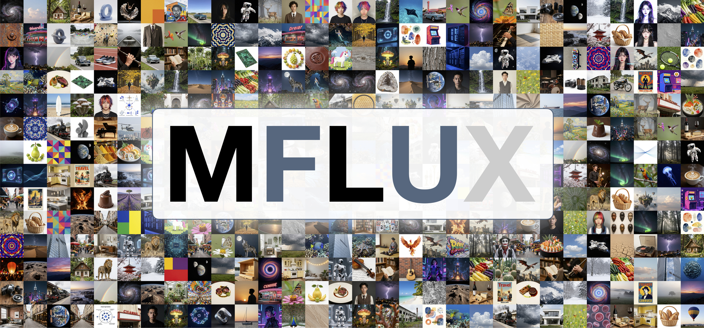

### About

Run the latest state-of-the-art generative image models locally on your Mac in native MLX!

### Table of contents

- [💡 Philosophy](#-philosophy)
- [💿 Installation](#-installation)
- [🎨 Models](#-models)
- [✨ Features](#-features)
- [🌱 Related projects](#related-projects)
- [🙏 Acknowledgements](#-acknowledgements)
- [⚖️ License](#%EF%B8%8F-license)

---

### 💡 Philosophy

MFLUX is a line-by-line MLX port of several state-of-the-art generative image model implementations from the [Huggingface Diffusers](https://github.com/huggingface/diffusers) and [Huggingface Transformers](https://github.com/huggingface/transformers) libraries.
MFLUX is purposefully kept minimal and explicit - Network architectures are hardcoded and no config files are used
except for the tokenizers. All models are implemented from scratch in MLX and only the tokenizers are used via the [Huggingface Transformers](https://github.com/huggingface/transformers) library. Other than that, there are only minimal dependencies like [Numpy](https://numpy.org) and [Pillow](https://pypi.org/project/pillow/) for simple image post-processing.

---

### 💿 Installation
If you haven't already, [install `uv`](https://github.com/astral-sh/uv?tab=readme-ov-file#installation), then run:

```sh
uv tool install --upgrade mflux --prerelease=allow
```

After installation, the following command shows all available MFLUX CLI commands: 

```sh
uv tool list 
```

To generate your first image using, for example, the z-image-turbo model, run

```
mflux-generate-z-image-turbo \
  --prompt "A puffin standing on a cliff" \
  --width 1280 \
  --height 500 \
  --seed 42 \
  --steps 9 \
  -q 8
```


The first time you run this, the model will automatiaclly download which can take some time. See the model section below for the different options and features. See the ... 

---

### 🎨 Models

MFLUX supports the following model families. They have different strengths and weaknesses; see each model’s README for full usage details.

| Model | Release date | Size | Type | Description |
| --- | --- | --- | --- | --- |
|[Z-Image](src/mflux/models/z_image/README.md) | Nov 2025 | 6B | Distilled | Best all-rounder: fast, small, very good quality and realism. |
|[FLUX.2](src/mflux/models/flux2/README.md) | Jan 2026 | 4B & 9B | Distilled | Fastest + smallest with very good qaility and edit capabilities. |
|[FIBO](src/mflux/models/fibo/README.md) | Oct 2025 | 8B | Base | Very good JSON-based prompt understanding and editability, medium speed |
|[SeedVR2](src/mflux/models/seedvr2/README.md) | Jun 2025 | 3B | — | Best upscaling model. |
|[Qwen Image](src/mflux/models/qwen/README.md) | Aug 2025+ | 20B | Base | Large model (slower); strong prompt understanding and world knowledge. Has edit capabilities |
|[FLUX.1](src/mflux/models/flux/README.md) | Aug 2024 | 12B | Distilled & Base | Legacy option with decent quality. Has edit capabilities with 'Kontext' model and upscaling support via ControlNet |
|[Depth Pro](src/mflux/models/depth_pro/README.md) | Oct 2024 | — | — | Very fast and accurate depth estimation model from Apple. |

#### ✨ Features

**General**
- Quantization and local model loading
- LoRA support (multi-LoRA, scales, library lookup)
- Metadata export + reuse, plus prompt file support

**Model-specific highlights**
- Text-to-image and image-to-image generation.
- In-context editing, multi-image editing, and virtual try-on
- ControlNet (Canny), depth conditioning, fill/inpainting, and Redux
- Upscaling (SeedVR2 and Flux ControlNet)
- LoRA finetuning using the Dreambooth technique
- Depth map extraction and FIBO prompt tooling (VLM inspire/refine)

See the [common model README](src/mflux/models/common/README.md) for detailed usage and examples, and use the model section above to browse specific models and capabilities.


---

<a id="related-projects"></a>

### 🌱 Related projects

- [MindCraft Studio](https://themindstudio.cc/mindcraft#models) by [@shaoju](https://github.com/shaoju)
- [Mflux-ComfyUI](https://github.com/raysers/Mflux-ComfyUI) by [@raysers](https://github.com/raysers)
- [MFLUX-WEBUI](https://github.com/CharafChnioune/MFLUX-WEBUI) by [@CharafChnioune](https://github.com/CharafChnioune)
- [mflux-fasthtml](https://github.com/anthonywu/mflux-fasthtml) by [@anthonywu](https://github.com/anthonywu)
- [mflux-streamlit](https://github.com/elitexp/mflux-streamlit) by [@elitexp](https://github.com/elitexp)

---

### 🙏 Acknowledgements

MFLUX would not be possible without the great work of:

- The MLX Team for [MLX](https://github.com/ml-explore/mlx) and [MLX examples](https://github.com/ml-explore/mlx-examples)
- Black Forest Labs for the [FLUX project](https://github.com/black-forest-labs/flux)
- Tongyi Lab for the [Z-Image project](https://tongyi-mai.github.io/Z-Image-blog/)
- Qwen Team for the [Qwen Image project](https://qwen.ai/blog?id=a6f483777144685d33cd3d2af95136fcbeb57652&from=research.research-list)
- ByteDance, @numz and @adrientoupet for the [SeedVR2 project](https://github.com/numz/ComfyUI-SeedVR2_VideoUpscaler)
- Hugging Face for the [Diffusers library implementations](https://github.com/huggingface/diffusers) 
- Depth Pro authors for the [Depth Pro model](https://github.com/apple/ml-depth-pro?tab=readme-ov-file#citation)
- The MLX community and all [contributors and testers](https://github.com/filipstrand/mflux/graphs/contributors)

---

### ⚖️ License

This project is licensed under the [MIT License](LICENSE).
