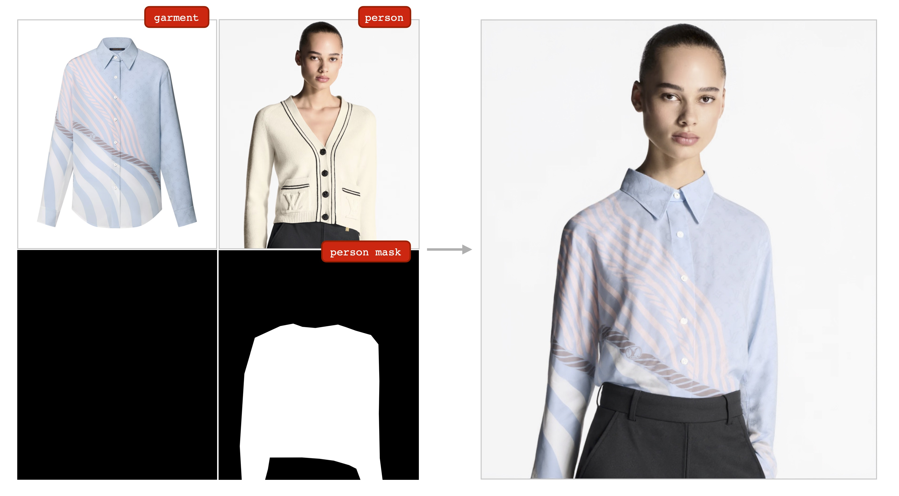
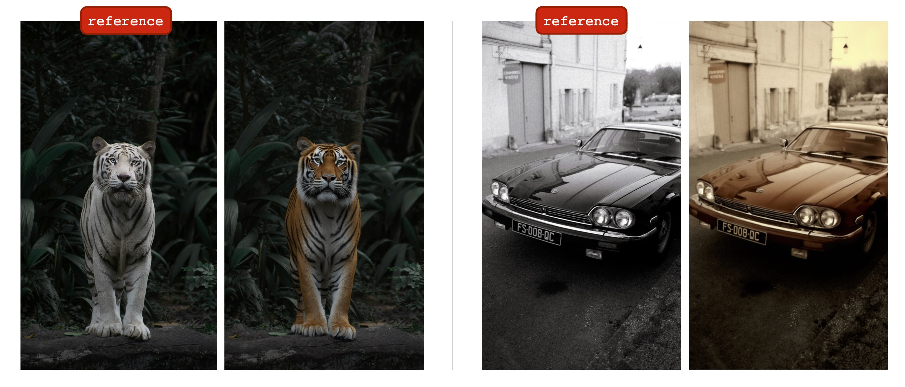
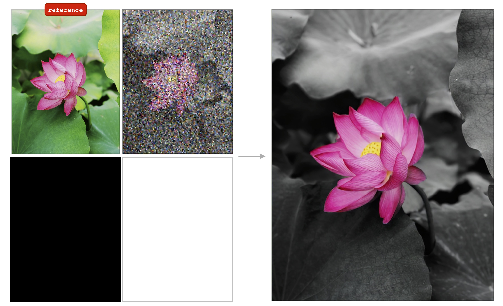
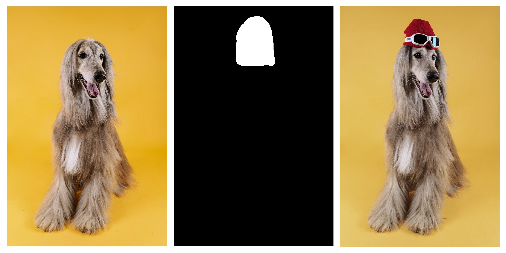
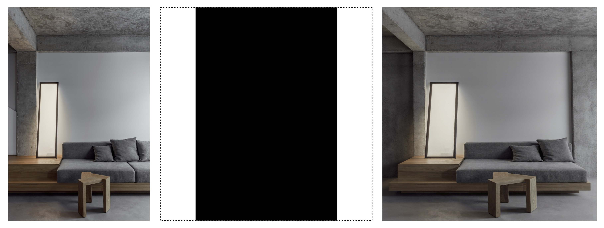
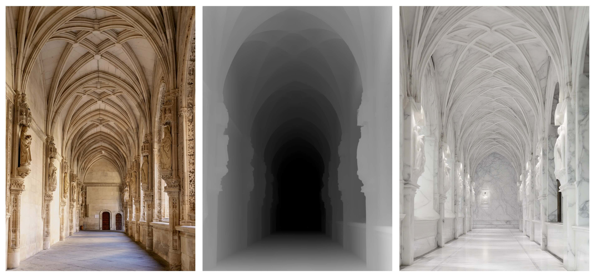
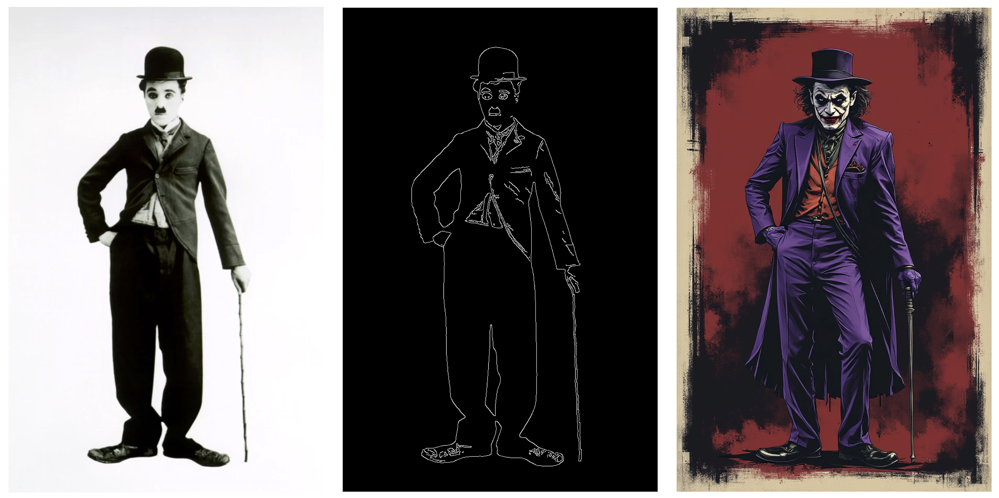
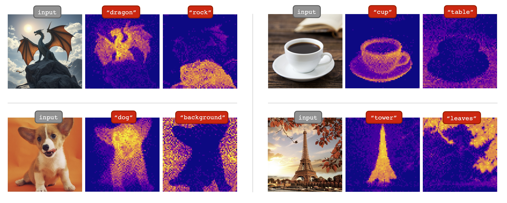
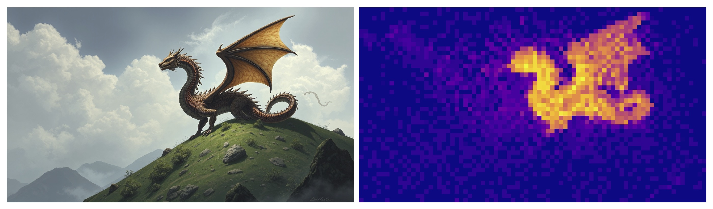

*A MLX port of FLUX based on the Huggingface Diffusers implementation.*


### About

Run the powerful [FLUX](https://blackforestlabs.ai/#get-flux) models from [Black Forest Labs](https://blackforestlabs.ai) locally on your Mac!

### Table of contents

<!-- TOC start (generated with https://github.com/derlin/bitdowntoc) -->

- [Philosophy](#philosophy)
- [💿 Installation](#-installation)
- [🖼️ Generating an image](#%EF%B8%8F-generating-an-image)
  * [📜 Full list of Command-Line Arguments](#-full-list-of-command-line-arguments)
- [⏱️ Image generation speed (updated)](#%EF%B8%8F-image-generation-speed-updated)
- [↔️ Equivalent to Diffusers implementation](#%EF%B8%8F-equivalent-to-diffusers-implementation)
- [🗜️ Quantization](#%EF%B8%8F-quantization)
  * [📊 Size comparisons for quantized models](#-size-comparisons-for-quantized-models)
  * [💾 Saving a quantized version to disk](#-saving-a-quantized-version-to-disk)
  * [💽 Loading and running a quantized version from disk](#-loading-and-running-a-quantized-version-from-disk)
- [💽 Running a non-quantized model directly from disk](#-running-a-non-quantized-model-directly-from-disk)
- [🌐 Third-Party HuggingFace Model Support](#-third-party-huggingface-model-support)
- [🎨 Image-to-Image](#-image-to-image)
- [🔌 LoRA](#-lora)
  * [Multi-LoRA](#multi-lora)
  * [LoRA Library Path](#lora-library-path)
  * [Supported LoRA formats (updated)](#supported-lora-formats-updated)
- [🎭 In-Context Generation](#-in-context-generation)
  * [🎨 In-Context LoRA](#-in-context-lora)
    + [Available Styles](#available-styles)
    + [How It Works](#how-it-works)
    + [Tips for Best Results](#tips-for-best-results)
  * [👕 CatVTON (Virtual Try-On)](#-catvton-virtual-try-on)
  * [✏️ IC-Edit (In-Context Editing)](#%EF%B8%8F-ic-edit-in-context-editing)
- [🛠️ Flux Tools](#%EF%B8%8F-flux-tools)
  * [🖌️ Fill](#%EF%B8%8F-fill)
    + [Inpainting](#inpainting)
    + [Outpainting](#outpainting)
  * [🔍 Depth](#-depth)
  * [🔄 Redux](#-redux)
- [🕹️ Controlnet](#%EF%B8%8F-controlnet)
- [🔎 Upscale](#-upscale)
- [🎛️ Dreambooth fine-tuning](#-dreambooth-fine-tuning)
  * [Training configuration](#training-configuration)
  * [Training example](#training-example)
  * [Resuming a training run](#resuming-a-training-run)
  * [Configuration details](#configuration-details)
  * [Memory issues](#memory-issues)
  * [Misc](#misc)
- [🧠 Concept Attention](#-concept-attention)
- [🚧 Current limitations](#-current-limitations)
- [💡Workflow tips](#workflow-tips)
- [🔬 Cool research / features to support](#-cool-research--features-to-support-)
- [🌱‍ Related projects](#-related-projects)
- [🙏 Acknowledgements](#-acknowledgements)
- [⚖️ License](#-license)

<!-- TOC end -->

### Philosophy

MFLUX is a line-by-line port of the FLUX implementation in the [Huggingface Diffusers](https://github.com/huggingface/diffusers) library to [Apple MLX](https://github.com/ml-explore/mlx).
MFLUX is purposefully kept minimal and explicit - Network architectures are hardcoded and no config files are used
except for the tokenizers. The aim is to have a tiny codebase with the single purpose of expressing these models
(thereby avoiding too many abstractions). While MFLUX priorities readability over generality and performance, [it can still be quite fast](#%EF%B8%8F-image-generation-speed-updated), [and even faster quantized](#%EF%B8%8F-quantization).

All models are implemented from scratch in MLX and only the tokenizers are used via the
[Huggingface Transformers](https://github.com/huggingface/transformers) library. Other than that, there are only minimal dependencies
like [Numpy](https://numpy.org) and [Pillow](https://pypi.org/project/pillow/) for simple image post-processing.


### 💿 Installation
For users, the easiest way to install MFLUX is to use `uv tool`: If you have [installed `uv`](https://github.com/astral-sh/uv?tab=readme-ov-file#installation), simply:

```sh
uv tool install --upgrade mflux
```

to get the `mflux-generate` and related command line executables. You can skip to the usage guides below.

<details>
<summary>For Python 3.13 dev preview</summary>

The [T5 encoder](https://huggingface.co/docs/transformers/en/model_doc/t5) is dependent on [sentencepiece](https://pypi.org/project/sentencepiece/), which does not have a installable wheel artifact for Python 3.13 as of Nov 2024. Until Google [publishes a 3.13 wheel](https://pypi.org/project/sentencepiece/), you need to build your own wheel with [official build instructions](https://github.com/google/sentencepiece/blob/master/python/README.md#build-and-install-sentencepiece) or for your convenience use a `.whl` pre-built by contributor @anthonywu. The steps below should work for most developers though your system may vary.

```sh
uv venv --python 3.13
python -V  # e.g. Python 3.13.0rc2
source .venv/bin/activate

# for your convenience, you can use the contributor wheel
uv pip install https://github.com/anthonywu/sentencepiece/releases/download/0.2.1-py13dev/sentencepiece-0.2.1-cp313-cp313-macosx_11_0_arm64.whl

# enable the pytorch nightly 
uv pip install --pre --extra-index-url https://download.pytorch.org/whl/nightly -e .
```
</details>

<details>
<summary>For the classic way to create a user virtual environment:</summary>

```
mkdir -p mflux && cd mflux && python3 -m venv .venv && source .venv/bin/activate
```

This creates and activates a virtual environment in the `mflux` folder. After that, install MFLUX via pip:

```
pip install -U mflux
```

</details>

<details>
<summary>For contributors (click to expand)</summary>

1. Clone the repo:
```sh
 git clone git@github.com:filipstrand/mflux.git
 ```
2. Install the application

```sh
 make install
 ```
3. To run the test suite
```sh
 make test
 ```
4. Follow format and lint checks prior to submitting Pull Requests. The recommended `make lint` and `make format` installs and uses [`ruff`](https://github.com/astral-sh/ruff). You can setup your editor/IDE to lint/format automatically, or use our provided `make` helpers:
  - `make format` - formats your code
  - `make lint` - shows your lint errors and warnings, but does not auto fix
  - `make check` - via `pre-commit` hooks, formats your code **and** attempts to auto fix lint errors
  - consult official [`ruff` documentation](https://docs.astral.sh/ruff/) on advanced usages

</details>

*If you have trouble installing MFLUX, please see the [installation related issues section](https://github.com/filipstrand/mflux/issues?q=is%3Aissue+install+).* 

### 🖼️ Generating an image

Run the command `mflux-generate` by specifying a prompt and the model and some optional arguments. For example, here we use a quantized version of the `schnell` model for 2 steps:

```sh
mflux-generate --model schnell --prompt "Luxury food photograph" --steps 2 --seed 2 -q 8
```

This example uses the more powerful `dev` model with 25 time steps:

```sh
mflux-generate --model dev --prompt "Luxury food photograph" --steps 25 --seed 2 -q 8
```

You can also pipe prompts from other commands using stdin:

```sh
echo "A majestic mountain landscape" | mflux-generate --prompt - --model schnell --steps 2
```

This is useful for integrating MFLUX into shell scripts or dynamically generating prompts using LLM inference tools such as [`llm`](https://llm.datasette.io/en/stable/), [`mlx-lm`](https://github.com/ml-explore/mlx-lm), [`ollama`](https://ollama.ai/), etc.

⚠️ *If the specific model is not already downloaded on your machine, it will start the download process and fetch the model weights (~34GB in size for the Schnell or Dev model respectively). See the [quantization](#%EF%B8%8F-quantization) section for running compressed versions of the model.* ⚠️

*By default, model files are downloaded to the `.cache` folder within your home directory. For example, in my setup, the path looks like this:*

```
/Users/filipstrand/.cache/huggingface/hub/models--black-forest-labs--FLUX.1-dev
```

*To change this default behavior, you can do so by modifying the `HF_HOME` environment variable. For more details on how to adjust this setting, please refer to the [Hugging Face documentation](https://huggingface.co/docs/huggingface_hub/en/package_reference/environment_variables)*.

🔒 [FLUX.1-dev currently requires granted access to its Huggingface repo. For troubleshooting, see the issue tracker](https://github.com/filipstrand/mflux/issues/14) 🔒

#### 📜 Full list of Command-Line Arguments

- **`--prompt`** (required, `str`): Text description of the image to generate. Use `-` to read the prompt from stdin (e.g., `echo "A beautiful sunset" | mflux-generate --prompt -`).

- **`--model`** or **`-m`** (required, `str`): Model to use for generation. Can be one of the official models (`"schnell"` or `"dev"`) or a HuggingFace repository ID for a compatible third-party model (e.g., `"Freepik/flux.1-lite-8B-alpha"`).

- **`--base-model`** (optional, `str`, default: `None`): Specifies which base architecture a third-party model is derived from (`"schnell"` or `"dev"`). Required when using third-party models from HuggingFace.

- **`--output`** (optional, `str`, default: `"image.png"`): Output image filename. If `--seed` or `--auto-seeds` establishes multiple seed values, the output filename will automatically be modified to include the seed value (e.g., `image_seed_42.png`).

- **`--seed`** (optional, repeatable `int` args, default: `None`): 1 or more seeds for random number generation. e.g. `--seed 42` or `--seed 123 456 789`. When multiple seeds are provided, MFLUX will generate one image per seed, using the same prompt and settings. Default is a single time-based value.

- **`--auto-seeds`** (optional, `int`, default: `None`): Auto generate N random Seeds in a series of image generations. For example, `--auto-seeds 5` will generate 5 different images with 5 different random seeds. This is superseded by explicit `--seed` arguments and `seed` values in `--config-from-metadata` files.

- **`--height`** (optional, `int`, default: `1024`): Height of the output image in pixels.

- **`--width`** (optional, `int`, default: `1024`): Width of the output image in pixels.

- **`--steps`** (optional, `int`, default: `4`): Number of inference steps.

- **`--guidance`** (optional, `float`, default: `3.5`): Guidance scale (only used for `"dev"` model).

- **`--path`** (optional, `str`, default: `None`): Path to a local model on disk.

- **`--quantize`** or **`-q`** (optional, `int`, default: `None`): [Quantization](#%EF%B8%8F-quantization) (choose between `3`, `4`, `6`, or `8` bits).

- **`--lora-paths`** (optional, `[str]`, default: `None`): The paths to the [LoRA](#-LoRA) weights.

- **`--lora-scales`** (optional, `[float]`, default: `None`): The scale for each respective [LoRA](#-LoRA) (will default to `1.0` if not specified and only one LoRA weight is loaded.)

- **`--metadata`** (optional): Exports a `.json` file containing the metadata for the image with the same name. (Even without this flag, the image metadata is saved and can be viewed using `exiftool image.png`)

- **`--image-path`** (optional, `str`, default: `None`): Local path to the initial image for image-to-image generation.

- **`--image-strength`** (optional, `float`, default: `0.4`): Controls how strongly the initial image influences the output image. A value of `0.0` means no influence. (Default is `0.4`)

- **`--config-from-metadata`** or **`-C`** (optional, `str`): [EXPERIMENTAL] Path to a prior file saved via `--metadata`, or a compatible handcrafted config file adhering to the expected args schema.

- **`--low-ram`** (optional): Reduces GPU memory usage by limiting the MLX cache size and releasing text encoders and transformer components after use (single image generation only). While this may slightly decrease performance, it helps prevent system memory swapping to disk, allowing image generation on systems with limited RAM.

- **`--battery-percentage-stop-limit`** or **`-B`** (optional, `int`, default: `5`): On Mac laptops powered by battery, automatically stops image generation when battery percentage reaches this threshold. Prevents your Mac from shutting down and becoming unresponsive during long generation sessions.

- **`--lora-name`** (optional, `str`, default: `None`): The name of the LoRA to download from Hugging Face.

- **`--lora-repo-id`** (optional, `str`, default: `"ali-vilab/In-Context-LoRA"`): The Hugging Face repository ID for LoRAs.

- **`--stepwise-image-output-dir`** (optional, `str`, default: `None`): [EXPERIMENTAL] Output directory to write step-wise images and their final composite image to. This feature may change in future versions. When specified, MFLUX will save an image for each denoising step, allowing you to visualize the generation process from noise to final image.

- **`--vae-tiling`** (optional, flag): Enable VAE tiling to reduce memory usage during the decoding phase. This splits the image into smaller chunks for processing, which can prevent out-of-memory errors when generating high-resolution images. Note that this optimization may occasionally produce a subtle seam in the middle of the image, but it's often worth the tradeoff for being able to generate images that would otherwise cause your system to run out of memory.

- **`--vae-tiling-split`** (optional, `str`, default: `"horizontal"`): When VAE tiling is enabled, this parameter controls the direction to split the latents. Options are `"horizontal"` (splits into top/bottom) or `"vertical"` (splits into left/right). Use this option to control where potential seams might appear in the final image.

#### 📜 In-Context LoRA Command-Line Arguments

The `mflux-generate-in-context` command supports most of the same arguments as `mflux-generate`, with these additional parameters:

- **`--image-path`** (required, `str`): Path to the reference image that will guide the style of the generated image.

- **`--lora-style`** (optional, `str`, default: `None`): The style to use for In-Context LoRA generation. Choose from: `couple`, `storyboard`, `font`, `home`, `illustration`, `portrait`, `ppt`, `sandstorm`, `sparklers`, or `identity`.

See the [In-Context Generation](#-in-context-generation) section for more details on how to use this feature effectively.

#### 📜 CatVTON Command-Line Arguments

The `mflux-generate-in-context-catvton` command supports most of the same arguments as `mflux-generate`, with these specific parameters:

- **`--person-image`** (required, `str`): Path to the person image who will "wear" the garment.

- **`--person-mask`** (required, `str`): Path to a binary mask image indicating where the garment should be applied on the person.

- **`--garment-image`** (required, `str`): Path to the garment image to be virtually worn.

- **`--save-full-image`** (optional, flag): Additionally save the full side-by-side image containing both the garment reference and the result.

See the [CatVTON (Virtual Try-On)](#-catvton-virtual-try-on) section for more details on this feature.

#### 📜 IC-Edit Command-Line Arguments

The `mflux-generate-in-context-edit` command supports most of the same arguments as `mflux-generate`, with these specific parameters:

- **`--reference-image`** (required, `str`): Path to the reference image to be edited.

- **`--instruction`** (optional, `str`): Simple text instruction describing the desired edit (e.g., "make the hair black"). This will be automatically formatted as a diptych template. Either `--instruction` or `--prompt` is required.

- **`--save-full-image`** (optional, flag): Additionally save the full side-by-side image showing the original and edited versions.

**Note**: The IC-Edit tool automatically downloads and applies the required LoRA, and optimizes the resolution to 512px width for best results.

See the [IC-Edit (In-Context Editing)](#-ic-edit-in-context-editing) section for more details on this feature.

#### 📜 Redux Tool Command-Line Arguments

The `mflux-generate-redux` command uses most of the same arguments as `mflux-generate`, with these specific parameters:

- **`--redux-image-paths`** (required, `[str]`): Paths to one or more reference images to influence the generation.

- **`--redux-image-strengths`** (optional, `[float]`, default: `[1.0, 1.0, ...]`): Strength values (between 0.0 and 1.0) for each reference image. Higher values give more influence to that reference image. If not provided, all images use a strength of 1.0.

See the [Redux](#-redux) section for more details on this feature.

#### 📜 Concept Attention Command-Line Arguments

The `mflux-concept` command supports most of the same arguments as `mflux-generate`, with these specific parameters:

- **`--concept`** (required, `str`): The concept prompt to use for attention visualization. This defines what specific aspect or element you want to analyze within your generated image.

- **`--heatmap-layer-indices`** (optional, `[int]`, default: `[15, 16, 17, 18]`): Transformer layer indices to use for heatmap generation. These layers capture different levels of abstraction in the attention mechanism.

- **`--heatmap-timesteps`** (optional, `[int]`, default: `None`): Timesteps to use for heatmap generation. If not specified, all timesteps are used. Lower timestep values focus on early stages of generation.

The `mflux-concept-from-image` command uses most of the same arguments as `mflux-concept`, with this additional parameter:

- **`--input-image-path`** (required, `str`): Path to a reference image for concept attention analysis. The model will analyze how the concept appears in this reference image and apply similar attention patterns to the generated image.

See the [Concept Attention](#-concept-attention) section for more details on this feature.

#### 📜 Fill Tool Command-Line Arguments

The `mflux-generate-fill` command supports most of the same arguments as `mflux-generate`, with these specific parameters:

- **`--image-path`** (required, `str`): Path to the original image that will be modified.

- **`--masked-image-path`** (required, `str`): Path to a binary mask image where white areas (255) will be regenerated and black areas (0) will be preserved.

- **`--guidance`** (optional, `float`, default: `30.0`): The Fill tool works best with higher guidance values compared to regular image generation.

See the [Fill](#-fill) section for more details on inpainting and outpainting.

#### 📜 Depth Tool Command-Line Arguments

The `mflux-generate-depth` command supports most of the same arguments as `mflux-generate`, with these specific parameters:

- **`--image-path`** (optional, `str`, default: `None`): Path to the reference image from which to extract a depth map. Either this or `--depth-image-path` must be provided.

- **`--depth-image-path`** (optional, `str`, default: `None`): Path to a pre-generated depth map image. Either this or `--image-path` must be provided.

The `mflux-save-depth` command for extracting depth maps without generating images has these arguments:

- **`--image-path`** (required, `str`): Path to the image from which to extract a depth map.

- **`--output`** (optional, `str`, default: Uses the input filename with "_depth" suffix): Path where the generated depth map will be saved.

- **`--quantize`** or **`-q`** (optional, `int`, default: `None`): Quantization for the Depth Pro model.

See the [Depth](#-depth) section for more details on this feature.

#### 📜 ControlNet Command-Line Arguments

The `mflux-generate-controlnet` command supports most of the same arguments as `mflux-generate`, with these additional parameters:

- **`--controlnet-image-path`** (required, `str`): Path to the local image used by ControlNet to guide output generation.

- **`--controlnet-strength`** (optional, `float`, default: `0.4`): Degree of influence the control image has on the output. Ranges from `0.0` (no influence) to `1.0` (full influence).

- **`--controlnet-save-canny`** (optional, bool, default: `False`): If set, saves the Canny edge detection reference image used by ControlNet.

See the [Controlnet](#%EF%B8%8F-controlnet) section for more details on how to use this feature effectively.


#### Dynamic Prompts with `--prompt-file`

MFlux supports dynamic prompt updates through the `--prompt-file` option. Instead of providing a fixed prompt with `--prompt`, you can specify a plain text file containing your prompt. The file is re-read before each generation, allowing you to modify prompts between iterations without restarting.

##### Key Benefits

- **Real-time Prompt Editing**: Edit prompts between generations while the program continues running
- **Iterative Refinement**: Fine-tune prompts based on previous results in a batch
- **Editor Integration**: Work with complex prompts in your preferred text editor
- **Consistent Parameters**: Experiment with prompt variations while keeping all other settings constant

##### Example Usage

```bash
# Generate 10 images using a prompt from a file
mflux-generate --prompt-file my_prompt.txt --auto-seeds 10
```

##### Workflow Example

1. Create a prompt file:
   ```
   echo "a surreal landscape with floating islands" > my_prompt.txt
   ```

2. Start a batch generation:
   ```
   mflux-generate --prompt-file my_prompt.txt --auto-seeds 10
   ```

3. After reviewing initial results, edit the prompt file while generation continues:
   ```
   echo "a surreal landscape with floating islands and waterfalls" > my_prompt.txt
   ```

4. Subsequent generations will automatically use your updated prompt

5. Continue refining as needed between generations

##### Notes

- `--prompt` and `--prompt-file` are mutually exclusive options
- Empty prompt files or non-existent files will raise appropriate errors
- Each generated image's metadata will contain the actual prompt used for that specific generation

#### 📜 Training Arguments

- **`--train-config`** (optional, `str`): Local path of the training configuration file. This file defines all aspects of the training process including model parameters, optimizer settings, and training data. See the [Training configuration](#training-configuration) section for details on the structure of this file.

- **`--train-checkpoint`** (optional, `str`): Local path of the checkpoint file which specifies how to continue the training process. Used when resuming an interrupted training run.


<details>
<summary>parameters supported by config files</summary>

#### How configs are used

- all config properties are optional and applied to the image generation if applicable
- invalid or incompatible properties will be ignored

#### Config schema

```json
{
  "$schema": "http://json-schema.org/draft-07/schema#",
  "type": "object",
  "properties": {
    "seed": {
      "type": ["integer", "null"]
    },
    "steps": {
      "type": ["integer", "null"]
    },
    "guidance": {
      "type": ["number", "null"]
    },
    "quantize": {
      "type": ["null", "string"]
    },
    "lora_paths": {
      "type": ["array", "null"],
      "items": {
        "type": "string"
      }
    },
    "lora_scales": {
      "type": ["array", "null"],
      "items": {
        "type": "number"
      }
    },
    "prompt": {
      "type": ["string", "null"]
    }
  }
}
```

#### Example

```json
{
  "model": "dev",
  "seed": 42,
  "steps": 8,
  "guidance": 3.0,
  "quantize": 4,
  "lora_paths": [
    "/some/path1/to/subject.safetensors",
    "/some/path2/to/style.safetensors"
  ],
  "lora_scales": [
    0.8,
    0.4
  ],
  "prompt": "award winning modern art, MOMA"
}
```
</details>

Or, with the correct python environment active, create and run a separate script like the following:

```python
from mflux import Flux1, Config

# Load the model
flux = Flux1.from_name(
   model_name="schnell",  # "schnell" or "dev"
   quantize=8,            # 4 or 8
)

# Generate an image
image = flux.generate_image(
   seed=2,
   prompt="Luxury food photograph",
   config=Config(
      num_inference_steps=2,  # "schnell" works well with 2-4 steps, "dev" works well with 20-25 steps
      height=1024,
      width=1024,
   )
)

image.save(path="image.png")
```

For more options on how to configure MFLUX, please see [generate.py](src/mflux/generate.py).

### ⏱️ Image generation speed (updated)

These numbers are based on the *non-quantized* `schnell` model, with the configuration provided in the code snippet below.
To time your machine, run the following:
```sh
time mflux-generate \
--prompt "Luxury food photograph" \
--model schnell \
--steps 2 \
--seed 2 \
--height 1024 \
--width 1024
```

To find out the spec of your machine (including number of CPU cores, GPU cores, and memory, run the following command:
```sh
system_profiler SPHardwareDataType SPDisplaysDataType
```

| Device      | M-series            | User                                                                                                                               | Reported Time | Notes                           |
|-------------|---------------------|------------------------------------------------------------------------------------------------------------------------------------|---------------|---------------------------------|
| Mac Studio  | 2023 M2 Ultra       | [@awni](https://x.com/awnihannun/status/1823515121827897385)                                                                       | <15s          |                                 |
| Macbook Pro | 2024 M4 Max (128GB) | [@ivanfioravanti](https://gist.github.com/awni/a67d16d50f0f492d94a10418e0592bde?permalink_comment_id=5153531#gistcomment-5153531)  | ~19s          |                                 |
| Macbook Pro | 2023 M3 Max         | [@karpathy](https://gist.github.com/awni/a67d16d50f0f492d94a10418e0592bde?permalink_comment_id=5153531#gistcomment-5153531)        | ~20s          |                                 |
| -           | 2023 M2 Max (96GB)  | [@explorigin](https://github.com/filipstrand/mflux/issues/6)                                                                       | ~25s          |                                 |
| Mac Mini    | 2024 M4 Pro (64GB)  | [@Stoobs](https://github.com/filipstrand/mflux/issues/92)                                                                          | ~34s          |                                 |
| Mac Mini    | 2023 M2 Pro (32GB)  | [@leekichko](https://github.com/filipstrand/mflux/issues/85)                                                                       | ~54s          |                                 |
| -           | 2022 M1 MAX (64GB)  | [@BosseParra](https://x.com/BosseParra/status/1826191780812877968)                                                                 | ~55s          |                                 |
| Macbook Pro | 2023 M2 Max (32GB)  | @filipstrand                                                                                                                       | ~70s          |                                 |
| -           | 2023 M3 Pro (36GB)  | [@kush-gupt](https://github.com/filipstrand/mflux/issues/11)                                                                       | ~80s          |                                 |
| Mac Mini    | 2024 M4 (16GB)      | [@wnma3mz](https://github.com/filipstrand/mflux/issues/105)                                                                        | ~97s          | 512 x 512, 8-bit quantization   |
| Macbook Pro | 2021 M1 Pro (32GB)  | @filipstrand                                                                                                                       | ~160s         |                                 |
| -           | 2021 M1 Pro (16GB)  | [@qw-in](https://github.com/filipstrand/mflux/issues/7)                                                                            | ~175s         | Might freeze your mac           |
| Macbook Air | 2020 M1 (8GB)       | [@mbvillaverde](https://github.com/filipstrand/mflux/issues/13)                                                                    | ~335s         | With resolution 512 x 512       |


*Note that these numbers includes starting the application from scratch, which means doing model i/o, setting/quantizing weights etc.
If we assume that the model is already loaded, you can inspect the image metadata using `exiftool image.png` and see the total duration of the denoising loop (excluding text embedding).*

*These benchmarks are not very scientific and is only intended to give ballpark numbers. They were performed during different times with different MFLUX and MLX-versions etc. Additional hardware information such as number of GPU cores, Mac device etc. are not always known.*

### ↔️ Equivalent to Diffusers implementation

There is only a single source of randomness when generating an image: The initial latent array.
In this implementation, this initial latent is fully deterministically controlled by the input `seed` parameter.
However, if we were to import a fixed instance of this latent array saved from the Diffusers implementation, then MFLUX will produce an identical image to the Diffusers implementation (assuming a fixed prompt and using the default parameter settings in the Diffusers setup).


The images below illustrate this equivalence.
In all cases the Schnell model was run for 2 time steps.
The Diffusers implementation ran in CPU mode.
The precision for MFLUX can be set in the [Config](src/mflux/config/config.py) class.
There is typically a noticeable but very small difference in the final image when switching between 16bit and 32bit precision.

---
```
Luxury food photograph
```


---
```
detailed cinematic dof render of an old dusty detailed CRT monitor on a wooden desk in a dim room with items around, messy dirty room. On the screen are the letters "FLUX" glowing softly. High detail hard surface render
```


---

```
photorealistic, lotr, A tiny red dragon curled up asleep inside a nest, (Soft Focus) , (f_stop 2.8) , (focal_length 50mm) macro lens f/2. 8, medieval wizard table, (pastel) colors, (cozy) morning light filtering through a nearby window, (whimsical) steam shapes, captured with a (Canon EOS R5) , highlighting (serene) comfort, medieval, dnd, rpg, 3d, 16K, 8K
```


---


```
A weathered fisherman in his early 60s stands on the deck of his boat, gazing out at a stormy sea. He has a thick, salt-and-pepper beard, deep-set blue eyes, and skin tanned and creased from years of sun exposure. He's wearing a yellow raincoat and hat, with water droplets clinging to the fabric. Behind him, dark clouds loom ominously, and waves crash against the side of the boat. The overall atmosphere is one of tension and respect for the power of nature.
```


---

```
Luxury food photograph of an italian Linguine pasta alle vongole dish with lots of clams. It has perfect lighting and a cozy background with big bokeh and shallow depth of field. The mood is a sunset balcony in tuscany.  The photo is taken from the side of the plate. The pasta is shiny with sprinkled parmesan cheese and basil leaves on top. The scene is complemented by a warm, inviting light that highlights the textures and colors of the ingredients, giving it an appetizing and elegant look.
```


---

### 🗜️ Quantization

MFLUX supports running FLUX in 3, 4, 6, or 8-bit quantized mode. Running a quantized version can greatly speed up the
generation process and reduce the memory consumption by several gigabytes. [Quantized models also take up less disk space](#-size-comparisons-for-quantized-models).

```sh
mflux-generate \
    --model schnell \
    --steps 2 \
    --seed 2 \
    --quantize 8 \
    --height 1920 \
    --width 1024 \
    --prompt "Tranquil pond in a bamboo forest at dawn, the sun is barely starting to peak over the horizon, panda practices Tai Chi near the edge of the pond, atmospheric perspective through the mist of morning dew, sunbeams, its movements are graceful and fluid — creating a sense of harmony and balance, the pond's calm waters reflecting the scene, inviting a sense of meditation and connection with nature, style of Howard Terpning and Jessica Rossier"
```


*In this example, weights are quantized at **runtime** - this is convenient if you don't want to [save a quantized copy of the weights to disk](#-saving-a-quantized-version-to-disk), but still want to benefit from the potential speedup and RAM reduction quantization might bring.*


By selecting the `--quantize` or `-q` flag to be `4`, `8`, or removing it entirely, we get all 3 images above. As can be seen, there is very little difference between the images (especially between the 8-bit, and the non-quantized result).
Image generation times in this example are based on a 2021 M1 Pro (32GB) machine. Even though the images are almost identical, there is a ~2x speedup by
running the 8-bit quantized version on this particular machine. Unlike the non-quantized version, for the 8-bit version the swap memory usage is drastically reduced and GPU utilization is close to 100% during the whole generation. Results here can vary across different machines.

For systems with limited RAM, you can also use the `--low-ram` option which reduces GPU memory usage by constraining the MLX cache size and releasing text encoders and transformer components after use. This option is particularly helpful for preventing system memory swapping to disk on machines with less available RAM.

#### 📊 Size comparisons for quantized models

The model sizes for both `schnell` and `dev` at various quantization levels are as follows:

| 3 bit  | 4 bit  | 6 bit   | 8 bit   | Original (16 bit) |
|--------|--------|---------|---------|-------------------|
| 7.52GB | 9.61GB | 13.81GB | 18.01GB | 33.73GB           |


#### 💾 Saving a quantized version to disk

To save a local copy of the quantized weights, run the `mflux-save` command like so:

```sh
mflux-save \
    --path "/Users/filipstrand/Desktop/schnell_8bit" \
    --model schnell \
    --quantize 8
```

*Note that when saving a quantized version, you will need the original huggingface weights.*

It is also possible to specify [LoRA](#-lora) adapters when saving the model, e.g

```sh
mflux-save \
    --path "/Users/filipstrand/Desktop/schnell_8bit" \
    --model schnell \
    --quantize 8 \
    --lora-paths "/path/to/lora.safetensors" \
    --lora-scales 0.7
```

When generating images with a model like this, no LoRA adapter is needed to be specified since
it is already baked into the saved quantized weights.

#### 💽 Loading and running a quantized version from disk

To generate a new image from the quantized model, simply provide a `--path` to where it was saved:

```sh
mflux-generate \
    --path "/Users/filipstrand/Desktop/schnell_8bit" \
    --model schnell \
    --steps 2 \
    --seed 2 \
    --height 1920 \
    --width 1024 \
    --prompt "Tranquil pond in a bamboo forest at dawn, the sun is barely starting to peak over the horizon, panda practices Tai Chi near the edge of the pond, atmospheric perspective through the mist of morning dew, sunbeams, its movements are graceful and fluid — creating a sense of harmony and balance, the pond's calm waters reflecting the scene, inviting a sense of meditation and connection with nature, style of Howard Terpning and Jessica Rossier"
```

*Note: When loading a quantized model from disk, there is no need to pass in `-q` flag, since we can infer this from the weight metadata.*

*Also Note: Once we have a local model (quantized [or not](#-running-a-non-quantized-model-directly-from-disk)) specified via the `--path` argument, the huggingface cache models are not required to launch the model.
In other words, you can reclaim the 34GB diskspace (per model) by deleting the full 16-bit model from the [Huggingface cache](#%EF%B8%8F-generating-an-image) if you choose.*

⚠️ * Quantized models saved with mflux < v.0.6.0 will not work with v.0.6.0 and later due to updated implementation. The solution is to [save a new quantized local copy](https://github.com/filipstrand/mflux/issues/149) 

*If you don't want to download the full models and quantize them yourself, the 4-bit weights are available here for a direct download:*
- For mflux < v.0.6.0:
  - [madroid/flux.1-schnell-mflux-4bit](https://huggingface.co/madroid/flux.1-schnell-mflux-4bit)
  - [madroid/flux.1-dev-mflux-4bit](https://huggingface.co/madroid/flux.1-dev-mflux-4bit)
- For mflux >= v.0.6.0:
  - [dhairyashil/FLUX.1-schnell-mflux-v0.6.2-4bit](https://huggingface.co/dhairyashil/FLUX.1-schnell-mflux-v0.6.2-4bit)
  - [dhairyashil/FLUX.1-dev-mflux-4bit](https://huggingface.co/dhairyashil/FLUX.1-dev-mflux-4bit)

<details>
<summary>Using the community model support, the quantized weights can be also be automatically downloaded</summary>

```sh
mflux-generate \
    --model "dhairyashil/FLUX.1-schnell-mflux-v0.6.2-4bit" \
    --base-model schnell \
    --steps 2 \
    --seed 2 \
    --prompt "Luxury food photograph"
```

</details>

### 💽 Running a non-quantized model directly from disk

MFLUX also supports running a non-quantized model directly from a custom location.
In the example below, the model is placed in `/Users/filipstrand/Desktop/schnell`:

```sh
mflux-generate \
    --path "/Users/filipstrand/Desktop/schnell" \
    --model schnell \
    --steps 2 \
    --seed 2 \
    --prompt "Luxury food photograph"
```

Note that the `--model` flag must be set when loading a model from disk.

Also note that unlike when using the typical `alias` way of initializing the model (which internally handles that the required resources are downloaded),
when loading a model directly from disk, we require the downloaded models to look like the following:

```
.
├── text_encoder
│   └── model.safetensors
├── text_encoder_2
│   ├── model-00001-of-00002.safetensors
│   └── model-00002-of-00002.safetensors
├── tokenizer
│   ├── merges.txt
│   ├── special_tokens_map.json
│   ├── tokenizer_config.json
│   └── vocab.json
├── tokenizer_2
│   ├── special_tokens_map.json
│   ├── spiece.model
│   ├── tokenizer.json
│   └── tokenizer_config.json
├── transformer
│   ├── diffusion_pytorch_model-00001-of-00003.safetensors
│   ├── diffusion_pytorch_model-00002-of-00003.safetensors
│   └── diffusion_pytorch_model-00003-of-00003.safetensors
└── vae
    └── diffusion_pytorch_model.safetensors
```
This mirrors how the resources are placed in the [HuggingFace Repo](https://huggingface.co/black-forest-labs/FLUX.1-schnell/tree/main) for FLUX.1.
*Huggingface weights, unlike quantized ones exported directly from this project, have to be
processed a bit differently, which is why we require this structure above.*

---

### 🌐 Third-Party HuggingFace Model Support

MFLUX now supports compatible third-party models from HuggingFace that follow the FLUX architecture. This opens up the ecosystem to community-created models that may offer different capabilities, sizes, or specializations.

To use a third-party model, specify the HuggingFace repository ID with the `--model` parameter and indicate which base architecture (dev or schnell) it's derived from using the `--base-model` parameter:

```sh
mflux-generate \
    --model Freepik/flux.1-lite-8B \
    --base-model schnell \
    --steps 4 \
    --seed 42 \
    --prompt "A beautiful landscape with mountains and a lake"
```

Some examples of compatible third-party models include:
- [Freepik/flux.1-lite-8B-alpha](https://huggingface.co/Freepik/flux.1-lite-8B-alpha) - A lighter version of FLUX
- [shuttleai/shuttle-3-diffusion](https://huggingface.co/shuttleai/shuttle-3-diffusion) - Shuttle's implementation based on FLUX

The model will be automatically downloaded from HuggingFace the first time you use it, similar to the official FLUX models.

*Note: Third-party models may have different performance characteristics, capabilities, or limitations compared to the official FLUX models. Always refer to the model's documentation on HuggingFace for specific usage instructions.*

---

### 🎨 Image-to-Image

One way to condition the image generation is by starting from an existing image and let MFLUX produce new variations.
Use the `--image-path` flag to specify the reference image, and the `--image-strength` to control how much the reference 
image should guide the generation. For example, given the reference image below, the following command produced the first
image using the  [Sketching](https://civitai.com/models/803456/sketching?modelVersionId=898364) LoRA: 

```sh
mflux-generate \
--prompt "sketching of an Eiffel architecture, masterpiece, best quality. The site is lit by lighting professionals, creating a subtle illumination effect. Ink on paper with very fine touches with colored markers, (shadings:1.1), loose lines, Schematic, Conceptual, Abstract, Gestural. Quick sketches to explore ideas and concepts." \
--image-path "reference.png" \
--image-strength 0.3 \
--lora-paths Architectural_Sketching.safetensors \
--lora-scales 1.0 \
--model dev \
--steps 20 \
--seed 43 \
--guidance 4.0 \
--quantize 8 \
--height 1024 \
--width 1024
```

Like with [Controlnet](#-controlnet), this technique combines well with [LoRA](#-lora) adapters:


In the examples above the following LoRAs are used [Sketching](https://civitai.com/models/803456/sketching?modelVersionId=898364), [Animation Shot](https://civitai.com/models/883914/animation-shot-flux-xl-ponyrealism) and [flux-film-camera](https://civitai.com/models/874708?modelVersionId=979175) are used.

---

### 🔌 LoRA

MFLUX support loading trained [LoRA](https://huggingface.co/docs/diffusers/en/training/lora) adapters (actual training support is coming).

The following example [The_Hound](https://huggingface.co/TheLastBen/The_Hound) LoRA from [@TheLastBen](https://github.com/TheLastBen):

```sh
mflux-generate --prompt "sandor clegane" --model dev --steps 20 --seed 43 -q 8 --lora-paths "sandor_clegane_single_layer.safetensors"
```


---

The following example is [Flux_1_Dev_LoRA_Paper-Cutout-Style](https://huggingface.co/Norod78/Flux_1_Dev_LoRA_Paper-Cutout-Style) LoRA from [@Norod78](https://huggingface.co/Norod78):

```sh
mflux-generate --prompt "pikachu, Paper Cutout Style" --model schnell --steps 4 --seed 43 -q 8 --lora-paths "Flux_1_Dev_LoRA_Paper-Cutout-Style.safetensors"
```


*Note that LoRA trained weights are typically trained with a **trigger word or phrase**. For example, in the latter case, the sentence should include the phrase **"Paper Cutout Style"**.*

*Also note that the same LoRA weights can work well with both the `schnell` and `dev` models. Refer to the original LoRA repository to see what mode it was trained for.*

#### Multi-LoRA

Multiple LoRAs can be sent in to combine the effects of the individual adapters. The following example combines both of the above LoRAs:

```sh
mflux-generate \
   --prompt "sandor clegane in a forest, Paper Cutout Style" \
   --model dev \
   --steps 20 \
   --seed 43 \
   --lora-paths sandor_clegane_single_layer.safetensors Flux_1_Dev_LoRA_Paper-Cutout-Style.safetensors \
   --lora-scales 1.0 1.0 \
   -q 8
```


Just to see the difference, this image displays the four cases: One of having both adapters fully active, partially active and no LoRA at all.
The example above also show the usage of `--lora-scales` flag.

#### LoRA Library Path

MFLUX supports a convenient LoRA library feature that allows you to reference LoRA files by their basename instead of full paths. This is particularly useful when you have a collection of LoRA files organized in one or more directories.

To use this feature, set the `LORA_LIBRARY_PATH` environment variable to point to your LoRA directories. You can specify multiple directories separated by colons (`:`):

```sh
export LORA_LIBRARY_PATH="/path/to/loras:/another/path/to/more/loras"
```

Once set, MFLUX will automatically discover all `.safetensors` files in these directories (including subdirectories) and allow you to reference them by their basename:

```sh
# Instead of using full paths:
mflux-generate \
    --prompt "a portrait" \
    --lora-paths "/path/to/loras/style1.safetensors" "/another/path/to/more/loras/style2.safetensors"

# You can simply use basenames:
mflux-generate \
    --prompt "a portrait" \
    --lora-paths "style1" "style2"
```

<details>
<summary>Notes on organizing your LoRA files</summary>

- The basename is the filename without the `.safetensors` extension
- If multiple files have the same basename, the first directory in `LORA_LIBRARY_PATH` takes precedence
  - to workaround this, rename or symlink to another name your `.safetensors` files to avoid conflicts
- Full paths still work as before, making this feature fully backwards compatible
- The library paths are scanned recursively, so LoRAs in subdirectories are also discovered. However, we do not recommend setting the library paths to a directory with a large number of files, as it can slow down the scanning process on every run.
</details>

#### Supported LoRA formats (updated)

Since different fine-tuning services can use different implementations of FLUX, the corresponding
LoRA weights trained on these services can be different from one another. The aim of MFLUX is to support the most common ones.
The following table show the current supported formats:

| Supported | Name      | Example                                                                                                  | Notes                               |
|-----------|-----------|----------------------------------------------------------------------------------------------------------|-------------------------------------|
| ✅        | BFL       | [civitai - Impressionism](https://civitai.com/models/545264/impressionism-sdxl-pony-flux)                | Many things on civitai seem to work |
| ✅        | Diffusers | [Flux_1_Dev_LoRA_Paper-Cutout-Style](https://huggingface.co/Norod78/Flux_1_Dev_LoRA_Paper-Cutout-Style/) |                                     |
| ❌        | XLabs-AI  | [flux-RealismLora](https://huggingface.co/XLabs-AI/flux-RealismLora/tree/main)                           |                                     |

To report additional formats, examples or other any suggestions related to LoRA format support, please see [issue #47](https://github.com/filipstrand/mflux/issues/47).

---

### 🎭 In-Context Generation

In-Context Generation is a powerful collection of techniques that allows you to generate images based on reference images and context, without requiring model fine-tuning. MFLUX supports multiple in-context approaches, each designed for specific use cases ranging from style transfer to virtual try-on and image editing.

**Note**: Black Forest Labs has announced [FLUX.1 Kontext](https://bfl.ai/models/flux-kontext), a new model suite designed specifically for text-and-image-driven generation and editing with advanced in-context capabilities. This official model may replace existing third-party implementations in the future. FLUX.1 Kontext offers character consistency, local editing, style reference, and interactive speed optimizations. The dev variant is coming soon as an open-weights model.

#### 🎨 In-Context LoRA

In-Context LoRA allows you to generate images in a specific style based on a reference image. This approach uses specialized LoRA weights that enable the model to understand and apply the visual context from your reference image to a new generation.

This feature is based on the [In-Context LoRA for Diffusion Transformers](https://github.com/ali-vilab/In-Context-LoRA) project by Ali-ViLab.


To use In-Context LoRA, you need:
1. A reference image
2. A style LoRA (optional - the in-context ability works without LoRAs, but they can significantly enhance the results)

##### Available Styles

MFLUX provides several pre-defined styles from the [Hugging Face ali-vilab/In-Context-LoRA repository](https://huggingface.co/ali-vilab/In-Context-LoRA) that you can use with the `--lora-style` argument:

| Style Name     | Description                               |
|----------------|-------------------------------------------|
| `couple`       | Couple profile photography style          |
| `storyboard`   | Film storyboard sketching style           |
| `font`         | Font design and typography style          |
| `home`         | Home decoration and interior design style |
| `illustration` | Portrait illustration style               |
| `portrait`     | Portrait photography style                |
| `ppt`          | Presentation template style               |
| `sandstorm`    | Sandstorm visual effect                   |
| `sparklers`    | Sparklers visual effect                   |
| `identity`     | Visual identity and branding design style |

##### How It Works

The In-Context LoRA generation creates a side-by-side image where:
- The left side shows your reference image with noise applied
- The right side shows the new generation that follows your prompt while maintaining the visual context

The final output is automatically cropped to show only the right half (the generated image).


##### Prompting for In-Context LoRA

For best results with In-Context LoRA, your prompt should describe both the reference image and the target image you want to generate. Use markers like `[IMAGE1]`, `[LEFT]`, or `[RIGHT]` to distinguish between the two parts.

Here's an example:

```sh
mflux-generate-in-context \
  --model dev \
  --steps 20 \
  --quantize 8 \
  --seed 42 \
  --height 1024 \
  --width 1024 \
  --image-path "reference.png" \
  --lora-style identity \
  --prompt "In this set of two images, a bold modern typeface with the brand name 'DEMA' is introduced and is shown on a company merchandise product photo; [IMAGE1] a simplistic black logo featuring a modern typeface with the brand name 'DEMA' on a bright light green/yellowish background; [IMAGE2] the design is printed on a green/yellowish hoodie as a company merchandise product photo with a plain white background."
```

This prompt clearly describes both the reference image (after `[IMAGE1]`) and the desired output (after `[IMAGE2]`). Other marker pairs you can use include:
- `[LEFT]` and `[RIGHT]`
- `[TOP]` and `[BOTTOM]`
- `[REFERENCE]` and `[OUTPUT]`

**Important**: In the current implementation, the reference image is ALWAYS placed on the left side of the composition, and the generated image on the right side. When using marker pairs in your prompt, the first marker (e.g., `[IMAGE1]`, `[LEFT]`, `[REFERENCE]`) always refers to your reference image, while the second marker (e.g., `[IMAGE2]`, `[RIGHT]`, `[OUTPUT]`) refers to what you want to generate.

##### Tips for Best Results

1. **Choose the right reference image**: Select a reference image with a clear composition and structure that matches your intended output.
2. **Adjust guidance**: Higher guidance values (7.0-9.0) tend to produce results that more closely follow your prompt.
3. **Try different styles**: Each style produces distinctly different results - experiment to find the one that best matches your vision.
4. **Increase steps**: For higher quality results, use 25-30 steps.
5. **Detailed prompting**: Be specific about both the reference image and your desired output in your prompt.
6. **Try without LoRA**: While LoRAs enhance the results, you can experiment without them to see the base in-context capabilities.

#### 👕 CatVTON (Virtual Try-On)

⚠️ **Experimental Feature**: CatVTON is an experimental feature and may be removed or significantly changed in future updates.

CatVTON enables virtual try-on capabilities using in-context learning. This approach allows you to generate images of people wearing different garments by providing a person image, a person mask, and a garment image.

The implementation is based on [@nftblackmagic/catvton-flux](https://github.com/nftblackmagic/catvton-flux) and uses the model weights from [xiaozaa/catvton-flux-beta](https://huggingface.co/xiaozaa/catvton-flux-beta) (approximately 24 GB download).


##### How it works

CatVTON uses a sophisticated in-context learning approach that creates a side-by-side composition for virtual try-on:

1. **Image Layout**: The garment image is placed on the left side, while the person image is positioned on the right side of the composition.

2. **Selective Processing**: The model treats each side differently:
   - **Left side (garment)**: The model can only *read* information from this area - no inpainting or modifications occur here. This serves as a reference for the garment's appearance, texture, and style.
   - **Right side (person)**: Only the areas highlighted in the person mask are inpainted. The mask determines exactly which parts of the person image should be modified to "wear" the garment.

3. **Contextual Understanding**: By reading the garment characteristics from the left and selectively applying them to the masked regions on the right, the model creates a realistic virtual try-on that maintains proper lighting, shadows, and fabric behavior.

This approach allows the model to understand the garment's properties while precisely controlling which parts of the person image should be transformed, resulting in natural-looking virtual clothing fitting.



##### Example Command

```bash
mflux-generate-in-context-catvton \
  --person-image "person.png" \
  --person-mask "mask.png" \
  --garment-image "garment.png" \
  --prompt "The pair of images highlights a clothing and its styling on a model, high resolution, 4K, 8K; [IMAGE1] Detailed product shot of a light blue shirt with designer details such as white and pink patterns; [IMAGE2] The *exact* same cloth (the light blue shirt with designer details such as white and pink patterns) is worn by a model in a lifestyle setting." \
  --steps 20 \
  --seed 6269363 \
  --guidance 30 \
  --height 1024 \
  --width 891 \
  -q 8
```


##### Required Inputs

- **Person Image**: A photo of the person who will "wear" the garment
- **Person Mask**: A binary mask indicating the areas where the garment should be applied
- **Garment Image**: The clothing item to be virtually worn

##### CatVTON Features

- **Automatic Prompting**: If no prompt is provided, CatVTON uses an optimized default prompt designed for virtual try-on scenarios
- **Side-by-Side Generation**: Creates a diptych showing the garment product shot alongside the styled result
- **Optimized for Clothing**: Specifically tuned for clothing and fashion applications
- **High-Quality Results**: Maintains realistic lighting, shadows, and fabric properties

##### Tips for CatVTON

1. **High-Quality Inputs**: Use high-resolution, well-lit images for best results
2. **Accurate Masks**: Ensure the person mask precisely covers the areas where the garment should appear
3. **Consistent Lighting**: Match lighting conditions between person and garment images when possible
4. **Garment Type**: Works best with clearly defined clothing items (shirts, dresses, jackets, etc.)
5. **Pattern Limitations**: Very intricate patterns, fine details, and complex textures may not transfer well - simpler, solid colors and basic patterns typically work better
6. **Try Multiple Seeds**: Generate several variations with different seeds to find the best result, as outcomes can vary significantly

#### ✏️ IC-Edit (In-Context Editing)

⚠️ **Experimental Feature**: IC-Edit is an experimental feature and may be removed or significantly changed in future updates.

IC-Edit provides intuitive image editing capabilities using natural language instructions. This approach automatically applies a specialized LoRA and generates edited versions of your reference image based on simple text instructions.

The implementation is based on [@River-Zhang/ICEdit](https://github.com/River-Zhang/ICEdit).


*Original images credit: [Jimmy Chang (flower)](https://unsplash.com/photos/closeup-photography-of-pink-lotus-flower-LP5WXkrnxX0), [Kar Ming Moo (tiger)](https://unsplash.com/photos/brown-and-black-tiger-lying-on-ground-Q_3WmguWgYg), [Martin Baron (car)](https://unsplash.com/photos/a-shiny-black-car-parks-on-a-street-8JoIWt2KzYI) on Unsplash*

##### How it works

IC-Edit employs a streamlined diptych approach for natural language image editing:

1. **Image Layout**: The reference image is placed on the left side, while the right side is reserved for the edited result.

2. **Automatic Masking**: Unlike CatVTON, no user-provided mask is required. The system automatically creates a simple but effective mask:
   - **Left side (reference)**: Completely black mask - no denoising occurs here, preserving the original image as reference
   - **Right side (edit area)**: Completely white mask - the entire area is available for denoising and modification

3. **Instruction Processing**: Your natural language instruction is automatically wrapped in a diptych template that tells the model to create the desired changes on the right side while using the left side as reference.

4. **Guided Generation**: The model reads the visual information from the left side and applies the requested modifications to generate the edited result on the right side, maintaining visual coherence and context.

This simplified approach removes the complexity of mask creation while still providing precise control through natural language instructions, making image editing accessible and intuitive.



##### Example Command

```bash
mflux-generate-in-context-edit \
  --reference-image "flower.jpg" \
  --prompt "two images of the exact same flower in two different styles: On the left the photo has is in bright colors showing green leaves and a pink flower. On the right, the *exact* same photo (same flower, same leaves, same background, identical etc). but with where everything is black and white except for the flower which is still in color. The content is *exactly* the same between the left and right image, except only for the coloring (black and white for everything except for the colorful flower)" \
  --steps 20 \
  --seed 8570325 \
  --guidance 30 \
  -q 8
```


##### Key Features

- **Natural Language Instructions**: Use simple, descriptive instructions like "make the hair black", "add sunglasses", or "change the background to a beach"
- **Automatic Prompting**: Instructions are automatically wrapped in a diptych template for optimal results
- **Optimal Resolution**: Automatically resizes to 512px width (the resolution IC-Edit was trained on) while maintaining aspect ratio
- **Specialized LoRA**: Automatically downloads and applies the IC-Edit LoRA for enhanced editing capabilities

##### IC-Edit Options

You can use either `--instruction` for simple edits or `--prompt` for full control:

```sh
# Using instruction (recommended)
mflux-generate-in-context-edit \
  --reference-image "photo.jpg" \
  --instruction "remove the glasses"

# Using custom prompt (advanced)
mflux-generate-in-context-edit \
  --reference-image "photo.jpg" \
  --prompt "A diptych with two side-by-side images of the same scene. On the right, the scene is exactly the same as on the left but with a vintage filter applied"
```

##### Tips for IC-Edit

1. **Clear Instructions**: Use specific, actionable instructions for best results
2. **Single Changes**: Focus on one edit at a time for more predictable results
3. **Reference Quality**: Higher quality reference images generally produce better edits
4. **Iterative Editing**: Use the output of one edit as input for the next to build complex changes
5. **Try Multiple Seeds**: Generate several variations with different seeds to find the best result, as outcomes can vary significantly

⚠️ *Note: Using the IC-Edit tool requires an additional ~230MB download for the specialized LoRA weights. The download happens automatically on first use. This remarkably small LoRA (less than 0.7% of the base model's ~34GB) enables sophisticated image editing capabilities, demonstrating that the base FLUX model is already highly competent at style transfers and transformations - the LoRA simply provides the user control and interface to access these latent capabilities.*

---

### 🛠️ Flux Tools

MFLUX supports the official [Flux.1 Tools](https://blackforestlabs.ai/flux-1-tools/).

#### 🖌️ Fill

The Fill tool uses the [FLUX.1-Fill-dev](https://huggingface.co/black-forest-labs/FLUX.1-Fill-dev) model to allow you to selectively edit parts of an image by providing a binary mask. This is useful for inpainting (replacing specific areas) and outpainting (expanding the canvas).

#### Inpainting

Inpainting allows you to selectively regenerate specific parts of an image while preserving the rest. This is perfect for removing unwanted objects, adding new elements, or changing specific areas of an image without affecting the surrounding content. The Fill tool understands the context of the entire image and creates seamless edits that blend naturally with the preserved areas.


*Original dog image credit: [Julio Bernal on Unsplash](https://unsplash.com/photos/brown-and-white-long-coated-dog-WLGx0fKFSeI)*

##### Creating Masks

Before using the Fill tool, you need an image and a corresponding mask. You can create a mask using the included tool:

```bash
python -m tools.fill_mask_tool /path/to/your/image.jpg
```

This will open an interactive interface where you can paint over the areas you want to regenerate.
Pressing the `s` key will save the mask at the same location as the image.

##### Example

To regenerate specific parts of an image:

```bash
mflux-generate-fill \
  --prompt "A professionally shot studio photograph of a dog wearing a red hat and ski goggles. The dog is centered against a uniformly bright yellow background, with well-balanced lighting and sharp details." \
  --steps 20 \
  --seed 42 \
  --height 1280 \
  --width 851 \
  --guidance 30 \
  -q 8 \
  --image-path "dog.png" \
  --masked-image-path "dog_mask.png" \
```

#### Outpainting


*Original room image credit: [Alexey Aladashvili on Unsplash](https://unsplash.com/photos/a-living-room-with-a-couch-and-a-table-JFzglhmwlck)*

Outpainting extends your image beyond its original boundaries, allowing you to expand the canvas in any direction while maintaining visual consistency with the original content. This is useful for creating wider landscapes, revealing more of a scene, or transforming a portrait into a full-body image. The Fill tool intelligently generates new content that seamlessly connects with the existing image.

You can expand the canvas of your image using the provided tool:

```bash
python -m tools.create_outpaint_image_canvas_and_mask \
  /path/to/your/image.jpg \
  --image-outpaint-padding "0,30%,20%,0"
```

As an example, here's how to add 25% padding to both the left and right sides of an image:

```bash
python -m tools.create_outpaint_image_canvas_and_mask \
  room.png \
  --image-outpaint-padding "0,25%,0,25%"
```

The padding format is "top,right,bottom,left" where each value can be in pixels or as a percentage. For example, "0,30%,20%,0" expands the canvas by 30% to the right and 20% to the bottom.

After running this command, you'll get two files: an expanded canvas with your original image and a corresponding mask. You can then run the `mflux-generate-fill` command similar to the inpainting example, using these files as input.

##### Example

Once you've created the expanded canvas and mask files, run the Fill tool on them:

```bash
mflux-generate-fill \
  --prompt "A detailed interior room photograph with natural lighting, extended in a way that perfectly complements the original space. The expanded areas continue the architectural style, color scheme, and overall aesthetic of the room seamlessly." \
  --steps 25 \
  --seed 43 \
  --guidance 30 \
  -q 8 \
  --image-path "room.png" \
  --masked-image-path "room_mask.png" \
```

##### Tips for Best Results

- **Model**: The model is always `FLUX.1-Fill-dev` and should not be specified.
- **Guidance**: Higher guidance values (around 30) typically yield better results. This is the default if not specified.
- **Resolution**: Higher resolution images generally produce better results with the Fill tool.
- **Masks**: Make sure your mask clearly defines the areas you want to regenerate. White areas in the mask will be regenerated, while black areas will be preserved.
- **Prompting**: For best results, provide detailed prompts that describe both what you want in the newly generated areas and how it should relate to the preserved parts of the image.
- **Steps**: Using 20-30 denoising steps generally produces higher quality results.

⚠️ *Note: Using the Fill tool requires an additional 33.92 GB download from [black-forest-labs/FLUX.1-Fill-dev](https://huggingface.co/black-forest-labs/FLUX.1-Fill-dev). The download happens automatically on first use.*

#### 🔍 Depth

Using the depth tool, you can generate high-quality images constrained on a depth map from a reference image. These maps represent the estimated distance of each pixel from the camera, with brighter areas representing objects closer to the camera and darker areas representing objects farther away.

For state-of-the-art depth extraction, MFLUX now supports the [Depth Pro](https://github.com/apple/ml-depth-pro) model, natively implemented in MLX based on the reference implementation. 


*Original hallway image credit: [Yuliya Matuzava on Unsplash](https://unsplash.com/photos/a-long-hallway-in-a-building-with-arches-and-arches-39NJt9jfGSU)*

##### Example

Using the `mflux-generate-depth` we can let MFLUX generate a new image conditioned on the depth map of the input image:

```bash
mflux-generate-depth \
  --prompt "A hallway made of white carrara marble" \
  -q 8 \
  --height 1680 \
  --width 1200 \
  --image-path "original_image.png" \
  --steps 20 \
  --seed 7102725
```

Instead of automatically generating the depth map based on a reference image, you can instead input the depth map yourself using the `--depth-image-path`, like so:

```bash
mflux-generate-depth \
  --prompt "A hallway made of white carrara marble" \
  -q 8 \
  --height 1680 \
  --width 1200 \
  --depth-image-path "depth_image.png" \
  --steps 20
```

To generate and export the depth map from an image without triggering the image generation, run the following command:

```bash
mflux-save-depth --image-path "your_image.jpg" -q 8
```

This will create a depth map and save it with the same name as your image but with a "_depth" suffix (e.g., "your_image_depth.png").
Quantization is supported for the Depth Pro model, however, output quality can very depend on the input image. 

⚠️ *Note: The Depth Pro model requires an additional 1.9GB download from Apple. The download happens automatically on first use.*

⚠️ *Note: Using the Depth tool requires an additional 33.92 GB download from [black-forest-labs/FLUX.1-Depth-dev](https://huggingface.co/black-forest-labs/FLUX.1-Depth-dev). The download happens automatically on first use.*

#### 🔄 Redux

The Redux tool is an adapter for FLUX.1 models that enables image variation generation similar to the [image-to-image](#-image-to-image) technique. 
It can reproduce an input image with slight variations, allowing you to refine and enhance existing images. 
Unlike the image-to-image technique which resumes the denoising process mid-way starting from the input image, the redux tool instead embeds the image and joins it with the T5 text encodings.


*Image credit: [Paris Bilal on Unsplash](https://unsplash.com/photos/a-cat-statue-sitting-on-top-of-a-white-base-Bedd4qHGWCg)*

##### Example

The following examples show how to use the Redux tool to generate variations:

```bash
mflux-generate-redux \
  --prompt "a grey statue of a cat on a white platform in front of a blue background" \
  --redux-image-paths "original.png" \
  --steps 20 \
  --height 1654 \
  --width 1154 \
  -q 8
```

You can also control the influence of each reference image by specifying strength values (between 0.0 and 1.0) using the `--redux-image-strengths` parameter:

```bash
mflux-generate-redux \
  --prompt "a grey statue of a cat on a white platform in front of a blue background" \
  --redux-image-paths "image1.png" "image2.png" \
  --redux-image-strengths 0.8 0.5 \
  --steps 20 \
  --height 1024 \
  --width 768 \
  -q 8
```

A higher strength value gives the reference image more influence over the final result. If you don't specify any strengths, a default value of 1.0 is used for all images.

There is a tendency for the reference image to dominate over the input prompt.

⚠️ *Note: Using the Redux tool requires an additional 1.1GB download from [black-forest-labs/FLUX.1-Redux-dev](https://huggingface.co/black-forest-labs/FLUX.1-Redux-dev). The download happens automatically on first use.*

---

### 🕹️ Controlnet

MFLUX has [Controlnet](https://huggingface.co/docs/diffusers/en/using-diffusers/controlnet) support for an even more fine-grained control
of the image generation. By providing a reference image via `--controlnet-image-path` and a strength parameter via `--controlnet-strength`, you can guide the generation toward the reference image.

```sh
mflux-generate-controlnet \
  --prompt "A comic strip with a joker in a purple suit" \
  --model dev \
  --steps 20 \
  --seed 1727047657 \
  --height 1066 \
  --width 692 \
  -q 8 \
  --lora-paths "Dark Comic - s0_8 g4.safetensors" \
  --controlnet-image-path "reference.png" \
  --controlnet-strength 0.5 \
  --controlnet-save-canny
```


*This example combines the controlnet reference image with the LoRA [Dark Comic Flux](https://civitai.com/models/742916/dark-comic-flux)*.

⚠️ *Note: Controlnet requires an additional one-time download of ~3.58GB of weights from Huggingface. This happens automatically the first time you run the `generate-controlnet` command.
At the moment, the Controlnet used is [InstantX/FLUX.1-dev-Controlnet-Canny](https://huggingface.co/InstantX/FLUX.1-dev-Controlnet-Canny), which was trained for the `dev` model.
It can work well with `schnell`, but performance is not guaranteed.*

⚠️ *Note: The output can be highly sensitive to the controlnet strength and is very much dependent on the reference image.
Too high settings will corrupt the image. A recommended starting point a value like 0.4 and to play around with the strength.*


Controlnet can also work well together with [LoRA adapters](#-lora). In the example below the same reference image is used as a controlnet input
with different prompts and LoRA adapters active.


---

### 🔎 Upscale

The upscale tool allows you to increase the resolution of an existing image while maintaining or enhancing its quality and details. It uses a specialized ControlNet model that's trained to intelligently upscale images without introducing artifacts or losing image fidelity.

Under the hood, this is simply the controlnet pipeline with [jasperai/Flux.1-dev-Controlnet-Upscaler](https://huggingface.co/jasperai/Flux.1-dev-Controlnet-Upscaler), with a small modification that we don't process the image with canny edge detection.


*Image credit: [Kevin Mueller on Unsplash](https://unsplash.com/photos/gray-owl-on-black-background-xvwZJNaiRNo)*

#### How to use

```sh
mflux-upscale \
  --prompt "A gray owl on black background" \
  --steps 28 \
  --seed 42 \
  --height 1363 \
  --width 908 \
  -q 8 \
  --controlnet-image-path "low_res_image.png" \
  --controlnet-strength 0.6 
```

This will upscale your input image to the specified dimensions. The upscaler works best when increasing the resolution by a factor of 2-4x.

⚠️ *Note: Depending on the capability of your machine, you might run out of memory when trying to export the image. Try the `--vae-tiling` flag to process the image in smaller chunks, which significantly reduces memory usage during the VAE decoding phase at a minimal cost to performance. This optimization may occasionally produce a subtle seam in the middle of the image, but it's often worth the tradeoff for being able to generate higher resolution images. You can also use `--vae-tiling-split vertical` to change the split direction from the default horizontal (top/bottom) to vertical (left/right).*

#### Tips for Best Results

- For optimal results, try to maintain the same aspect ratio as the original image
- Prompting matters: Try to acculturate describe the image when upscaling
- The recommended `--controlnet-strength` is in the range between 0.5 to 0.7

---

### 🎛️ Dreambooth fine-tuning

As of release [v.0.5.0](https://github.com/filipstrand/mflux/releases/tag/v.0.5.0), MFLUX has support for fine-tuning your own LoRA adapters using the [Dreambooth](https://dreambooth.github.io) technique.


*This example shows the MFLUX training progression of the [included training example](#training-example) which is based on the [DreamBooth Dataset](https://github.com/google/dreambooth), also used in the [mlx-examples repo](https://github.com/ml-explore/mlx-examples/tree/main/flux#finetuning).*

#### Training configuration

To describe a training run, you need to provide a [training configuration](src/mflux/dreambooth/_example/train.json) file which specifies the details such as
what training data to use and various parameters. To try it out, one of the easiest ways is to start from the 
provided [example configuration](src/mflux/dreambooth/_example/train.json) and simply use your own dataset and prompts by modifying the `examples` section of the json file.

#### Training example

A complete example ([training configuration](src/mflux/dreambooth/_example/train.json) + [dataset](src/mflux/dreambooth/_example/images)) is provided in this repository. To start a training run, go to the project folder `cd mflux`, and simply run:

```sh
mflux-train --train-config src/mflux/dreambooth/_example/train.json
```

By default, this will train an adapter with images of size `512x512` with a batch size of 1 and can take up to several hours to fully complete depending on your machine.
If this task is too computationally demanding, see the section on [memory issues](#memory-issues) for tips on how to speed things up and what tradeoffs exist.

During training, MFLUX will output training checkpoints with artifacts (weights, states) according to what is specified in the configuration file.
As specified in the file `train.json`, these files will be placed in a folder on the Desktop called `~/Desktop/train`, but this can of course be changed to any other path by adjusting the configuration. 
All training artifacts will be saved as self-contained zip file, which can later be pointed to [resume an existing training run](#resuming-a-training-run).
To find the LoRA weights, simply unzip and look for the `adapter` safetensors file and [use it as you would with a regular downloaded LoRA adapter](#-lora).

#### Resuming a training run

The training process will continue to run until each training example has been used `num_epochs` times. 
For various reasons however, the user might choose to interrupt the process.
To resume training for a given checkpoint, say `0001000_checkpoint.zip`, simply run: 

```sh
mflux-train --train-checkpoint 0001000_checkpoint.zip
```

This uses the `--train-checkpoint` command-line argument to specify the checkpoint file to resume from.

There are two nice properties of the training procedure: 

- Fully deterministic (given a specified `seed` in the training configuration)
- The complete training state (including optimizer state) is saved at each checkpoint.

Because of these, MFLUX has the ability to resume a training run from a previous checkpoint and have the results
be *exactly* identical to a training run which was never interrupted in the first place.

*⚠️ Note: Everything but the dataset itself is contained within this zip file, as the dataset can be quite large.
The zip file will contain configuration files which point to the original dataset, so make sure that it is in the same place when resuming training*.

*⚠️ Note: One current limitation is that a training run can only be resumed if it has not yet been completed. 
In other words, only checkpoints that represent an interrupted training-run can be resumed and run until completion.*

#### Configuration details

Currently, MFLUX supports fine-tuning only for the transformer part of the model.
In the training configuration, under `lora_layers`, you can specify which layers you want to train. The available ones are: 

- `transformer_blocks`:
  - `attn.to_q`
  - `attn.to_k`
  - `attn.to_v`
  - `attn.add_q_proj`
  - `attn.add_k_proj`
  - `attn.add_v_proj`
  - `attn.to_out`
  - `attn.to_add_out`
  - `ff.linear1`
  - `ff.linear2`
  - `ff_context.linear1`
  - `ff_context.linear2`
- `single_transformer_blocks`:
  - `proj_out`
  - `proj_mlp`
  - `attn.to_q`
  - `attn.to_k`
  - `attn.to_v`

The `block_range` under the respective layer category specifies which blocks to train.
The maximum range available for the different layer categories are:

- `transformer_blocks`:
  - `start: 0`
  - `end: 19`
- `single_transformer_blocks`:
  - `start: 0`
  - `end: 38`

<details>
<summary>Specify individual layers</summary>

For even more precision, you can specify individual block indices to train like so:

```json
"lora_layers": {
  "single_transformer_blocks": {
    "block_range": {
      "indices": [
        0,
        1,
        7,
        19,
        20
      ],
      ...
  },
...
```
</details>

*⚠️ Note: As the joint transformer blocks (`transformer_blocks`) - are placed earlier on in the sequence of computations, they will require more resources to train.
In other words, training later layers, such as only the `single_transformer_blocks` should be faster. However, training too few / only later layers might result in a faster but unsuccessful training.*

*Under the `examples` section, there is an argument called `"path"` which specifies where the images are located. This path is relative to the config file itself.*

#### Memory issues

Depending on the configuration of the training setup, fine-tuning can be quite memory intensive.
In the worst case, if your Mac runs out of memory it might freeze completely and crash!

To avoid this, consider some of the following strategies to reduce memory requirements by adjusting the parameters in the training configuration:

- Use a quantized based model by setting `"quantize": 4` or `"quantize": 8`
- For the `layer_types`, consider skipping some of the trainable layers (e.g. by not including `proj_out` etc.)
- Use a lower `rank` value for the LoRA matrices.
- Don't train all the  `38` layers from `single_transformer_blocks` or all of the `19` layers from `transformer_blocks`  
- Use a smaller batch size, for example `"batch_size": 1`
- Make sure your Mac is not busy with other background tasks that holds memory.

Applying some of these strategies, like how [train.json](src/mflux/dreambooth/_example/train.json) is set up by default,
will allow a 32GB M1 Pro to perform a successful fine-tuning run. 
Note, however, that reducing the trainable parameters might lead to worse performance.
 

*Additional techniques such as gradient checkpoint and other strategies might be implemented in the future.* 

#### Misc

This feature is currently v1 and can be considered a bit experimental. Interfaces might change (configuration file setup etc.)
The aim is to also gradually expand the scope of this feature with alternative techniques, data augmentation etc.

- As with loading external LoRA adapters, the MFLUX training currently only supports training the transformer part of the network.
- Sometimes, a model trained with the `dev` model might actually work better when applied to the `schnell` weights.
- Currently, all training images are assumed to be in the resolution specified in the configuration file.
- Loss curve can be a bit misleading/hard to read, sometimes it conveys little improvement over time, but actual image samples show the real progress.
- When plotting the loss during training, we label it as "validation loss" but it is actually only the first 10 elements of the training examples for now. Future updates should support user inputs of separate validation images.
- Training also works with the original model as quantized!
- [For the curious, a motivation for the loss function can be found here](src/mflux/dreambooth/optimization/_loss_derivation/dreambooth_loss.pdf).
- Two great resources that heavily inspired this feature are: 
  - The fine-tuning script in [mlx-examples](https://github.com/ml-explore/mlx-examples/tree/main/flux#finetuning)
  - The original fine-tuning script in [Diffusers](https://huggingface.co/docs/diffusers/v0.11.0/en/training/dreambooth)


---

### 🧠 Concept Attention

The Concept Attention feature allows you to visualize and understand how FLUX models focus on specific concepts within your prompts during image generation.



This implementation is based on the research paper ["ConceptAttention: Diffusion Transformers Learn Highly Interpretable Features"](https://arxiv.org/abs/2502.04320) by [Helbling et al.](https://github.com/helblazer811/ConceptAttention), which demonstrates that multi-modal diffusion transformers like FLUX learn highly interpretable representations that can be leveraged to generate precise concept localization maps.

MFLUX provides two concept attention tools:

1. **Text-based Concept Analysis** (`mflux-concept`): Analyzes attention patterns for a specific concept within your text prompt
2. **Image-guided Concept Analysis** (`mflux-concept-from-image`): Uses a reference image to guide concept attention analysis

#### Text-based Concept Analysis

This approach analyzes how the model attends to a specific concept mentioned in your prompt. The model generates an image while tracking attention patterns, then creates a heatmap showing where the model focused when processing your concept.

##### Example

```bash
mflux-concept \
  --prompt "A dragon on a hill" \
  --concept "dragon" \
  --model schnell \
  --steps 4 \
  --seed 9643208 \
  --height 720 \
  --width 1280 \
  --heatmap-layer-indices 15 16 17 18 \
  --heatmap-timesteps 0 1 2 3 \
  -q 4
```
This will generate the following image



This command will generate:
- The main image based on your prompt
- A concept attention heatmap showing where the model focused on the "dragon" concept
- Both images are automatically saved with appropriate naming

#### Image-guided Concept Analysis

This approach uses a reference image to guide the concept attention analysis. The model analyzes how a concept appears in the reference image and applies similar attention patterns to generate a new image that maintains those conceptual relationships.

##### Example

```bash
mflux-concept-from-image \
  --model schnell \
  --input-image-path "puffin.png" \
  --prompt "Two puffins are perched on a grassy, flower-covered cliffside, with one appearing to call out while the other looks on silently against a blurred ocean backdrop" \
  --concept "bird" \
  --steps 4 \
  --height 720 \
  --width 1280 \
  --seed 4529717 \
  --heatmap-layer-indices 15 16 17 18 \
  --heatmap-timesteps 0 1 2 3 \
  -q 4
```

This will generate the following image


#### Advanced Configuration

- **`--heatmap-layer-indices`**: Controls which transformer layers to analyze (default: 15-18). Different layers capture different levels of abstraction

- **`--heatmap-timesteps`**: Specifies which denoising steps to include in the analysis (default: all steps). Lower timestep values focus on early generation stages where broad composition is determined.

---

### 🚧 Current limitations

- Images are generated one by one.
- Negative prompts not supported.
- LoRA weights are only supported for the transformer part of the network.
- Some LoRA adapters does not work.
- Currently, the supported controlnet is the [canny-only version](https://huggingface.co/InstantX/FLUX.1-dev-Controlnet-Canny).
- Dreambooth training currently does not support sending in training parameters as flags.
- In-Context Generation features currently only support a left-right image setup (reference image on left, generated image on right).

### Optional Tool: Batch Image Renamer

With a large number of generated images, some users want to automatically rename their image outputs to reflect the prompts and configs.

The bundled `tools/rename_images.py` is an optional tool that is part with the project repo
but *not* included in the `mflux` Python package due to additional dependencies that
do not make sense to become standard project requirements.

The script uses [KeyBERT](https://maartengr.github.io/KeyBERT/) (a keyword extraction library)
to extract keywords from mflux exif metadata to update the image file names.
We then use `uv run` to execute the script in an isolated env without affecting your `mflux` env.

Users who want to use or extend this tool to their own needs is encouraged to `git clone` the repo
then `uv run tools/rename_images.py <paths>` or download the single-file standalone script
and `uv run your/path/rename_images.py`.

This script's renaming logic can be customized to your needs.
See `uv run tools/rename_images.py --help` for full CLI usage help.

### 💡Workflow Tips

- To hide the model fetching status progress bars, `export HF_HUB_DISABLE_PROGRESS_BARS=1`
- Use config files to save complex job parameters in a file instead of passing many `--args`
- Set up shell aliases for required args examples:
  - shortcut for dev model: `alias mflux-dev='mflux-generate --model dev'`
  - shortcut for schnell model *and* always save metadata: `alias mflux-schnell='mflux-generate --model schnell --metadata'`
- For systems with limited memory, use the `--low-ram` flag to reduce memory usage by constraining the MLX cache size and releasing components after use
- On battery-powered Macs, use `--battery-percentage-stop-limit` (or `-B`) to prevent your laptop from shutting down during long generation sessions
- When generating multiple images with different seeds, use `--seed` with multiple values or `--auto-seeds` to automatically generate a series of random seeds
- Use `--stepwise-image-output-dir` to save intermediate images at each denoising step, which can be useful for debugging or creating animations of the generation process

### 🔬 Cool research / features to support
- [ ] [PuLID](https://github.com/ToTheBeginning/PuLID)

### 🌱‍ Related projects

- [Mflux-ComfyUI](https://github.com/raysers/Mflux-ComfyUI) by [@raysers](https://github.com/raysers)
- [MFLUX-WEBUI](https://github.com/CharafChnioune/MFLUX-WEBUI) by [@CharafChnioune](https://github.com/CharafChnioune)
- [mflux-fasthtml](https://github.com/anthonywu/mflux-fasthtml) by [@anthonywu](https://github.com/anthonywu)
- [mflux-streamlit](https://github.com/elitexp/mflux-streamlit) by [@elitexp](https://github.com/elitexp)

### 🙏 Acknowledgements

MFLUX would not be possible without the great work of:

- The MLX Team for [MLX](https://github.com/ml-explore/mlx) and [MLX examples](https://github.com/ml-explore/mlx-examples)
- Black Forest Labs for the [FLUX project](https://github.com/black-forest-labs/flux)
- Hugging Face for the [Diffusers library implementation of Flux](https://huggingface.co/black-forest-labs/FLUX.1-dev) 
- Depth Pro authors for the [Depth Pro model](https://github.com/apple/ml-depth-pro?tab=readme-ov-file#citation)
- The MLX community and all [contributors and testers](https://github.com/filipstrand/mflux/graphs/contributors)

### ⚖️ License

This project is licensed under the [MIT License](LICENSE).
