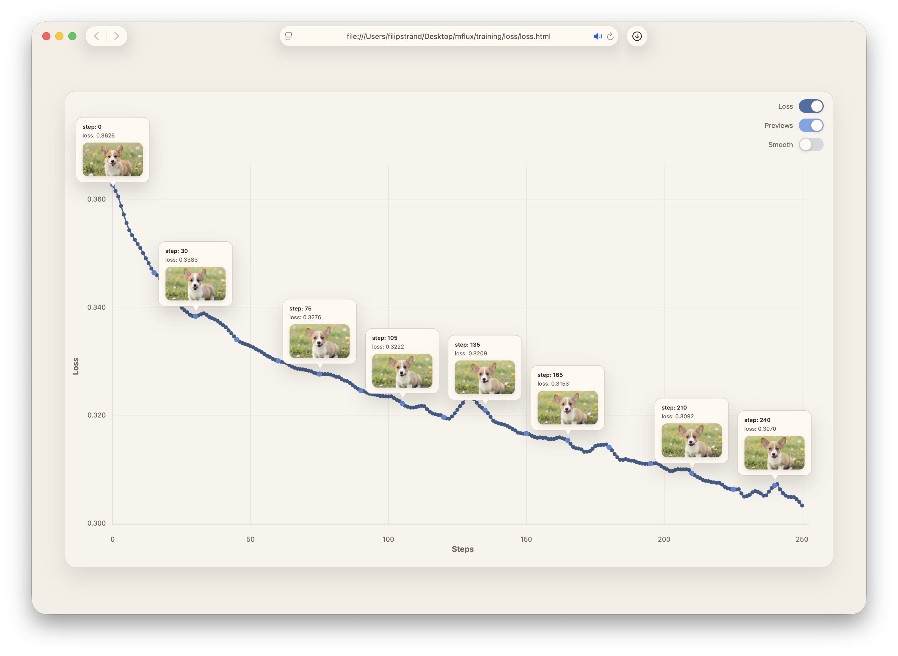

## Common CLI patterns (shared across models)

This README covers stable, shared patterns. For model-specific usage, see each model README and the model list in the top-level `README.md`.

> [!NOTE]
> MFLUX supports many CLI combinations. The quickest way to get a correct command is to ask a coding agent (Cursor, Claude Code, or similar), e.g. “Can you help me generate an image using z-image?” When in doubt, check the current CLI entrypoints for up-to-date support.

### Quick navigation

- [Quantization](#quantization)
- [Local model paths](#local-model-paths)
- [Third-party HuggingFace models](#third-party-huggingface-models)
- [Prompt files](#prompt-files)
- [LoRA basics](#lora-basics)
- [Training (LoRA)](#training-lora)
- [Output files](#output-files)
- [Auto seeds](#auto-seeds)
- [Metadata reuse](#metadata-reuse)
- [Metadata inspection](#metadata-inspection)
- [Resource and inspection options](#resource-and-inspection-options)
- [MLX cache limit](#mlx-cache-limit)
- [Cache locations](#cache-locations)
- [Capabilities by task](#capabilities-by-task)
- [Command reference](#command-reference)
- [CLI completions](#cli-completions)

---

## Quantization

Quantization reduces memory use and speeds up inference. Most models support `--quantize` (3, 4, 5, 6, 8). This is the on-the-fly option, and quantization is performed as weights are loaded.

```sh
mflux-generate-z-image-turbo \
  --model z-image-turbo \
  --quantize 8 \
  --steps 9 \
  --prompt "A photo of a dog"
```

<details>
<summary>Python API</summary>

```python
from mflux.models.common.config import ModelConfig
from mflux.models.z_image import ZImageTurbo

model = ZImageTurbo(quantize=8, model_config=ModelConfig.z_image_turbo())
image = model.generate_image(
    seed=42,
    prompt="A photo of a dog",
    num_inference_steps=9,
)
image.save("dog.png")
```
</details>

### Saving a quantized model

```sh
mflux-save \
  --path "/Users/me/models/z-image-turbo_8bit" \
  --model z-image-turbo \
  --quantize 8
```

<details>
<summary>Python API</summary>

```python
from mflux.models.common.config import ModelConfig
from mflux.models.z_image import ZImageTurbo

model = ZImageTurbo(quantize=8, model_config=ModelConfig.z_image_turbo())
model.save_model("/Users/me/models/z-image-turbo_8bit")
```
</details>

You can optionally include LoRAs when saving:

```sh
mflux-save \
  --path "/Users/me/models/z-image-turbo_8bit" \
  --model z-image-turbo \
  --quantize 8 \
  --lora-paths "/path/to/lora.safetensors" \
  --lora-scales 0.7
```

<details>
<summary>Python API</summary>

```python
from mflux.models.common.config import ModelConfig
from mflux.models.z_image import ZImageTurbo

model = ZImageTurbo(
    quantize=8,
    model_config=ModelConfig.z_image_turbo(),
    lora_paths=["/path/to/lora.safetensors"],
    lora_scales=[0.7],
)
model.save_model("/Users/me/models/z-image-turbo_8bit")
```
</details>

> [!WARNING]
> Quantized models saved with mflux < v0.6.0 are incompatible with newer versions. Re-save using `mflux-save`.

---

## Local model paths

Use a local path with `--model` and specify `--base-model` when required:

```sh
mflux-generate-z-image-turbo \
  --model "/Users/me/models/z-image-turbo" \
  --base-model z-image-turbo \
  --steps 9 \
  --prompt "Luxury food photograph"
```

<details>
<summary>Python API</summary>

```python
from mflux.models.common.config import ModelConfig
from mflux.models.z_image import ZImageTurbo

model = ZImageTurbo(
    model_config=ModelConfig.z_image_turbo(),
    model_path="/Users/me/models/z-image-turbo",
)
image = model.generate_image(
    seed=42,
    prompt="Luxury food photograph",
    num_inference_steps=9,
)
image.save("luxury_food.png")
```
</details>

Local HuggingFace-style weights should match the repo layout for the model. See the model README if you need the exact directory structure.

---

## Third-party HuggingFace models

The `--model` argument can be a HuggingFace repo or a local path:

```sh
mflux-generate-z-image-turbo \
  --model filipstrand/Z-Image-Turbo-mflux-4bit \
  --steps 9 \
  --prompt "A beautiful landscape"
```

<details>
<summary>Python API</summary>

```python
from mflux.models.common.config import ModelConfig
from mflux.models.z_image import ZImageTurbo

model = ZImageTurbo(
    model_config=ModelConfig.z_image_turbo(),
    model_path="filipstrand/Z-Image-Turbo-mflux-4bit",
)
image = model.generate_image(
    seed=42,
    prompt="A beautiful landscape",
    num_inference_steps=9,
)
image.save("landscape.png")
```
</details>

---

## Prompt files

Use `--prompt-file` to iterate on prompts without restarting the CLI:

```sh
mflux-generate-z-image-turbo \
  --model z-image-turbo \
  --steps 9 \
  --prompt-file ./prompt.txt
```

<details>
<summary>Python API</summary>

```python
from pathlib import Path

from mflux.models.common.config import ModelConfig
from mflux.models.z_image import ZImageTurbo

prompt = Path("./prompt.txt").read_text().strip()
model = ZImageTurbo(model_config=ModelConfig.z_image_turbo())
image = model.generate_image(
    seed=42,
    prompt=prompt,
    num_inference_steps=9,
)
image.save("prompt_file.png")
```
</details>

---

## LoRA basics

```sh
mflux-generate-z-image-turbo \
  --model z-image-turbo \
  --steps 9 \
  --prompt "a portrait" \
  --lora-paths "/local/path/to/lora.safetensors" \
  --lora-scales 0.8
```

<details>
<summary>Python API</summary>

```python
from mflux.models.common.config import ModelConfig
from mflux.models.z_image import ZImageTurbo

model = ZImageTurbo(
    model_config=ModelConfig.z_image_turbo(),
    lora_paths=["/local/path/to/lora.safetensors"],
    lora_scales=[0.8],
)
image = model.generate_image(
    seed=42,
    prompt="a portrait",
    num_inference_steps=9,
)
image.save("portrait_lora.png")
```
</details>

You can also use a real HuggingFace LoRA repo with Z-Image Turbo:

```sh
mflux-generate-z-image-turbo \
  --model filipstrand/Z-Image-Turbo-mflux-4bit \
  --steps 9 \
  --prompt "t3chnic4lly vibrant 1960s portrait" \
  --lora-paths renderartist/Technically-Color-Z-Image-Turbo \
  --lora-scales 0.5
```

<details>
<summary>Python API</summary>

```python
from mflux.models.common.config import ModelConfig
from mflux.models.z_image import ZImageTurbo

model = ZImageTurbo(
    model_config=ModelConfig.z_image_turbo(),
    model_path="filipstrand/Z-Image-Turbo-mflux-4bit",
    lora_paths=["renderartist/Technically-Color-Z-Image-Turbo"],
    lora_scales=[0.5],
)
image = model.generate_image(
    seed=42,
    prompt="t3chnic4lly vibrant 1960s portrait",
    num_inference_steps=9,
)
image.save("portrait_hf_lora.png")
```
</details>

For multi-LoRA, pass multiple paths and scales. For library usage, set `LORA_LIBRARY_PATH` and pass basenames.

---

## Training (LoRA)



- Use `mflux-train --config /path/to/train.json` to start a run.
- Resume with `mflux-train --resume /path/to/checkpoint.zip`.
- Training supports normal (txt2img) and edit modes; the mode is auto-detected from your data folder layout (see examples below).
- Expected layout: a config file plus a data folder with images and optional prompt files.
- **Edit mode limitation**: Edit training currently supports only FLUX.2-klein-base models (`flux2-klein-base-4b` or `flux2-klein-base-9b`).
- For model-specific config fields, see the [Z-Image README](../z_image/README.md) and [FLUX.2 README](../flux2/README.md).

CLI example using the repo training sample ([train.json](training/_example/train.json)):

```sh
uv run mflux-train --config src/mflux/models/common/training/_example/train.json
```

Example dataset layout (txt2img) — point `data` in the training config at a folder with this kind of structure of (text, image) pairs:

```
01.txt
01.png
02.txt
02.png
03.txt
03.jpg
04.txt
04.jpg
preview_1.txt   <-- (optional) preview prompt run periodically during training
preview_2.txt   <-- (optional) preview prompt run periodically during training
```

Preview prompts are read from `data/preview*.txt` when monitoring is enabled. If no `preview*.txt` files are found, the first data prompt is used as a fallback (for both txt2img and edit training). For edit training, if preview prompts are explicitly provided (not fallback), each preview prompt must have a matching `data/preview*.{png,jpg,jpeg,webp}` image.

The repo sample includes images like [01.jpeg](training/_example/images/01.jpeg). The prompts in the example images were auto-generated by the Qwen3-VL-235B-A22B model from [`mlx-vlm`](https://github.com/Blaizzy/mlx-vlm)


Example dataset layout (edit) — point `data` in the training config at a folder with this kind of structure of (text_in, image_in, image_out) triplets:

```
01_in.txt
01_in.png
01_out.png
02_in.txt
02_in.png
02_out.png
03_in.txt
03_in.png
03_out.png
preview_1.txt  <-- (optional) preview prompts run periodically during training
preview_1.png  <-- (optional) edit preview image for preview_1.txt
preview_2.txt  <-- (optional) preview prompts run periodically during training
preview_2.png  <-- (optional) edit preview image for preview_2.txt
```

We use `_in` for the context/reference image and `_out` for the target image to make the direction explicit and keep pairing unambiguous.
Preview text always comes from `data/preview*.txt`. For edit training, if preview prompts are explicitly provided (not using fallback), each preview prompt must have a matching `data/preview*.{png,jpg,jpeg,webp}` image. Non-edit training does not accept preview images.

### Training outputs

Training output folders include checkpoints, loss plots, and preview images:
```
checkpoints/
  0000030_checkpoint.zip
loss/
  loss.html
preview/
  0000000_preview_image_preview.png
  0000015_preview_image_preview.png
  0000030_preview_image_preview.png
```

Each checkpoint zip (e.g., `0000030_checkpoint.zip`) is a self-contained snapshot of the training state, but the original data folder must still be available to resume training.

---

## Output files

Use `--output` to set the output filename. When generating multiple seeds or images, MFLUX appends suffixes automatically. 
```sh
mflux-generate-z-image-turbo \
  --model z-image-turbo \
  --steps 9 \
  --prompt "a portrait" \
  --output ./outputs/zimage.png
```

<details>
<summary>Python API</summary>

```python
from mflux.models.common.config import ModelConfig
from mflux.models.z_image import ZImageTurbo

model = ZImageTurbo(model_config=ModelConfig.z_image_turbo())
image = model.generate_image(
    seed=42,
    prompt="a portrait",
    num_inference_steps=9,
)
image.save("./outputs/zimage.png")
```
</details>

---

## Auto seeds

Use `--auto-seeds` to generate multiple random seeds in one run:

```sh
mflux-generate-z-image-turbo \
  --model z-image-turbo \
  --steps 9 \
  --auto-seeds 4 \
  --prompt "a portrait"
```

<details>
<summary>Python API</summary>

```python
from mflux.models.common.config import ModelConfig
from mflux.models.z_image import ZImageTurbo

model = ZImageTurbo(model_config=ModelConfig.z_image_turbo())
seeds = [42, 1337, 2024, 9999]
for seed in seeds:
    image = model.generate_image(
        seed=seed,
        prompt="a portrait",
        num_inference_steps=9,
    )
    image.save(f"portrait_{seed}.png")
```
</details>

---

## Metadata reuse

Reuse prior generation parameters from a metadata JSON:

```sh
mflux-generate-z-image-turbo \
  --model z-image-turbo \
  --steps 9 \
  --config-from-metadata ./image.json \
  --prompt "Same composition, warmer light"
```

<details>
<summary>Python API</summary>

```python
import json

from mflux.models.common.config import ModelConfig
from mflux.models.z_image import ZImageTurbo

with open("./image.json", "r") as handle:
    metadata = json.load(handle)

model = ZImageTurbo(model_config=ModelConfig.z_image_turbo())
image = model.generate_image(
    seed=metadata.get("seed", 42),
    prompt="Same composition, warmer light",
    num_inference_steps=metadata.get("steps", 9),
    width=metadata.get("width", 1024),
    height=metadata.get("height", 1024),
)
image.save("image_warmer_light.png")
```
</details>

---

## Metadata inspection

Use `mflux-info` to inspect metadata embedded in an image generated by MFLUX:

```sh
mflux-info ./image.png
```

<details>
<summary>Python API</summary>

```python
from mflux.utils.metadata_reader import MetadataReader

metadata = MetadataReader.read_all_metadata("./image.png")
print(metadata)
```
</details>

---

## Resource and inspection options

Use `--low-ram` to reduce memory usage (at the cost of performance). Use `--stepwise-image-output-dir` to save stepwise images for inspection.

```sh
mflux-generate-z-image-turbo \
  --model z-image-turbo \
  --steps 9 \
  --prompt "a portrait" \
  --low-ram \
  --stepwise-image-output-dir ./steps
```

<details>
<summary>Python API</summary>

```python
from mflux.callbacks.instances.battery_saver import BatterySaver
from mflux.callbacks.instances.memory_saver import MemorySaver
from mflux.callbacks.instances.stepwise_handler import StepwiseHandler
from mflux.models.common.config import ModelConfig
from mflux.models.z_image import ZImageTurbo
from mflux.models.z_image.latent_creator import ZImageLatentCreator

model = ZImageTurbo(model_config=ModelConfig.z_image_turbo())
model.callbacks.register(BatterySaver(battery_percentage_stop_limit=20))
model.callbacks.register(MemorySaver(model=model, keep_transformer=False))
model.callbacks.register(
    StepwiseHandler(
        model=model,
        output_dir="./steps",
        latent_creator=ZImageLatentCreator,
    )
)
image = model.generate_image(
    seed=42,
    prompt="a portrait",
    num_inference_steps=9,
)
image.save("image.png")
```
</details>

---

## MLX cache limit

Use `--mlx-cache-limit-gb` to cap MLX cache usage.

```sh
mflux-generate-z-image-turbo \
  --model z-image-turbo \
  --steps 9 \
  --prompt "a portrait" \
  --mlx-cache-limit-gb 2.5
```

- Value must be positive (`> 0`).
- The value is converted internally using decimal gigabytes (`GB * 1000^3`).
- Works in both normal mode and `--low-ram` mode.

---

## Cache locations

- **MFLUX cache**: set `MFLUX_CACHE_DIR` to override the default (`~/Library/Caches/mflux` on macOS, `~/.cache/mflux` on Linux).
- **Hugging Face cache**: set `HF_HOME` (for example, `HF_HOME=/Volumes/T7/.cache/huggingface`). For more details, refer to the Hugging Face cache documentation.

Example with `HF_HOME` set for a generation run:

```sh
HF_HOME=/Volumes/T7/.cache/huggingface \
  mflux-generate-z-image-turbo \
  --model z-image-turbo \
  --steps 9 \
  --prompt "A moody coastal landscape at dusk"
```

<details>
<summary>Python API</summary>

```python
import os

from mflux.models.common.config import ModelConfig
from mflux.models.z_image import ZImageTurbo

os.environ["HF_HOME"] = "/Volumes/T7/.cache/huggingface"
model = ZImageTurbo(model_config=ModelConfig.z_image_turbo())
image = model.generate_image(
    seed=42,
    prompt="A moody coastal landscape at dusk",
    num_inference_steps=9,
)
image.save("coastal_dusk.png")
```
</details>

---

## Capabilities by task

- Text-to-image and image-to-image generation
- Editing: in-context edit, multi-image edit, virtual try-on
- ControlNet, depth conditioning, fill/inpainting, Redux
- Upscaling (SeedVR2 and Flux ControlNet)
- Quantization, local paths, and third-party models
- LoRA support and LoRA library tooling
- Metadata export and reuse
- Training (LoRA)
- Utilities: depth map extraction, FIBO VLM inspire/refine

---

## Command reference

Use the model READMEs for exact command names and options. General utilities that work across models:

- **Model management**: `mflux-save`, `mflux-info`, `mflux-lora-library`
- **Training**: `mflux-train`
- **Utilities**: `mflux-save-depth`

For model-specific generation commands (Flux, Flux2, Qwen, Z-Image, FIBO) and specialized features (ControlNet, depth, fill, Redux, in-context editing, kontext, concept attention, upscaling), see the respective model READMEs and the top-level `README.md`.

---

## CLI completions

MFLUX provides ZSH shell completions for all CLI commands. Install with:

```sh
mflux-completions
```

Then reload your shell (`exec zsh`) and enjoy tab completion for all mflux commands, options, and arguments. Completions include smart suggestions for model names, quantization levels, LoRA styles, and file paths.

For detailed installation instructions, troubleshooting, and advanced usage, see [`src/mflux/cli/completions/README.md`](../../cli/completions/README.md).
