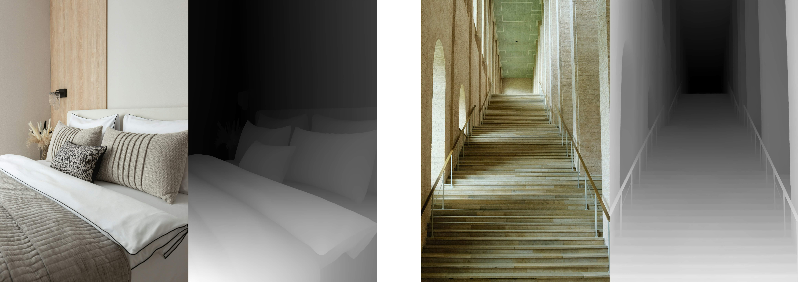

# Depth Pro
This directory contains MFLUX’s MLX implementation of **Depth Pro** (Apple’s monocular depth model), used for generating depth maps from images. Depth maps can be used by the FLUX depth tool (`mflux-generate-depth`) to constrain image generation.


*Example images from [Unsplash](https://unsplash.com/photos/VotK70bRo0U) and [Unsplash](https://unsplash.com/photos/Q3QJbt9f54g)*

## Export a depth map
To generate and export the depth map from an image (without running image generation), run:

```sh
mflux-save-depth --image-path "your_image.jpg" -q 8
```

This will create a depth map and save it with the same name as your image but with a `_depth` suffix (e.g., `your_image_depth.png`).

## Notes
- Quantization is supported for the Depth Pro model, however output quality can vary a lot depending on the input image.

> [!WARNING]
> Note: The Depth Pro model requires an additional ~1.9GB download from Apple. The download happens automatically on first use.

