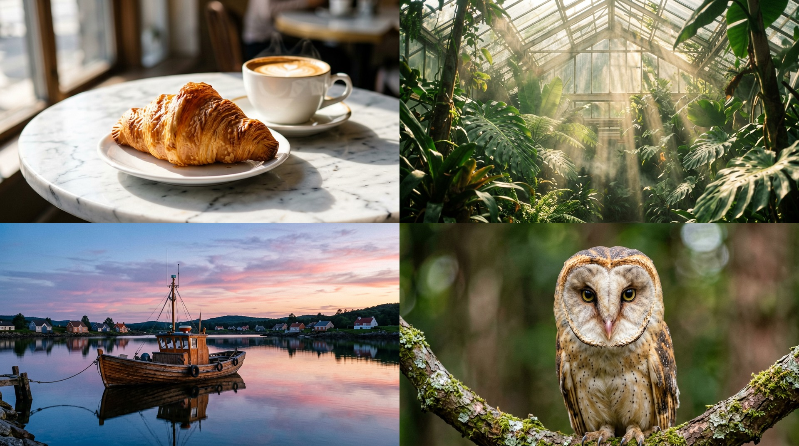

# ERNIE-Image
This directory contains MFLUX's MLX implementation of **ERNIE-Image** and **ERNIE-Image-Turbo**.

MFLUX supports [ERNIE-Image](https://huggingface.co/baidu/ERNIE-Image) and [ERNIE-Image-Turbo](https://huggingface.co/baidu/ERNIE-Image-Turbo) from Baidu, released in April 2026. ERNIE-Image is an 8B single-stream Diffusion Transformer for text-to-image generation. ERNIE-Image-Turbo is a distilled variant that produces high-quality images in just 8 steps.

All the standard modes such as img2img, LoRA and quantizations are supported for this model.



## Example
The following uses ERNIE-Image-Turbo to generate a photorealistic barn owl portrait in 8 steps:

```sh
mflux-generate-ernie-image-turbo \
  --prompt "Close-up portrait of a barn owl perched on a mossy branch, heart-shaped face, detailed feathers, soft forest bokeh, natural wildlife photography." \
  --width 1024 \
  --height 576 \
  --seed 404 \
  --steps 8 \
  -q 8
```

## Base model example
Base (non-distilled) ERNIE-Image uses more steps and supports classifier-free guidance:

> [!WARNING]
> Base (non-distilled) ERNIE-Image is typically slower. Use ERNIE-Image-Turbo for most tasks.

```sh
mflux-generate-ernie-image \
  --prompt "Close-up portrait of a barn owl perched on a mossy branch, heart-shaped face, detailed feathers, soft forest bokeh, natural wildlife photography." \
  --width 1024 \
  --height 576 \
  --seed 404 \
  --steps 50 \
  --guidance 4.0 \
  -q 8
```

<details>
<summary>Python API</summary>

```python
from mflux.models.common.config import ModelConfig
from mflux.models.ernie_image import ErnieImage

model = ErnieImage(
    model_config=ModelConfig.ernie_image_turbo(),
    quantize=8,
)
image = model.generate_image(
    seed=404,
    prompt="Close-up portrait of a barn owl perched on a mossy branch, heart-shaped face, detailed feathers, soft forest bokeh, natural wildlife photography.",
    num_inference_steps=8,
    width=1024,
    height=576,
    guidance=1.0,
)
image.save("ernie_owl.png")
```
</details>

## Image-to-image
Pass `--image-path` and `--image-strength` (0.0–1.0) to blend an input image with the denoising process:

```sh
mflux-generate-ernie-image-turbo \
  --prompt "A watercolor painting of the same scene, soft brush strokes, muted colors." \
  --image-path input.jpg \
  --image-strength 0.6 \
  --width 1024 \
  --height 576 \
  --seed 42 \
  --steps 8 \
  -q 8
```

## LoRA
Pre-trained LoRA files (`.safetensors`) can be applied at inference time with `--lora-paths` and `--lora-scales`. Both the `diffusion_model.layers.N.*` format (Lucie / ai-toolkit style) and the `lora_unet_layers_N_*` format (kohya / ComfyUI style) are supported.

```sh
mflux-generate-ernie-image-turbo \
  --prompt "..." \
  --lora-paths /path/to/lora.safetensors \
  --lora-scales 1.0 \
  --steps 8 -q 8
```

> [!WARNING]
> ERNIE-Image weights are large (~22 GB unquantized). Use `-q 8` (~12 GB) or `-q 4` (~6.4 GB) for reduced memory usage.

## Notes
- ERNIE-Image tends toward vivid, high-contrast output. Prompts like `35mm film grain`, `analog`, or `soft lighting` can soften the look.
- The official pipeline includes a **Prompt Enhancer (PE)** that rewrites short prompts into longer descriptions. This port does not include the PE — use detailed, descriptive prompts for best results.
- Distilled ERNIE-Image-Turbo uses `--guidance 1.0` and 8 steps. Base ERNIE-Image supports higher guidance (typically around `4.0`) and ~50 steps.

## Training
ERNIE-Image and ERNIE-Image-Turbo support LoRA fine-tuning via `mflux-train`. Start from the example configs:

- Turbo: [`train_ernie_image_turbo.json`](../common/training/_example/train_ernie_image_turbo.json)
- Base: [`train_ernie_image.json`](../common/training/_example/train_ernie_image.json)

For the dataset layout and shared training options, see the common [training docs](../common/README.md#training-lora).

Example (turbo defaults to 8 steps):

```json
{
  "model": "ernie-image-turbo",
  "data": "images/",
  "seed": 42,
  "steps": 8,
  "guidance": 1.0,
  "quantize": 8,
  "low_ram": false,
  "max_resolution": 1024,
  "training_loop": { "num_epochs": 200, "batch_size": 1, "timestep_low": 1, "timestep_high": 8 },
  "optimizer": { "name": "AdamW", "learning_rate": 1e-4 },
  "checkpoint": { "output_path": "train_ernie_turbo", "save_frequency": 50 },
  "monitoring": {
    "preview_width": 640,
    "preview_height": 368,
    "plot_frequency": 20,
    "generate_image_frequency": 50
  },
  "lora_layers": {
    "targets": [
      { "module_path": "layers.{block}.self_attention.to_q",     "blocks": { "start": 0, "end": 36 }, "rank": 16 },
      { "module_path": "layers.{block}.self_attention.to_k",     "blocks": { "start": 0, "end": 36 }, "rank": 16 },
      { "module_path": "layers.{block}.self_attention.to_v",     "blocks": { "start": 0, "end": 36 }, "rank": 16 },
      { "module_path": "layers.{block}.self_attention.to_out.0", "blocks": { "start": 0, "end": 36 }, "rank": 16 },
      { "module_path": "text_proj",                                                                     "rank": 16 }
    ]
  }
}
```

Run training:

```sh
mflux-train --config /path/to/train_ernie_image_turbo.json
```

Additional LoRA targets (`mlp.*`, `time_embedding.*`, `adaln_modulation`, `final_norm.linear`) are supported — see the full example configs and `ErnieLoRAMapping` for all options.
