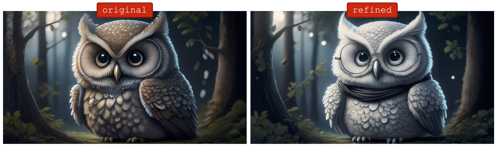
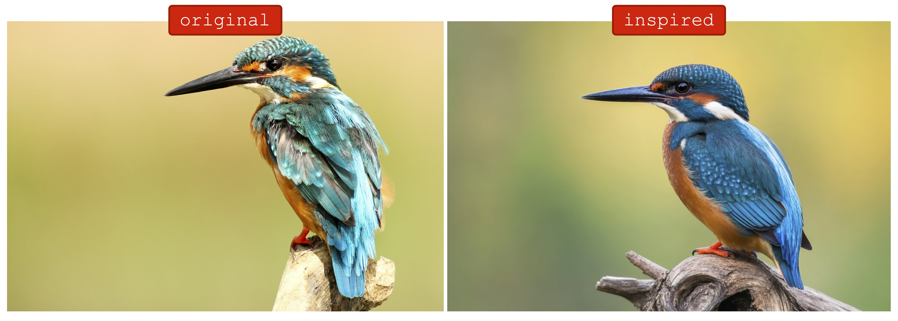

# FIBO
[FIBO](https://huggingface.co/briaai/FIBO) from [Bria.ai](https://bria.ai), the first open-source JSON-native text-to-image model trained on long structured captions. FIBO delivers high image quality, strong prompt adherence, and professional-grade control—trained exclusively on licensed data. ([Technical Paper](https://arxiv.org/abs/2511.06876))


FIBO is an 8B-parameter DiT-based, flow-matching model using **SmolLM3-3B** as the text encoder with a novel **DimFusion** conditioning architecture for efficient long-caption training, and **Wan 2.2** as the VAE. The VLM-assisted prompting uses a fine-tuned **Qwen3-VL** to expand short user intents, fill in missing details, and extract/edit structured prompts from images.

Most text-to-image models excel at imagination—but not control. FIBO is trained on structured JSON captions up to 1,000+ words, enabling precise, reproducible control over lighting, composition, color, and camera settings. The structured captions foster native disentanglement, allowing targeted, iterative refinement without prompt drift.

## Key Features
- **VLM-guided JSON-native prompting**: Transform short prompts into structured schemas with 1,000+ words (lighting, camera, composition, DoF)
- **Disentangled control**: Tweak a single attribute (e.g., camera angle) without breaking the scene
- **Strong prompt adherence**: High alignment on PRISM-style evaluations
- **Enterprise-grade**: 100% licensed data with governance, repeatability, and legal clarity

## The three modes: Generate, Refine, and Inspire

### Generate
While the actual prompt input to FIBO is a structured JSON file, the generate command provides an interface to input pure text prompts. These are then expanded into structured JSON prompts using FIBO's Vision-Language Model (VLM) before being passed to the diffusion model for image generation.

```sh
mflux-generate-fibo \
  --prompt "Three cartoon animal chefs in a colorful bakery kitchen, Pixar style: a bunny with floppy ears wearing a tall white chef hat and pink apron holding a chocolate cake on the left, a raccoon with a striped tail wearing blue oven mitts and a yellow bandana frosting cupcakes in the center, a penguin wearing a red bowtie and checkered apron carrying a tray of golden croissants on the right, warm kitchen lighting with flour dust in air" \
  --width 1200 \
  --height 540 \
  --steps 20 \
  --guidance 4.0 \
  --seed 42 \
  --output animal_bakers.png
```

This command will output both the generated image (`animal_bakers.png`) and a JSON prompt file (`animal_bakers.json`) containing the expanded structured prompt used for generation.

If a JSON prompt file is provided, it will be used directly for image generation, thus bypassing the VLM step and giving you full control over the prompt structure:

```sh
mflux-generate-fibo \
    --prompt-file animal_bakers.json \
    --width 1200 \
    --height 540 \
    --steps 20 \
    --guidance 4.0 \
    --seed 42 \
    --output animal_bakers.png
```

When working with a JSON prompt file, you can use whatever tool you prefer to edit it and are not forced to use the built-in FIBO-VLM. Other good alternatives are [coding](https://cursor.com/agents) [agents](https://www.claude.com/product/claude-code), other [LLMs](https://github.com/ml-explore/mlx-lm)/[VLMs](https://github.com/Blaizzy/mlx-vlm) etc.

<details>
<summary><strong>Click to expand the JSON prompt file used (animal_bakers.json)</strong></summary>

```json
{
  "short_description": "Three cartoon animal chefs are in a bakery kitchen, each holding a culinary creation. A bunny chef on the left presents a chocolate cake, a raccoon chef in the center is frosting cupcakes, and a penguin chef on the right carries a tray of croissants. The kitchen is brightly lit with warm tones, and flour dusts the air, creating a lively and cheerful baking atmosphere.",
  "objects": [
    {
      "description": "A cartoon bunny wearing a white chef's hat and a pink apron, holding a chocolate cake with white frosting and cherries.",
      "location": "left foreground",
      "relationship": "The bunny chef is presenting the chocolate cake.",
      "relative_size": "medium",
      "shape_and_color": "Rounded bunny shape, white hat, pink apron, brown cake, white frosting, red cherries.",
      "texture": "smooth",
      "appearance_details": "Floppy ears, rosy cheeks, smiling expression.",
      "pose": "Standing upright, holding the cake with both hands.",
      "expression": "Joyful and proud.",
      "clothing": "White chef's hat, pink apron.",
      "action": "Holding and presenting a cake.",
      "gender": "female",
      "skin_tone_and_texture": "White fur, smooth texture.",
      "orientation": "Upright, facing forward."
    },
    {
      "description": "A cartoon raccoon wearing blue oven mitts and a yellow bandana, actively frosting cupcakes with pink and yellow frosting.",
      "location": "center midground",
      "relationship": "The raccoon chef is in the process of frosting cupcakes.",
      "relative_size": "medium",
      "shape_and_color": "Distinct raccoon shape, blue mitts, yellow bandana, pink and yellow frosting, brown cupcakes.",
      "texture": "smooth",
      "appearance_details": "Striped tail, bushy fur, focused expression.",
      "pose": "Leaning forward slightly, hands busy frosting.",
      "expression": "Concentrated and happy.",
      "clothing": "Blue oven mitts, yellow bandana.",
      "action": "Frosting cupcakes.",
      "gender": "male",
      "skin_tone_and_texture": "Brown and black fur, smooth texture.",
      "orientation": "Upright, slightly angled."
    },
    {
      "description": "A cartoon penguin wearing a red bowtie and a checkered apron, carrying a tray of golden croissants.",
      "location": "right foreground",
      "relationship": "The penguin chef is carrying a tray of freshly baked croissants.",
      "relative_size": "medium",
      "shape_and_color": "Classic penguin shape, red bowtie, red and white apron, golden croissants.",
      "texture": "smooth",
      "appearance_details": "Black and white body, orange beak and feet, smiling expression.",
      "pose": "Standing upright, holding the tray with both hands.",
      "expression": "Cheerful and friendly.",
      "clothing": "Red bowtie, checkered apron.",
      "action": "Carrying a tray of croissants.",
      "gender": "male",
      "skin_tone_and_texture": "Feathered texture, smooth appearance.",
      "orientation": "Upright, facing forward."
    }
  ],
  "background_setting": "A brightly lit bakery kitchen with wooden countertops, shelves stocked with baking ingredients and equipment, and a window in the background. Flour is lightly dusted in the air.",
  "lighting": {
    "conditions": "warm indoor lighting",
    "direction": "front-lit and side-lit",
    "shadows": "soft, diffused shadows"
  },
  "aesthetics": {
    "composition": "centered composition with the three chefs forming a horizontal line",
    "color_scheme": "warm and cheerful, with dominant browns, yellows, pinks, and whites",
    "mood_atmosphere": "joyful, friendly, and inviting",
    "aesthetic_score": "very high",
    "preference_score": "very high"
  },
  "photographic_characteristics": {
    "depth_of_field": "shallow",
    "focus": "sharp focus on the chefs and their creations",
    "camera_angle": "eye-level",
    "lens_focal_length": "standard lens"
  },
  "style_medium": "digital illustration",
  "text_render": [],
  "context": "This image is a charming illustration, likely for a children's book, educational material, or a bakery-themed advertisement, designed to evoke feelings of happiness and the joy of baking.",
  "artistic_style": "Pixar-style animation"
}
```

Note: This JSON prompt was generated using FIBO's "Generate" mode from a short text description. Note the strong alignment between the JSON prompt and the image!
</details>

### Refine
While the JSON prompt can be edited manually, it can be quite complex and inconvenient to modify directly. The refinement mode expands a simple user instruction in order to tweak specific attributes. The VLM processes these instructions and updates the JSON prompt accordingly before generating new images.



Assuming we already have a previous prompt file, like `owl_brown.json`, we can refine this prompt to change the owl's color and add some accessories:

```sh
mflux-refine-fibo \
    --prompt-file owl_brown.json \
    --instructions "Make the owl white instead of brown, and add round glasses and a black scarf. Keep everything else exactly the same - the same forest background, moonlight lighting, composition, and overall whimsical atmosphere." \
    --output owl_white.json
```

Then generate the refined image using the updated JSON prompt:

```sh
mflux-generate-fibo \
    --prompt-file owl_white.json \
    --width 1024 \
    --height 560 \
    --steps 20 \
    --guidance 4.0 \
    --seed 42 \
    --quantize 4 \
    --output owl_white.png
```

It is worth noting that refine does not work the same way as other editing techniques like Flux Kontext or Qwen Image Edit. Instead of modifying an existing image, it modifies the underlying **structured prompt** to produce a new image.

### Inspire
Provide an image instead of text. FIBO's vision-language model extracts a detailed, structured prompt, blends it with your creative intent, and produces related images—ideal for inspiration without overreliance on the original.



Starting from an image, you can extract a structured JSON prompt that captures its visual characteristics:

```sh
mflux-inspire-fibo \
    --image-path bird.jpg \
    --prompt "blue and brown bird on brown tree trunk" \
    --output bird_inspired.json \
    --seed 42
```

Then generate new images with similar characteristics:

```sh
mflux-generate-fibo \
    --prompt-file bird_inspired.json \
    --width 1024 \
    --height 672 \
    --steps 20 \
    --guidance 4.0 \
    --seed 42 \
    -q 8 \
    --output bird_inspired.png
```

## Notes
> [!WARNING]
> FIBO requires downloading the `briaai/FIBO` model weights (~24GB) and the `briaai/FIBO-vlm` vision-language model (~8GB), totaling ~32GB for the full model, or use quantization for smaller sizes.

