## FLUX.1

> [!NOTE]
> FLUX.1 is still fully supported, but newer models like FLUX.2, Z-Image Turbo, and Qwen Image often provide better performance and native support for many of the techniques and features documented here (such as in-context editing).

Supported base models include `schnell`, `dev`, and `krea-dev` (alias `dev-krea`), typically run via `mflux-generate`.

---

### FLUX.1 Krea [dev]: Enhanced Photorealism
MFLUX supports **FLUX.1 Krea [dev]**, an 'opinionated' text-to-image model developed in collaboration with [Krea AI](https://krea.ai).

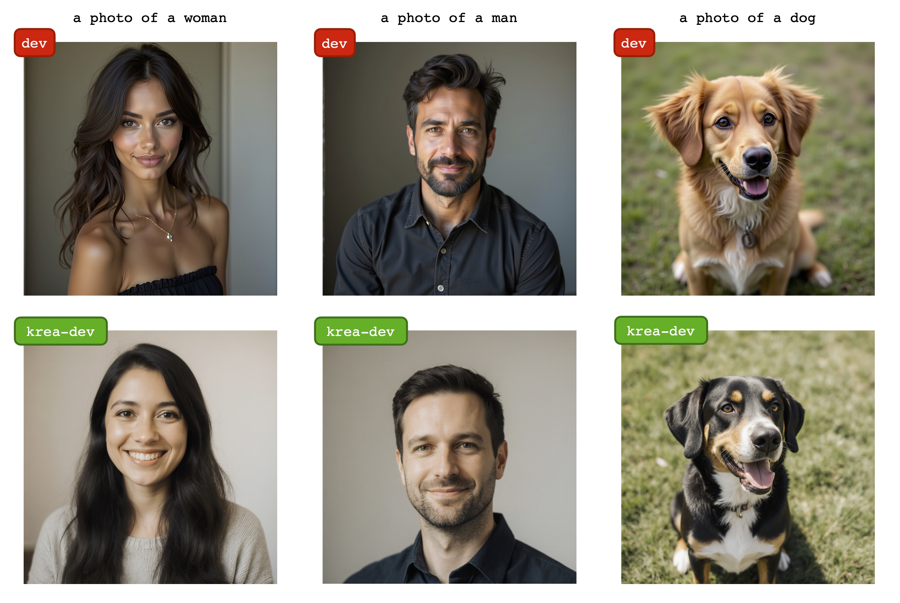

```sh
mflux-generate \
    --model krea-dev \
    --prompt "A photo of a dog" \
    --steps 25 \
    --seed 2674888 \
    -q 8 \
    --height 1024 \
    --width 1024
```

*Learn more about FLUX.1 Krea [dev] in the [official announcement](https://bfl.ai/announcements/flux-1-krea-dev).*

---

```sh
mflux-generate \
    --model schnell \
    --steps 2 \
    --seed 2 \
    --quantize 8 \
    --height 1920 \
    --width 1024 \
    --prompt "Tranquil pond in a bamboo forest at dawn, the sun is barely starting to peak over the horizon, panda practices Tai Chi near the edge of the pond, atmospheric perspective through the mist of morning dew, sunbeams, its movements are graceful and fluid — creating a sense of harmony and balance, the pond's calm waters reflecting the scene, inviting a sense of meditation and connection with nature, style of Howard Terpning and Jessica Rossier"
```

---

### 🛠️ Flux Tools

MFLUX supports the official [Flux.1 Tools](https://blackforestlabs.ai/flux-1-tools/).

#### 🖌️ Fill

The Fill tool uses the [FLUX.1-Fill-dev](https://huggingface.co/black-forest-labs/FLUX.1-Fill-dev) model to allow you to selectively edit parts of an image by providing a binary mask. This is useful for inpainting (replacing specific areas) and outpainting (expanding the canvas).

#### Inpainting

Inpainting allows you to selectively regenerate specific parts of an image while preserving the rest. This is perfect for removing unwanted objects, adding new elements, or changing specific areas of an image without affecting the surrounding content. The Fill tool understands the context of the entire image and creates seamless edits that blend naturally with the preserved areas.

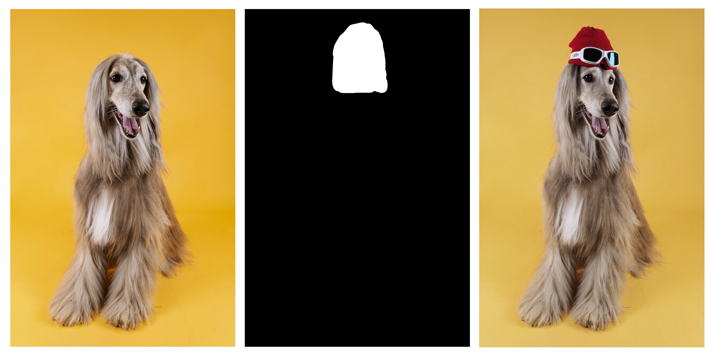
*Original dog image credit: [Julio Bernal on Unsplash](https://unsplash.com/photos/brown-and-white-long-coated-dog-WLGx0fKFSeI)*

##### Creating Masks

Before using the Fill tool, you need an image and a corresponding mask. You can create a mask using the included tool:

```bash
python tools/inpaint_mask_tool.py /path/to/your/image.jpg
```

This will open an interactive interface where you can paint over the areas you want to regenerate.
Pressing the `s` key will save the mask at the same location as the image.

##### Example

To regenerate specific parts of an image:

```bash
mflux-generate-fill \
  --prompt "A professionally shot studio photograph of a dog wearing a red hat and ski goggles. The dog is centered against a uniformly bright yellow background, with well-balanced lighting and sharp details." \
  --steps 20 \
  --seed 42 \
  --height 1280 \
  --width 851 \
  --guidance 30 \
  -q 8 \
  --image-path "dog.png" \
  --masked-image-path "dog_mask.png" \
```

#### Outpainting

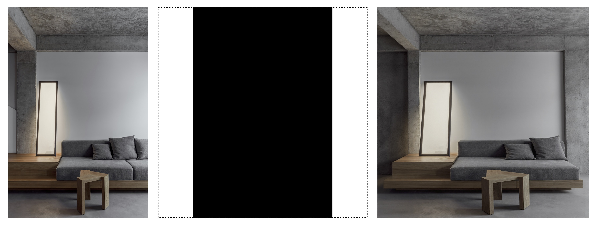
*Original room image credit: [Alexey Aladashvili on Unsplash](https://unsplash.com/photos/a-living-room-with-a-couch-and-a-table-JFzglhmwlck)*

Outpainting extends your image beyond its original boundaries, allowing you to expand the canvas in any direction while maintaining visual consistency with the original content. This is useful for creating wider landscapes, revealing more of a scene, or transforming a portrait into a full-body image. The Fill tool intelligently generates new content that seamlessly connects with the existing image.

You can expand the canvas of your image using the provided tool:

```bash
python tools/create_outpaint_image_canvas_and_mask.py \
  /path/to/your/image.jpg \
  --image-outpaint-padding "0,30%,20%,0"
```

As an example, here's how to add 25% padding to both the left and right sides of an image:

```bash
python tools/create_outpaint_image_canvas_and_mask.py \
  room.png \
  --image-outpaint-padding "0,25%,0,25%"
```

The padding format is "top,right,bottom,left" where each value can be in pixels or as a percentage. For example, "0,30%,20%,0" expands the canvas by 30% to the right and 20% to the bottom.

After running this command, you'll get two files: an expanded canvas with your original image and a corresponding mask. You can then run the `mflux-generate-fill` command similar to the inpainting example, using these files as input.

##### Example

Once you've created the expanded canvas and mask files, run the Fill tool on them:

```bash
mflux-generate-fill \
  --prompt "A detailed interior room photograph with natural lighting, extended in a way that perfectly complements the original space. The expanded areas continue the architectural style, color scheme, and overall aesthetic of the room seamlessly." \
  --steps 25 \
  --seed 43 \
  --guidance 30 \
  -q 8 \
  --image-path "room.png" \
  --masked-image-path "room_mask.png" \
```

##### Tips for Best Results

- **Model**: The model is always `FLUX.1-Fill-dev` and should not be specified.
- **Guidance**: Higher guidance values (around 30) typically yield better results. This is the default if not specified.
- **Resolution**: Higher resolution images generally produce better results with the Fill tool.
- **Masks**: Make sure your mask clearly defines the areas you want to regenerate. White areas in the mask will be regenerated, while black areas will be preserved.
- **Prompting**: For best results, provide detailed prompts that describe both what you want in the newly generated areas and how it should relate to the preserved parts of the image.
- **Steps**: Using 20-30 denoising steps generally produces higher quality results.

> [!WARNING]
> Note: Using the Fill tool requires an additional 33.92 GB download from [black-forest-labs/FLUX.1-Fill-dev](https://huggingface.co/black-forest-labs/FLUX.1-Fill-dev). The download happens automatically on first use.

#### 🔍 Depth

Using the depth tool, you can generate high-quality images constrained on a depth map from a reference image. These maps represent the estimated distance of each pixel from the camera, with brighter areas representing objects closer to the camera and darker areas representing objects farther away.

For state-of-the-art depth extraction, MFLUX now supports the [Depth Pro](https://github.com/apple/ml-depth-pro) model, natively implemented in MLX based on the reference implementation. 

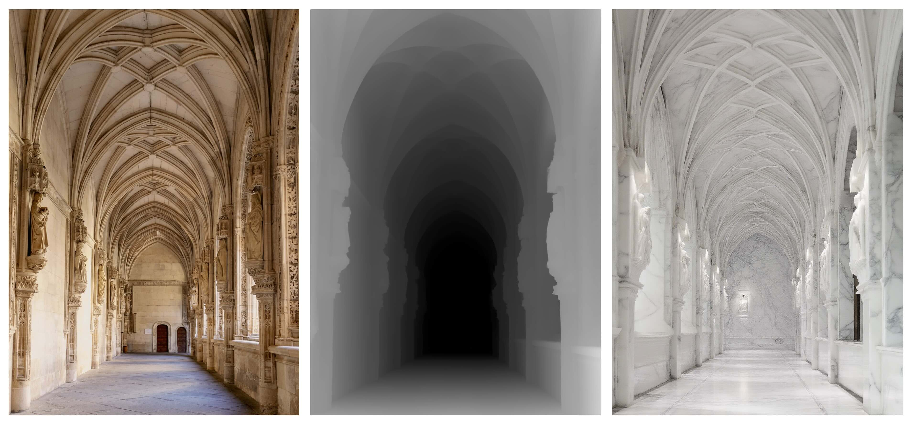
*Original hallway image credit: [Yuliya Matuzava on Unsplash](https://unsplash.com/photos/a-long-hallway-in-a-building-with-arches-and-arches-39NJt9jfGSU)*

##### Example

Using the `mflux-generate-depth` we can let MFLUX generate a new image conditioned on the depth map of the input image:

```bash
mflux-generate-depth \
  --prompt "A hallway made of white carrara marble" \
  -q 8 \
  --height 1680 \
  --width 1200 \
  --image-path "original_image.png" \
  --steps 20 \
  --seed 7102725
```

Instead of automatically generating the depth map based on a reference image, you can instead input the depth map yourself using the `--depth-image-path`, like so:

```bash
mflux-generate-depth \
  --prompt "A hallway made of white carrara marble" \
  -q 8 \
  --height 1680 \
  --width 1200 \
  --depth-image-path "depth_image.png" \
  --steps 20
```

To generate and export the depth map from an image without triggering the image generation, run the following command:

```bash
mflux-save-depth --image-path "your_image.jpg" -q 8
```

This will create a depth map and save it with the same name as your image but with a "_depth" suffix (e.g., "your_image_depth.png").
Quantization is supported for the Depth Pro model, however, output quality can very depend on the input image. 

> [!WARNING]
> Note: The Depth Pro model requires an additional 1.9GB download from Apple. The download happens automatically on first use.

> [!WARNING]
> Note: Using the Depth tool requires an additional 33.92 GB download from [black-forest-labs/FLUX.1-Depth-dev](https://huggingface.co/black-forest-labs/FLUX.1-Depth-dev). The download happens automatically on first use.

#### 🔄 Redux

The Redux tool is an adapter for FLUX.1 models that enables image variation generation similar to the [image-to-image](#-image-to-image) technique. 
It can reproduce an input image with slight variations, allowing you to refine and enhance existing images. 
Unlike the image-to-image technique which resumes the denoising process mid-way starting from the input image, the redux tool instead embeds the image and joins it with the T5 text encodings.

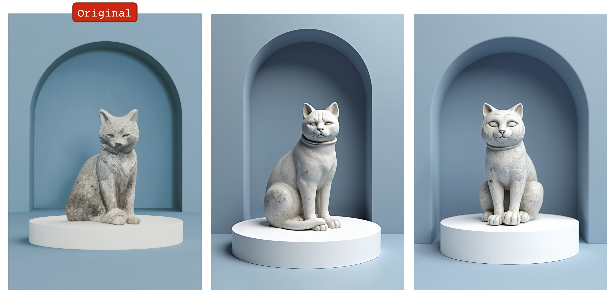
*Image credit: [Paris Bilal on Unsplash](https://unsplash.com/photos/a-cat-statue-sitting-on-top-of-a-white-base-Bedd4qHGWCg)*

##### Example

The following examples show how to use the Redux tool to generate variations:

```bash
mflux-generate-redux \
  --prompt "a grey statue of a cat on a white platform in front of a blue background" \
  --redux-image-paths "original.png" \
  --steps 20 \
  --height 1654 \
  --width 1154 \
  -q 8
```

You can also control the influence of each reference image by specifying strength values (between 0.0 and 1.0) using the `--redux-image-strengths` parameter:

```bash
mflux-generate-redux \
  --prompt "a grey statue of a cat on a white platform in front of a blue background" \
  --redux-image-paths "image1.png" "image2.png" \
  --redux-image-strengths 0.8 0.5 \
  --steps 20 \
  --height 1024 \
  --width 768 \
  -q 8
```

A higher strength value gives the reference image more influence over the final result. If you don't specify any strengths, a default value of 1.0 is used for all images.

There is a tendency for the reference image to dominate over the input prompt.

> [!WARNING]
> Note: Using the Redux tool requires an additional 1.1GB download from [black-forest-labs/FLUX.1-Redux-dev](https://huggingface.co/black-forest-labs/FLUX.1-Redux-dev). The download happens automatically on first use.

---

### 🎭 In-Context Generation

> [!WARNING]
> Legacy / outdated: this section documents older in-context workflows and may be changed or removed in a future release.

In-Context Generation is a powerful collection of techniques that allows you to generate images based on reference images and context, without requiring model fine-tuning. MFLUX supports multiple in-context approaches, each designed for specific use cases ranging from style transfer to virtual try-on and image editing.

#### 📸 Kontext

FLUX.1 Kontext, released in June 2025, is Black Forest Labs' [official model](https://bfl.ai/models/flux-kontext) that goes beyond text-to-image generation. Unlike previous flow models that only allow text-based generation, Kontext understands and creates from existing images, enabling flexible image editing through simple text instructions without complex workflows or finetuning.
Out of the various in-context generation techniques, Kontext is the most advanced and versatile, allowing for a wide range of image editing and generation tasks. It is recommended to try Kontext first before exploring other in-context methods.

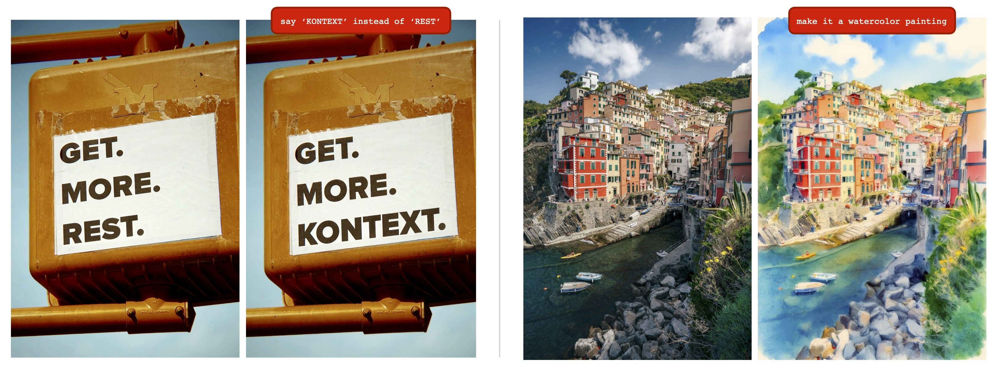

*Original images credit: [Jon Tyson (sign)](https://unsplash.com/photos/the-sign-urges-viewers-to-get-more-rest-a4Cm6EnYtls), [Daniel Seßler (town)](https://unsplash.com/photos/colorful-buildings-line-a-coastal-towns-harbor-haVcuj4buqE), [Liga Alksne (house)](https://unsplash.com/photos/a-building-with-a-mountain-in-the-background-jZV4jaycoxE) on Unsplash*

Kontext's core capabilities include **character consistency** (preserving unique elements across scenes), **local editing** (targeted modifications without affecting the rest), **style reference** (generating novel scenes while preserving styles), and **interactive speed** for iterative refinement with minimal latency.


##### Example Usage with sequential edits

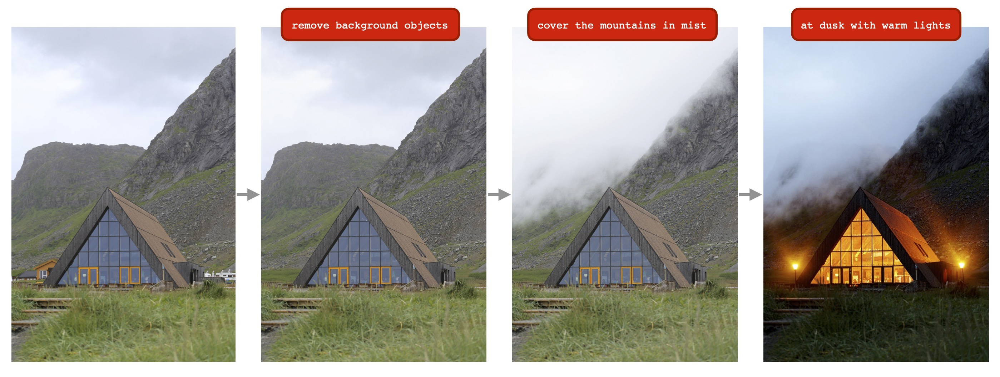

The image above illustrates **sequential editing** with Kontext - making multiple individual edits to progressively refine an image. Each edit builds upon the previous result, allowing for precise, iterative modifications.

Here's an example of one step in a sequential editing workflow, where we add atmospheric mist to the mountains:

```bash
mflux-generate-kontext \
  --image-path "house_without_background_objects.png" \
  --prompt "Make the mountains in the background be covered in white mist so that they are barely visible. Preserve the original camera angle, house placement etc" \
  --steps 20 \
  --seed 9375333 \
  --guidance 2.5 \
  --width 912 \
  --height 1360 \
  -q 8
```

##### Tips for Best Results

For comprehensive prompting strategies, see the [official Black Forest Labs Kontext prompting guide](https://docs.bfl.ai/guides/prompting_guide_kontext_i2i).

**Core Principles:**
- **Be Specific and Clear**: Use precise descriptions, avoid vague terms
- **Step-by-step Editing**: Break complex modifications into multiple simple steps  
- **Explicit Preservation**: State what should remain unchanged
- **Verb Selection**: Use "change", "replace" rather than "transform"

**Prompting Techniques:**

*Basic Modifications:*
- Simple: `"Change the car color to red"`
- Maintain style: `"Change to daytime while maintaining the same style of the painting"`

*Character Consistency:*
- Use specific descriptions: `"The woman with short black hair"` instead of `"she"`
- Preserve features: `"while maintaining the same facial features, hairstyle, and expression"`

*Style Transfer:*
- Name the style: `"Transform to Bauhaus art style"`
- Describe characteristics: `"Transform to oil painting with visible brushstrokes, thick paint texture"`
- Preserve composition: `"Change to Bauhaus style while maintaining the original composition"`

*Text Editing:*
- Use quotes: `"Replace 'joy' with 'BFL'"`
- Maintain format: `"Replace text while maintaining the same font style"`

**Common Problems & Solutions:**

❌ **Character changes too much**: `"Transform the person into a Viking"`  
✅ **Better**: `"Change the clothes to be a viking warrior while preserving facial features"`

❌ **Position changes**: `"Put him on a beach"`  
✅ **Better**: `"Change the background to a beach while keeping the person in the exact same position, scale, and pose"`

❌ **Vague style**: `"Make it a sketch"`  
✅ **Better**: `"Convert to pencil sketch with natural graphite lines, cross-hatching, and visible paper texture"`

**Ready-to-Use Templates:**
- **Object Modification**: `"Change [object] to [new state], keep [content to preserve] unchanged"`
- **Style Transfer**: `"Transform to [specific style], while maintaining [composition/character/other] unchanged"`
- **Background Replacement**: `"Change the background to [new background], keep the subject in the exact same position and pose"`
- **Text Editing**: `"Replace '[original text]' with '[new text]', maintain the same font style"`

**Technical Tips:**
1. **High-Quality References**: Use clear, well-lit reference images with distinct characteristics
2. **Guidance Scale**: Experiment with guidance values between 2.5-4.0 for optimal balance
3. **Multiple Seeds**: Try different seeds to explore variations while maintaining consistency
4. **Resolution**: Use standard resolutions (1024x1024, 768x1024, etc.) for best results

> [!WARNING]
> Note: Using the Kontext tool requires an additional ~34 GB download from [black-forest-labs/FLUX.1-Kontext-dev](https://huggingface.co/black-forest-labs/FLUX.1-Kontext-dev). The download happens automatically on first use.

#### 🎨 In-Context LoRA

In-Context LoRA allows you to generate images in a specific style based on a reference image. This approach uses specialized LoRA weights that enable the model to understand and apply the visual context from your reference image to a new generation.

This feature is based on the [In-Context LoRA for Diffusion Transformers](https://github.com/ali-vilab/In-Context-LoRA) project by Ali-ViLab.

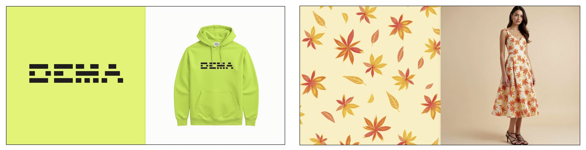

To use In-Context LoRA, you need:
1. A reference image
2. A style LoRA (optional - the in-context ability works without LoRAs, but they can significantly enhance the results)

##### Available Styles

MFLUX provides several pre-defined styles from the [Hugging Face ali-vilab/In-Context-LoRA repository](https://huggingface.co/ali-vilab/In-Context-LoRA) that you can use with the `--lora-style` argument:

| Style Name     | Description                               |
|----------------|-------------------------------------------|
| `couple`       | Couple profile photography style          |
| `storyboard`   | Film storyboard sketching style           |
| `font`         | Font design and typography style          |
| `home`         | Home decoration and interior design style |
| `illustration` | Portrait illustration style               |
| `portrait`     | Portrait photography style                |
| `ppt`          | Presentation template style               |
| `sandstorm`    | Sandstorm visual effect                   |
| `sparklers`    | Sparklers visual effect                   |
| `identity`     | Visual identity and branding design style |

##### How It Works

The In-Context LoRA generation creates a side-by-side image where:
- The left side shows your reference image with noise applied
- The right side shows the new generation that follows your prompt while maintaining the visual context

The final output is automatically cropped to show only the right half (the generated image).

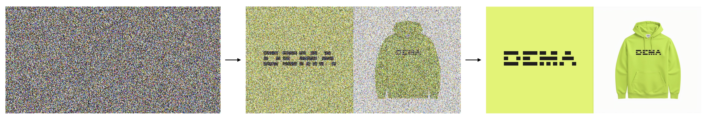

##### Prompting for In-Context LoRA

For best results with In-Context LoRA, your prompt should describe both the reference image and the target image you want to generate. Use markers like `[IMAGE1]`, `[LEFT]`, or `[RIGHT]` to distinguish between the two parts.

Here's an example:

```sh
mflux-generate-in-context \
  --model dev \
  --steps 20 \
  --quantize 8 \
  --seed 42 \
  --height 1024 \
  --width 1024 \
  --image-path "reference.png" \
  --lora-style identity \
  --prompt "In this set of two images, a bold modern typeface with the brand name 'DEMA' is introduced and is shown on a company merchandise product photo; [IMAGE1] a simplistic black logo featuring a modern typeface with the brand name 'DEMA' on a bright light green/yellowish background; [IMAGE2] the design is printed on a green/yellowish hoodie as a company merchandise product photo with a plain white background."
```

This prompt clearly describes both the reference image (after `[IMAGE1]`) and the desired output (after `[IMAGE2]`). Other marker pairs you can use include:
- `[LEFT]` and `[RIGHT]`
- `[TOP]` and `[BOTTOM]`
- `[REFERENCE]` and `[OUTPUT]`

**Important**: In the current implementation, the reference image is ALWAYS placed on the left side of the composition, and the generated image on the right side. When using marker pairs in your prompt, the first marker (e.g., `[IMAGE1]`, `[LEFT]`, `[REFERENCE]`) always refers to your reference image, while the second marker (e.g., `[IMAGE2]`, `[RIGHT]`, `[OUTPUT]`) refers to what you want to generate.

##### Tips for Best Results

1. **Choose the right reference image**: Select a reference image with a clear composition and structure that matches your intended output.
2. **Adjust guidance**: Higher guidance values (7.0-9.0) tend to produce results that more closely follow your prompt.
3. **Try different styles**: Each style produces distinctly different results - experiment to find the one that best matches your vision.
4. **Increase steps**: For higher quality results, use 25-30 steps.
5. **Detailed prompting**: Be specific about both the reference image and your desired output in your prompt.
6. **Try without LoRA**: While LoRAs enhance the results, you can experiment without them to see the base in-context capabilities.

#### 👕 CatVTON (Virtual Try-On)

> [!WARNING]
> **Experimental Feature**: CatVTON is an experimental feature and may be removed or significantly changed in future updates.

CatVTON enables virtual try-on capabilities using in-context learning. This approach allows you to generate images of people wearing different garments by providing a person image, a person mask, and a garment image.

The implementation is based on [@nftblackmagic/catvton-flux](https://github.com/nftblackmagic/catvton-flux) and uses the model weights from [xiaozaa/catvton-flux-beta](https://huggingface.co/xiaozaa/catvton-flux-beta) (approximately 24 GB download).

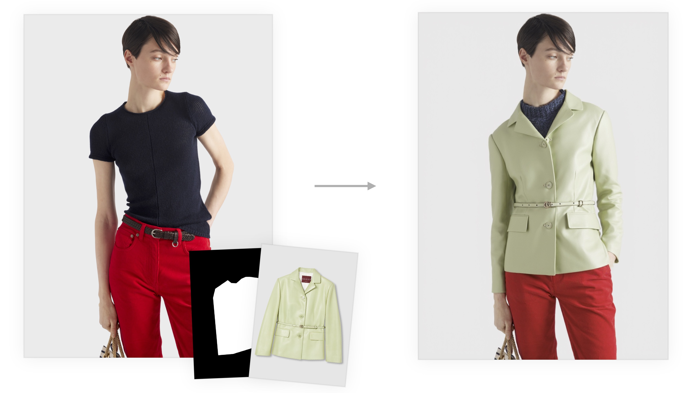

##### How it works

CatVTON uses a sophisticated in-context learning approach that creates a side-by-side composition for virtual try-on:

1. **Image Layout**: The garment image is placed on the left side, while the person image is positioned on the right side of the composition.

2. **Selective Processing**: The model treats each side differently:
   - **Left side (garment)**: The model can only *read* information from this area - no inpainting or modifications occur here. This serves as a reference for the garment's appearance, texture, and style.
   - **Right side (person)**: Only the areas highlighted in the person mask are inpainted. The mask determines exactly which parts of the person image should be modified to "wear" the garment.

3. **Contextual Understanding**: By reading the garment characteristics from the left and selectively applying them to the masked regions on the right, the model creates a realistic virtual try-on that maintains proper lighting, shadows, and fabric behavior.

This approach allows the model to understand the garment's properties while precisely controlling which parts of the person image should be transformed, resulting in natural-looking virtual clothing fitting.

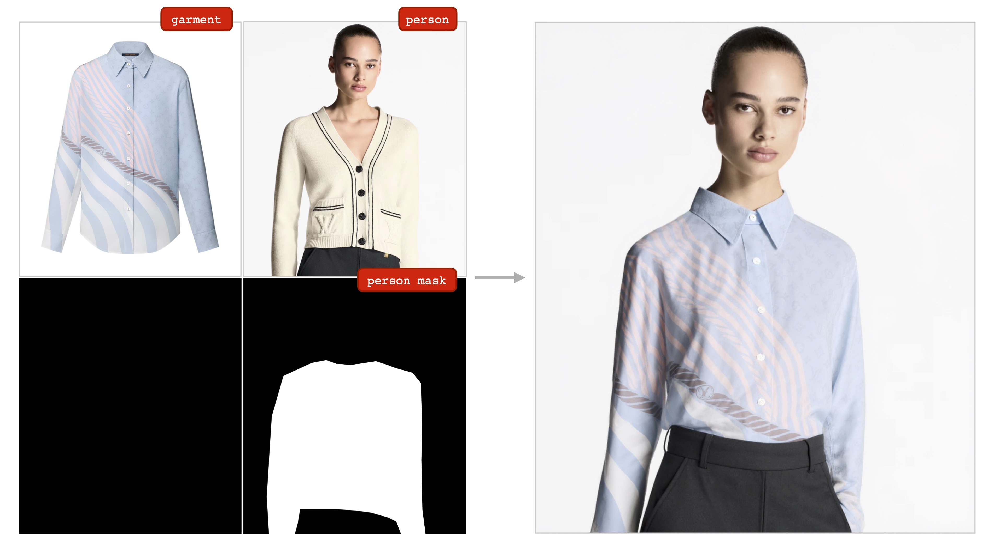

##### Example Command

```bash
mflux-generate-in-context-catvton \
  --person-image "person.png" \
  --person-mask "mask.png" \
  --garment-image "garment.png" \
  --prompt "The pair of images highlights a clothing and its styling on a model, high resolution, 4K, 8K; [IMAGE1] Detailed product shot of a light blue shirt with designer details such as white and pink patterns; [IMAGE2] The *exact* same cloth (the light blue shirt with designer details such as white and pink patterns) is worn by a model in a lifestyle setting." \
  --steps 20 \
  --seed 6269363 \
  --guidance 30 \
  --height 1024 \
  --width 891 \
  -q 8
```


##### Required Inputs

- **Person Image**: A photo of the person who will "wear" the garment
- **Person Mask**: A binary mask indicating the areas where the garment should be applied
- **Garment Image**: The clothing item to be virtually worn

##### CatVTON Features

- **Automatic Prompting**: If no prompt is provided, CatVTON uses an optimized default prompt designed for virtual try-on scenarios
- **Side-by-Side Generation**: Creates a diptych showing the garment product shot alongside the styled result
- **Optimized for Clothing**: Specifically tuned for clothing and fashion applications
- **High-Quality Results**: Maintains realistic lighting, shadows, and fabric properties

##### Tips for CatVTON

1. **High-Quality Inputs**: Use high-resolution, well-lit images for best results
2. **Accurate Masks**: Ensure the person mask precisely covers the areas where the garment should appear
3. **Consistent Lighting**: Match lighting conditions between person and garment images when possible
4. **Garment Type**: Works best with clearly defined clothing items (shirts, dresses, jackets, etc.)
5. **Pattern Limitations**: Very intricate patterns, fine details, and complex textures may not transfer well - simpler, solid colors and basic patterns typically work better
6. **Try Multiple Seeds**: Generate several variations with different seeds to find the best result, as outcomes can vary significantly

#### ✏️ IC-Edit (In-Context Editing)

> [!WARNING]
> **Experimental Feature**: IC-Edit is an experimental feature and may be removed or significantly changed in future updates.

IC-Edit provides intuitive image editing capabilities using natural language instructions. This approach automatically applies a specialized LoRA and generates edited versions of your reference image based on simple text instructions.

The implementation is based on [@River-Zhang/ICEdit](https://github.com/River-Zhang/ICEdit).

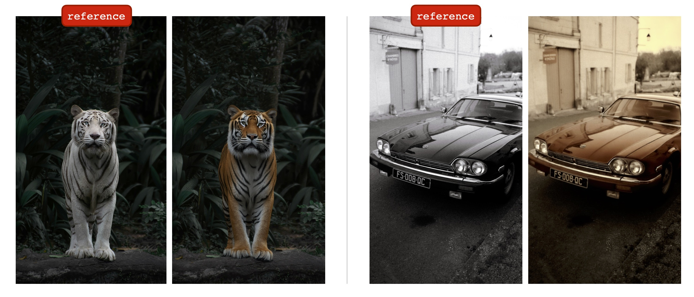
*Original images credit: [Jimmy Chang (flower)](https://unsplash.com/photos/closeup-photography-of-pink-lotus-flower-LP5WXkrnxX0), [Kar Ming Moo (tiger)](https://unsplash.com/photos/brown-and-black-tiger-lying-on-ground-Q_3WmguWgYg), [Martin Baron (car)](https://unsplash.com/photos/a-shiny-black-car-parks-on-a-street-8JoIWt2KzYI) on Unsplash*

##### How it works

IC-Edit employs a streamlined diptych approach for natural language image editing:

1. **Image Layout**: The reference image is placed on the left side, while the right side is reserved for the edited result.

2. **Automatic Masking**: Unlike CatVTON, no user-provided mask is required. The system automatically creates a simple but effective mask:
   - **Left side (reference)**: Completely black mask - no denoising occurs here, preserving the original image as reference
   - **Right side (edit area)**: Completely white mask - the entire area is available for denoising and modification

3. **Instruction Processing**: Your natural language instruction is automatically wrapped in a diptych template that tells the model to create the desired changes on the right side while using the left side as reference.

4. **Guided Generation**: The model reads the visual information from the left side and applies the requested modifications to generate the edited result on the right side, maintaining visual coherence and context.

This simplified approach removes the complexity of mask creation while still providing precise control through natural language instructions, making image editing accessible and intuitive.

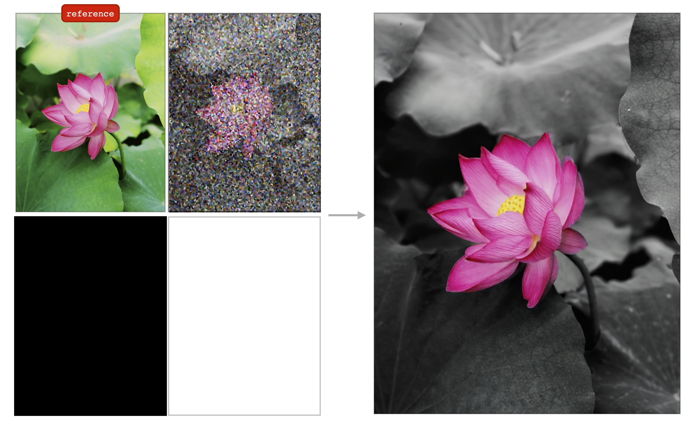

##### Example Command

```bash
mflux-generate-in-context-edit \
  --reference-image "flower.jpg" \
  --prompt "two images of the exact same flower in two different styles: On the left the photo has is in bright colors showing green leaves and a pink flower. On the right, the *exact* same photo (same flower, same leaves, same background, identical etc). but with where everything is black and white except for the flower which is still in color. The content is *exactly* the same between the left and right image, except only for the coloring (black and white for everything except for the colorful flower)" \
  --steps 20 \
  --seed 8570325 \
  --guidance 30 \
  -q 8
```


##### Key Features

- **Natural Language Instructions**: Use simple, descriptive instructions like "make the hair black", "add sunglasses", or "change the background to a beach"
- **Automatic Prompting**: Instructions are automatically wrapped in a diptych template for optimal results
- **Optimal Resolution**: Automatically resizes to 512px width (the resolution IC-Edit was trained on) while maintaining aspect ratio
- **Specialized LoRA**: Automatically downloads and applies the IC-Edit LoRA for enhanced editing capabilities

##### IC-Edit Options

You can use either `--instruction` for simple edits or `--prompt` for full control:

```sh
# Using instruction (recommended)
mflux-generate-in-context-edit \
  --reference-image "photo.jpg" \
  --instruction "remove the glasses"

# Using custom prompt (advanced)
mflux-generate-in-context-edit \
  --reference-image "photo.jpg" \
  --prompt "A diptych with two side-by-side images of the same scene. On the right, the scene is exactly the same as on the left but with a vintage filter applied"
```

##### Tips for IC-Edit

1. **Clear Instructions**: Use specific, actionable instructions for best results
2. **Single Changes**: Focus on one edit at a time for more predictable results
3. **Reference Quality**: Higher quality reference images generally produce better edits
4. **Iterative Editing**: Use the output of one edit as input for the next to build complex changes
5. **Try Multiple Seeds**: Generate several variations with different seeds to find the best result, as outcomes can vary significantly

> [!WARNING]
> Note: Using the IC-Edit tool requires an additional ~230MB download for the specialized LoRA weights. The download happens automatically on first use. This remarkably small LoRA (less than 0.7% of the base model's ~34GB) enables sophisticated image editing capabilities, demonstrating that the base FLUX model is already highly competent at style transfers and transformations - the LoRA simply provides the user control and interface to access these latent capabilities.

---

### 🕹️ Controlnet

MFLUX has [Controlnet](https://huggingface.co/docs/diffusers/en/using-diffusers/controlnet) support for an even more fine-grained control
of the image generation. By providing a reference image via `--controlnet-image-path` and a strength parameter via `--controlnet-strength`, you can guide the generation toward the reference image.

```sh
mflux-generate-controlnet \
  --prompt "A comic strip with a joker in a purple suit" \
  --model dev \
  --steps 20 \
  --seed 1727047657 \
  --height 1066 \
  --width 692 \
  -q 8 \
  --lora-paths "Dark Comic - s0_8 g4.safetensors" \
  --controlnet-image-path "reference.png" \
  --controlnet-strength 0.5 \
  --controlnet-save-canny
```
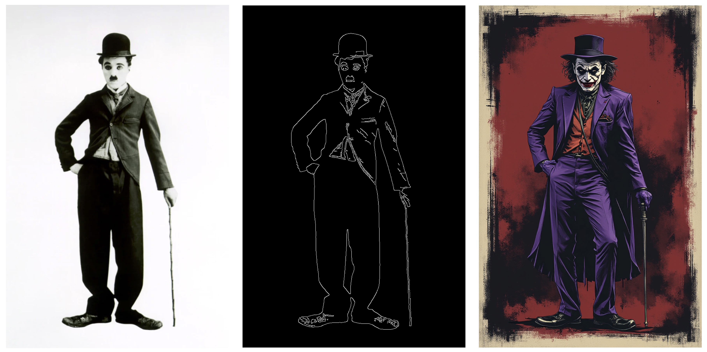

*This example combines the controlnet reference image with the LoRA [Dark Comic Flux](https://civitai.com/models/742916/dark-comic-flux)*.

> [!WARNING]
> Note: Controlnet requires an additional one-time download of ~3.58GB of weights from Huggingface. This happens automatically the first time you run the `generate-controlnet` command.
> At the moment, the Controlnet used is [InstantX/FLUX.1-dev-Controlnet-Canny](https://huggingface.co/InstantX/FLUX.1-dev-Controlnet-Canny), which was trained for the `dev` model.
> It can work well with `schnell`, but performance is not guaranteed.

> [!WARNING]
> Note: The output can be highly sensitive to the controlnet strength and is very much dependent on the reference image.
> Too high settings will corrupt the image. A recommended starting point a value like 0.4 and to play around with the strength.


Controlnet can also work well together with [LoRA adapters](#-lora). In the example below the same reference image is used as a controlnet input
with different prompts and LoRA adapters active.


---

### 🎛️ Dreambooth fine-tuning

As of release [v.0.5.0](https://github.com/filipstrand/mflux/releases/tag/v.0.5.0), MFLUX has support for fine-tuning your own LoRA adapters using the [Dreambooth](https://dreambooth.github.io) technique.

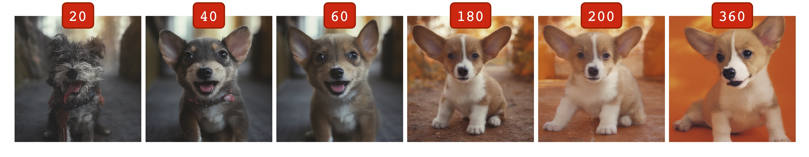

*This example shows the MFLUX training progression of the [included training example](#training-example) which is based on the [DreamBooth Dataset](https://github.com/google/dreambooth), also used in the [mlx-examples repo](https://github.com/ml-explore/mlx-examples/tree/main/flux#finetuning).*

#### Training configuration

To describe a training run, you need to provide a [training configuration](src/mflux/models/flux/variants/dreambooth/_example/train.json) file which specifies the details such as
what training data to use and various parameters. To try it out, one of the easiest ways is to start from the 
provided [example configuration](src/mflux/models/flux/variants/dreambooth/_example/train.json) and simply use your own dataset and prompts by modifying the `examples` section of the json file.

#### Training example

A complete example ([training configuration](src/mflux/models/flux/variants/dreambooth/_example/train.json) + [dataset](src/mflux/models/flux/variants/dreambooth/_example/images)) is provided in this repository. To start a training run, simply run:

```sh
mflux-train --train-config src/mflux/models/flux/variants/dreambooth/_example/train.json
```

By default, this will train an adapter with images of size `512x512` with a batch size of 1 and can take up to several hours to fully complete depending on your machine.
If this task is too computationally demanding, see the section on [memory issues](#memory-issues) for tips on how to speed things up and what tradeoffs exist.

During training, MFLUX will output training checkpoints with artifacts (weights, states) according to what is specified in the configuration file.
As specified in the file `train.json`, these files will be placed in a folder on the Desktop called `~/Desktop/train`, but this can of course be changed to any other path by adjusting the configuration. 
All training artifacts will be saved as self-contained zip file, which can later be pointed to [resume an existing training run](#resuming-a-training-run).
To find the LoRA weights, simply unzip and look for the `adapter` safetensors file and [use it as you would with a regular downloaded LoRA adapter](#-lora).

#### Resuming a training run

The training process will continue to run until each training example has been used `num_epochs` times. 
For various reasons however, the user might choose to interrupt the process.
To resume training for a given checkpoint, say `0001000_checkpoint.zip`, simply run: 

```sh
mflux-train --train-checkpoint 0001000_checkpoint.zip
```

This uses the `--train-checkpoint` command-line argument to specify the checkpoint file to resume from.

There are two nice properties of the training procedure: 

- Fully deterministic (given a specified `seed` in the training configuration)
- The complete training state (including optimizer state) is saved at each checkpoint.

Because of these, MFLUX has the ability to resume a training run from a previous checkpoint and have the results
be *exactly* identical to a training run which was never interrupted in the first place.

> [!WARNING]
> Note: Everything but the dataset itself is contained within this zip file, as the dataset can be quite large.
> The zip file will contain configuration files which point to the original dataset, so make sure that it is in the same place when resuming training.

> [!WARNING]
> Note: One current limitation is that a training run can only be resumed if it has not yet been completed.
> In other words, only checkpoints that represent an interrupted training-run can be resumed and run until completion.

<details>
<summary>⚙️ <strong>Configuration details</strong></summary>

Currently, MFLUX supports fine-tuning only for the transformer part of the model.
In the training configuration, under `lora_layers`, you can specify which layers you want to train. The available ones are: 

- `transformer_blocks`:
  - `attn.to_q`
  - `attn.to_k`
  - `attn.to_v`
  - `attn.add_q_proj`
  - `attn.add_k_proj`
  - `attn.add_v_proj`
  - `attn.to_out`
  - `attn.to_add_out`
  - `ff.linear1`
  - `ff.linear2`
  - `ff_context.linear1`
  - `ff_context.linear2`
- `single_transformer_blocks`:
  - `proj_out`
  - `proj_mlp`
  - `attn.to_q`
  - `attn.to_k`
  - `attn.to_v`

The `block_range` under the respective layer category specifies which blocks to train.
The maximum range available for the different layer categories are:

- `transformer_blocks`:
  - `start: 0`
  - `end: 19`
- `single_transformer_blocks`:
  - `start: 0`
  - `end: 38`

<details>
<summary>Specify individual layers</summary>

For even more precision, you can specify individual block indices to train like so:

```json
"lora_layers": {
  "single_transformer_blocks": {
    "block_range": {
      "indices": [
        0,
        1,
        7,
        19,
        20
      ],
      ...
  },
...
```
</details>

> [!WARNING]
> Note: As the joint transformer blocks (`transformer_blocks`) - are placed earlier on in the sequence of computations, they will require more resources to train.
> In other words, training later layers, such as only the `single_transformer_blocks` should be faster. However, training too few / only later layers might result in a faster but unsuccessful training.

*Under the `examples` section, there is an argument called `"path"` which specifies where the images are located. This path is relative to the config file itself.*

</details>

<details>
<summary>⚠️ <strong>Memory issues</strong></summary>

Depending on the configuration of the training setup, fine-tuning can be quite memory intensive.
In the worst case, if your Mac runs out of memory it might freeze completely and crash!

To avoid this, consider some of the following strategies to reduce memory requirements by adjusting the parameters in the training configuration:

- Use a quantized based model by setting `"quantize": 4` or `"quantize": 8`
- For the `layer_types`, consider skipping some of the trainable layers (e.g. by not including `proj_out` etc.)
- Use a lower `rank` value for the LoRA matrices.
- Don't train all the  `38` layers from `single_transformer_blocks` or all of the `19` layers from `transformer_blocks`  
- Use a smaller batch size, for example `"batch_size": 1`
- Make sure your Mac is not busy with other background tasks that holds memory.

Applying some of these strategies, like how [train.json](src/mflux/models/flux/variants/dreambooth/_example/train.json) is set up by default,
will allow a 32GB M1 Pro to perform a successful fine-tuning run. 
Note, however, that reducing the trainable parameters might lead to worse performance.
 

*Additional techniques such as gradient checkpoint and other strategies might be implemented in the future.*

</details> 

<details>
<summary>📝 <strong>Misc</strong></summary>

This feature is currently v1 and can be considered a bit experimental. Interfaces might change (configuration file setup etc.)
The aim is to also gradually expand the scope of this feature with alternative techniques, data augmentation etc.

- As with loading external LoRA adapters, the MFLUX training currently only supports training the transformer part of the network.
- Sometimes, a model trained with the `dev` model might actually work better when applied to the `schnell` weights.
- Currently, all training images are assumed to be in the resolution specified in the configuration file.
- Loss curve can be a bit misleading/hard to read, sometimes it conveys little improvement over time, but actual image samples show the real progress.
- When plotting the loss during training, we label it as "validation loss" but it is actually only the first 10 elements of the training examples for now. Future updates should support user inputs of separate validation images.
- Training also works with the original model as quantized!
- [For the curious, a motivation for the loss function can be found here](src/mflux/models/flux/variants/dreambooth/optimization/_loss_derivation/dreambooth_loss.pdf).
- Two great resources that heavily inspired this feature are: 
  - The fine-tuning script in [mlx-examples](https://github.com/ml-explore/mlx-examples/tree/main/flux#finetuning)
  - The original fine-tuning script in [Diffusers](https://huggingface.co/docs/diffusers/v0.11.0/en/training/dreambooth)

</details>


---

### 🧠 Concept Attention

The Concept Attention feature allows you to visualize and understand how FLUX models focus on specific concepts within your prompts during image generation.

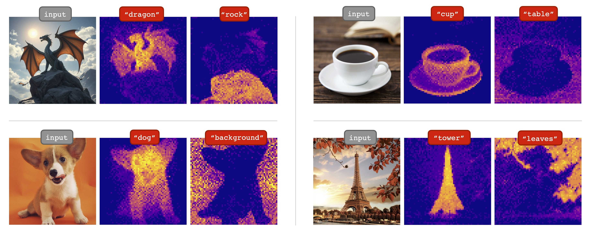

This implementation is based on the research paper ["ConceptAttention: Diffusion Transformers Learn Highly Interpretable Features"](https://arxiv.org/abs/2502.04320) by [Helbling et al.](https://github.com/helblazer811/ConceptAttention), which demonstrates that multi-modal diffusion transformers like FLUX learn highly interpretable representations that can be leveraged to generate precise concept localization maps.

MFLUX provides two concept attention tools:

1. **Text-based Concept Analysis** (`mflux-concept`): Analyzes attention patterns for a specific concept within your text prompt
2. **Image-guided Concept Analysis** (`mflux-concept-from-image`): Uses a reference image to guide concept attention analysis

#### Text-based Concept Analysis

This approach analyzes how the model attends to a specific concept mentioned in your prompt. The model generates an image while tracking attention patterns, then creates a heatmap showing where the model focused when processing your concept.

##### Example

```bash
mflux-concept \
  --prompt "A dragon on a hill" \
  --concept "dragon" \
  --model schnell \
  --steps 4 \
  --seed 9643208 \
  --height 720 \
  --width 1280 \
  --heatmap-layer-indices 15 16 17 18 \
  --heatmap-timesteps 0 1 2 3 \
  -q 4
```
This will generate the following image

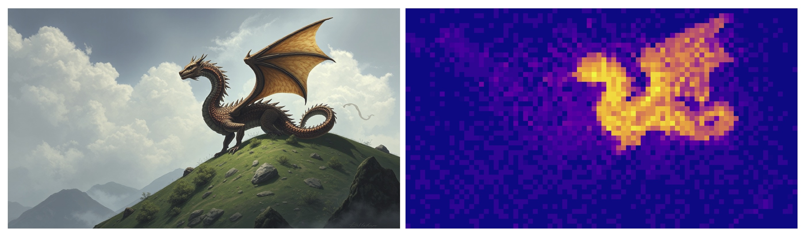

This command will generate:
- The main image based on your prompt
- A concept attention heatmap showing where the model focused on the "dragon" concept
- Both images are automatically saved with appropriate naming

#### Image-guided Concept Analysis

This approach uses a reference image to guide the concept attention analysis. The model analyzes how a concept appears in the reference image and applies similar attention patterns to generate a new image that maintains those conceptual relationships.

##### Example

```bash
mflux-concept-from-image \
  --model schnell \
  --input-image-path "puffin.png" \
  --prompt "Two puffins are perched on a grassy, flower-covered cliffside, with one appearing to call out while the other looks on silently against a blurred ocean backdrop" \
  --concept "bird" \
  --steps 4 \
  --height 720 \
  --width 1280 \
  --seed 4529717 \
  --heatmap-layer-indices 15 16 17 18 \
  --heatmap-timesteps 0 1 2 3 \
  -q 4
```

This will generate the following image

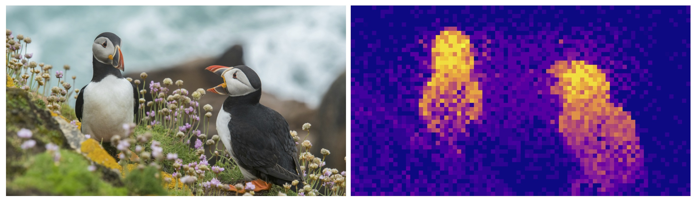

#### Advanced Configuration

- **`--heatmap-layer-indices`**: Controls which transformer layers to analyze (default: 15-18). Different layers capture different levels of abstraction

- **`--heatmap-timesteps`**: Specifies which denoising steps to include in the analysis (default: all steps). Lower timestep values focus on early generation stages where broad composition is determined.

---
