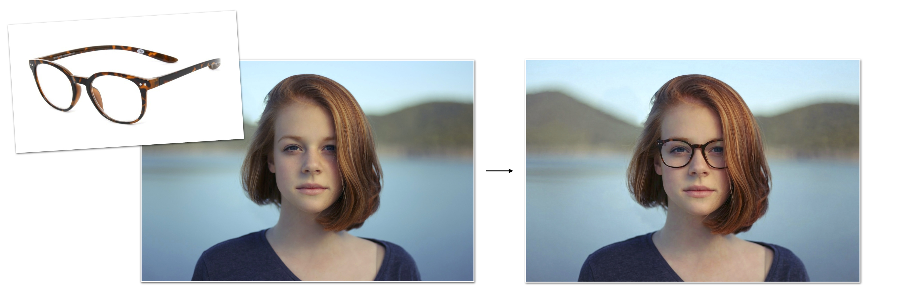

# FLUX.2
This directory contains MFLUX's MLX implementation of **FLUX.2**.

MFLUX supports [FLUX.2-klein-4B](https://huggingface.co/black-forest-labs/FLUX.2-klein-4B) and [FLUX.2-klein-9B](https://huggingface.co/black-forest-labs/FLUX.2-klein-9B) from Black Forest Labs, released in January 2026. FLUX.2 Klein is a fast, efficient image generation model available in 4B and 9B parameter variants. The 4B model delivers high-quality images in just 4 steps, making it one of the fastest open-source models available.

All the standard modes such as img2img, LoRA and quantizations are supported for this model. FLUX.2 also supports image-conditioned editing with multi-image support.


## Example
The following uses the 9B model to generate a photorealistic hummingbird image:

```sh
mflux-generate-flux2 \
  --model flux2-klein-9b \
  --prompt "Photorealistic close-up of a hummingbird hovering near red flowers, frozen wings, detailed feathers, soft green background bokeh, high shutter speed look." \
  --steps 4 \
  --seed 640563507 \
  --width 1024 \
  --height 560
```

<details>
<summary>Python API</summary>

```python
from mflux.models.common.config import ModelConfig
from mflux.models.flux2.variants import Flux2Klein

model = Flux2Klein(model_config=ModelConfig.flux2_klein_9b())
image = model.generate_image(
    seed=640563507,
    prompt="Photorealistic close-up of a hummingbird hovering near red flowers, frozen wings, detailed feathers, soft green background bokeh, high shutter speed look.",
    num_inference_steps=4,
    width=1024,
    height=560,
)
image.save("hummingbird.png")
```
</details>

## Image-conditioned editing
FLUX.2 supports image-conditioned editing with one or more reference images:



*Example image from [Unsplash](https://unsplash.com/photos/shallow-focus-photography-of-woman-outdoor-during-day-rDEOVtE7vOs)*

```sh
mflux-generate-flux2-edit \
  --model flux2-klein-9b \
  --image-paths person.jpg glasses.jpg \
  --prompt "Make the woman wear the eyeglasses (regular glasses, not sunglasses)" \
  --steps 4 \
  --seed 42
```

<details>
<summary>Python API</summary>

```python
from mflux.models.common.config import ModelConfig
from mflux.models.flux2.variants import Flux2KleinEdit

model = Flux2KleinEdit(model_config=ModelConfig.flux2_klein_9b())
image = model.generate_image(
    seed=42,
    prompt="Make the woman wear the eyeglasses (regular glasses, not sunglasses)",
    image_paths=["person.jpg", "glasses.jpg"],
    num_inference_steps=4,
)
image.save("flux2_edit.png")
```
</details>

> [!WARNING]
> Note: FLUX.2-klein-4B requires downloading the `black-forest-labs/FLUX.2-klein-4B` model weights (~15GB), and FLUX.2-klein-9B requires `black-forest-labs/FLUX.2-klein-9B` model weights (~32GB), or use quantization for smaller sizes.

## Notes
- FLUX.2 does not support `--negative-prompt` or CFG-style guidance. Use `--guidance 1.0`.
- Supported variants: `flux2-klein-4b` (default) and `flux2-klein-9b`.
