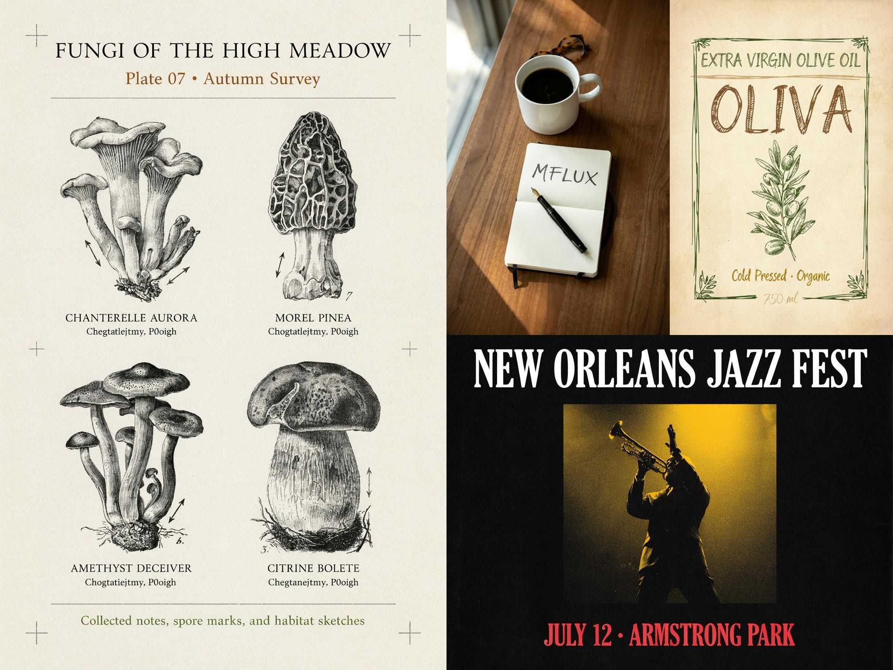

# Ideogram 4

This directory contains MFLUX's MLX implementation of **Ideogram 4 FP8**.

MFLUX supports [ideogram-ai/ideogram-4-fp8](https://huggingface.co/ideogram-ai/ideogram-4-fp8), a typography-focused text-to-image model distributed in an FP8 weight layout. The checkpoint expects structured **JSON captions** for best results; plain text prompts are accepted but often underperform.

**Supported in mflux:** text-to-image generation, JSON-caption validation, sampler presets, quantization via `mflux-save`, LoRA loading via `--lora-paths` (community formats; not yet validated against published Ideogram LoRAs), and shared CLI callbacks (stepwise previews, memory saver).

**Not supported yet:** image-to-image, training, Ideogram's hosted [Magic Prompt](https://github.com/ideogram-oss/ideogram-4/blob/main/docs/prompting.md#magic-prompt) API, and non-FP8 checkpoint layouts.



The collage above uses JSON captions for four themes: **natural-history poster**, **lifestyle photography**, **hand-sketched product label**, and **typographic event poster**. Ideogram 4 is strongest with structured captions like these rather than plain prompts.

For the caption schema, key-order rules, bounding-box layout, and color palette conditioning, see Ideogram's official [prompting guide](https://github.com/ideogram-oss/ideogram-4/blob/main/docs/prompting.md) and [Ideogram 4.0 technical blog](https://ideogram.ai/blog/ideogram-4.0/) (gallery images include full JSON prompts). To expand plain text into JSON captions, Ideogram provides [Magic Prompt](https://github.com/ideogram-oss/ideogram-4/blob/main/docs/prompting.md#magic-prompt); mflux does not call the hosted API; use `--prompt-file` or write JSON captions yourself.

<details>
<summary>Showcase JSON captions</summary>

Captions for the panels in `ideogram4_example.jpg`:

#### Fungi — natural-history poster (1024×1536, `V4_DEFAULT_20`)

```json
{
  "high_level_description": "A premium vertical natural-history field-guide poster with four mushroom specimens in a 2x2 botanical plate, letterpress feel, and serif typography on warm ivory paper.",
  "compositional_deconstruction": {
    "background": "Warm ivory paper with letterpress texture, registration marks, and margin ticks.",
    "elements": [
      {
        "type": "text",
        "bbox": [42, 120, 98, 880],
        "text": "FUNGI OF THE HIGH MEADOW",
        "desc": "Large serif title in graphite black."
      },
      {
        "type": "text",
        "bbox": [102, 280, 132, 720],
        "text": "Plate 07 • Autumn Survey",
        "desc": "Serif subtitle in chestnut."
      },
      {
        "type": "obj",
        "bbox": [150, 100, 850, 860],
        "desc": "Symmetrical 2x2 botanical plate of four detailed ink mushrooms with specimen arrows: ochre chanterelle top-left, chestnut morel top-right, violet deceiver bottom-left, citrine bolete bottom-right."
      },
      {
        "type": "text",
        "bbox": [460, 140, 490, 440],
        "text": "CHANTERELLE AURORA",
        "desc": "Small caps label."
      },
      {
        "type": "text",
        "bbox": [460, 560, 490, 860],
        "text": "MOREL PINEA",
        "desc": "Small caps label."
      },
      {
        "type": "text",
        "bbox": [830, 140, 860, 500],
        "text": "AMETHYST DECEIVER",
        "desc": "Small caps label."
      },
      {
        "type": "text",
        "bbox": [830, 560, 860, 860],
        "text": "CITRINE BOLETE",
        "desc": "Small caps label."
      },
      {
        "type": "text",
        "bbox": [900, 180, 940, 820],
        "text": "Collected notes, spore marks, and habitat sketches",
        "desc": "Bottom caption in moss green."
      }
    ]
  }
}
```

#### Morning desk — lifestyle photo (512×768, `V4_DEFAULT_20`, seed 42)

```json
{
  "high_level_description": "A lifestyle flat lay photograph of a morning desk setup with coffee, a notebook with MFLUX written on the page, and a fountain pen on walnut wood with soft window light from the left.",
  "compositional_deconstruction": {
    "background": "Walnut wood desk surface filling the tall frame beneath the objects, with soft morning window light entering from the left and gentle shadows across the grain.",
    "elements": [
      {
        "type": "obj",
        "bbox": [160, 300, 400, 700],
        "desc": "White ceramic coffee mug filled with black coffee, handle on the right, sitting upright near the upper center of the desk."
      },
      {
        "type": "obj",
        "bbox": [100, 360, 260, 640],
        "desc": "Round tortoiseshell reading glasses folded closed, lying beside the coffee mug."
      },
      {
        "type": "obj",
        "bbox": [420, 260, 860, 740],
        "desc": "Open cream-page notebook with a black elastic band, lying flat in the lower half of the frame."
      },
      {
        "type": "text",
        "bbox": [480, 380, 560, 680],
        "text": "MFLUX",
        "desc": "MFLUX written in dark fountain-pen ink on the open notebook page in clean uppercase letters."
      },
      {
        "type": "obj",
        "bbox": [560, 380, 760, 620],
        "desc": "Black lacquer fountain pen with a gold nib, resting diagonally across the open notebook beside the writing."
      }
    ]
  }
}
```

#### Oliva — hand-sketched label (512×768, `V4_DEFAULT_20`, seed 101)

```json
{
  "high_level_description": "A cozy hand-sketched extra virgin olive oil label drawn entirely in colored ink on warm aged parchment, with loose pen lettering, a botanical olive branch illustration, and a rich Mediterranean farmhouse feel.",
  "style_description": {
    "aesthetics": "rich, flavorful, cozy, artisanal, hand-drawn throughout",
    "lighting": "soft warm ambient light on aged paper",
    "medium": "graphic_design",
    "art_style": "colored ink sketch on aged paper, fine cross-hatching, loose pen strokes, light watercolor wash accents, no printed typography",
    "color_palette": ["#F3E9D2", "#5A6B3A", "#8B5E3C", "#C4A574", "#3E3228"]
  },
  "compositional_deconstruction": {
    "background": "Warm cream aged parchment filling the tall narrow frame with soft deckle edges and gentle foxing — one unified paper surface, no panels, stripes, or section dividers.",
    "elements": [
      {
        "type": "obj",
        "bbox": [110, 100, 890, 900],
        "desc": "A loose hand-sketched rectangular frame in olive-green ink with wobbly pen strokes and small sketched olive leaves at the corners, filling the tall label area."
      },
      {
        "type": "text",
        "bbox": [150, 140, 210, 860],
        "text": "EXTRA VIRGIN OLIVE OIL",
        "desc": "Hand-sketched uppercase lettering in muted olive-green ink, arced gently across the top of the label."
      },
      {
        "type": "text",
        "bbox": [250, 180, 400, 820],
        "text": "OLIVA",
        "desc": "Large hand-drawn wordmark in warm sepia-brown ink with cross-hatched shading inside the letterforms, sketched not printed."
      },
      {
        "type": "obj",
        "bbox": [420, 140, 780, 860],
        "desc": "Hand-sketched olive branch with leaves and ripe olives in olive-green and sepia ink cross-hatching, vertical botanical illustration as the central focal point."
      },
      {
        "type": "text",
        "bbox": [800, 280, 850, 720],
        "text": "Cold Pressed · Organic",
        "desc": "Small hand-sketched lettering in golden-ochre ink beneath the branch."
      },
      {
        "type": "text",
        "bbox": [870, 420, 920, 580],
        "text": "750 ml",
        "desc": "Tiny hand-sketched volume note in sepia ink near the bottom."
      }
    ]
  }
}
```

#### Jazz fest — event poster (1024×768, `V4_TURBO_12`, seed 202)

Adapted from the [Ideogram 4.0 prompt guide](https://www.imagine.art/blogs/ideogram-4-0-prompt-guide).

```json
{
  "high_level_description": "A bold typographic event poster for a New Orleans jazz festival featuring a trumpet player silhouette.",
  "style_description": {
    "aesthetics": "dramatic, high contrast, vintage",
    "lighting": "strong stage spotlight from above, deep surrounding shadows",
    "medium": "graphic_design",
    "art_style": "screenprint aesthetic, limited color palette, bold geometric shapes",
    "color_palette": ["#0A0A0A", "#F5C518", "#E63946", "#FFFFFF"]
  },
  "compositional_deconstruction": {
    "background": "Near-black background with subtle aged paper texture.",
    "elements": [
      {
        "type": "obj",
        "bbox": [200, 300, 850, 700],
        "desc": "A silhouette of a trumpet player mid-performance, arm raised, dramatic pose, rendered in deep gold against the dark background."
      },
      {
        "type": "text",
        "bbox": [30, 100, 180, 900],
        "text": "NEW ORLEANS JAZZ FEST",
        "desc": "Bold uppercase serif headline in bright white spanning the top of the poster."
      },
      {
        "type": "text",
        "bbox": [870, 200, 960, 800],
        "text": "JULY 12 · ARMSTRONG PARK",
        "desc": "Smaller red sans-serif text at the bottom with the date and venue."
      }
    ]
  }
}
```

</details>

## Example

The following uses the default `V4_DEFAULT_20` preset (20 steps with a guidance schedule):

```sh
mflux-generate-ideogram4 \
  --prompt-file teapot-caption.json \
  --width 1024 \
  --height 1024 \
  --seed 42 \
  --preset V4_DEFAULT_20
```

Example caption file:

```json
{
  "high_level_description": "A white ceramic teapot on a simple studio table.",
  "style_description": {
    "aesthetics": "clean, calm, minimal",
    "lighting": "soft diffuse studio lighting",
    "photo": "eye-level, 50mm lens, shallow depth of field",
    "medium": "photograph",
    "color_palette": ["#FFFFFF", "#E5E0D8", "#2E2E2E"]
  },
  "compositional_deconstruction": {
    "background": "A neutral studio tabletop with a pale wall behind it.",
    "elements": [
      {
        "type": "obj",
        "bbox": [250, 320, 780, 690],
        "desc": "A glossy white ceramic teapot with a curved handle and short spout."
      }
    ]
  }
}
```

## Presets

| Preset | Steps | Notes |
|--------|------:|-------|
| `V4_DEFAULT_20` | 20 | Default; balanced quality and speed |
| `V4_QUALITY_48` | 48 | Higher quality, slower |
| `V4_TURBO_12` | 12 | Faster, slightly different schedule |

Each preset sets the step count, per-step guidance schedule, and noise schedule. Shared `--steps` and `--guidance` flags are ignored on this CLI.

<details>
<summary>Python API</summary>

```python
from mflux.models.common.config import ModelConfig
from mflux.models.ideogram4 import Ideogram4

model = Ideogram4(model_config=ModelConfig.ideogram4_fp8())
image = model.generate_image(
    prompt={
        "high_level_description": "A white ceramic teapot on a simple studio table.",
        "style_description": {
            "aesthetics": "clean, calm, minimal",
            "lighting": "soft diffuse studio lighting",
            "photo": "eye-level, 50mm lens, shallow depth of field",
            "medium": "photograph",
        },
        "compositional_deconstruction": {
            "background": "A neutral studio tabletop with a pale wall behind it.",
            "elements": [
                {
                    "type": "obj",
                    "bbox": [250, 320, 780, 690],
                    "desc": "A glossy white ceramic teapot with a curved handle and short spout.",
                }
            ],
        },
    },
    seed=42,
    width=1024,
    height=1024,
    preset="V4_DEFAULT_20",
)
image.save("ideogram4.png")
```
</details>

> [!WARNING]
> Ideogram 4 requires downloading gated model weights from Hugging Face (~28 GB on disk for the FP8 checkpoint). Access must be approved on the model card before the first download.

## Notes

- Width and height must be in `[256, 2048]` and multiples of 16.
- JSON captions are compacted with `ensure_ascii=False` before tokenization. Validation follows the schema described in Ideogram's [prompting guide](https://github.com/ideogram-oss/ideogram-4/blob/main/docs/prompting.md).
- Caption validation warns for plain prompts, malformed JSON, schema issues, key-order problems, invalid bounding boxes, and non-uppercase hex colors. Use `--strict-caption-validation` to fail on warnings.
- Plain text prompts still run, but they can reduce quality and increase safety-filter false positives.
- The VAE is shared with FLUX.2 Klein; the FP8 linear stack, Qwen3-VL text encoder, and dual transformers live under `models/ideogram4/` (not shared with FLUX.2 yet).
