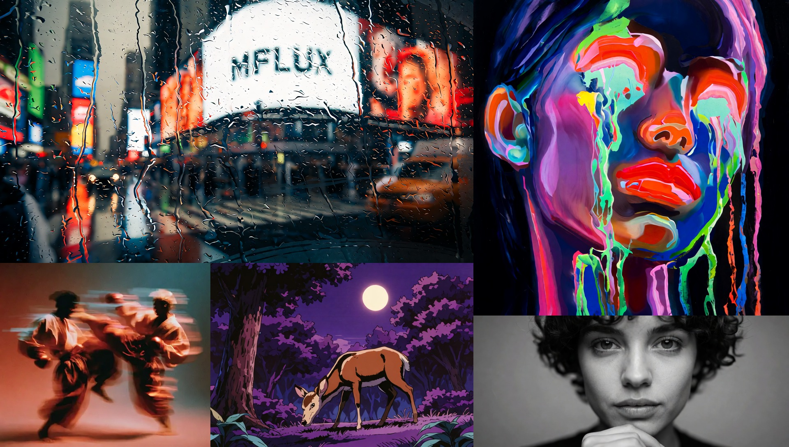

# Krea 2

This directory contains MFLUX's MLX implementation of **Krea 2 Turbo**
([`krea/Krea-2-Turbo`](https://huggingface.co/krea/Krea-2-Turbo)).

MFLUX supports [Krea 2 Turbo](https://huggingface.co/krea/Krea-2-Turbo) from Krea.ai — an
open-weights single-stream MMDiT built on the Qwen-Image stack (Qwen3-VL-4B text encoder,
Qwen-Image VAE). Turbo is a timestep-distilled 8-step checkpoint; see the
[Krea 2 technical report](https://www.krea.ai/blog/krea-2-technical-report) for details.

All the standard modes such as img2img, LoRA and quantizations are supported for this model.



*Showcase collage: official style LoRAs from the
[Krea 2 LoRAs collection](https://huggingface.co/collections/krea/krea-2-loras)
(rainy window, neon drip, sunset blur, retro anime) plus a plain Turbo portrait — seed 42,
8 steps, q8.*

## Example

The following generates a photorealistic fox image with Turbo defaults (8 steps,
guidance 1.0, `er_sde` sampler):

```sh
mflux-generate-krea2 \
  --prompt "a photograph of a red fox sitting in a sunlit forest clearing, sharp focus, bokeh" \
  --width 1024 \
  --height 1024 \
  --seed 42 \
  --steps 8 \
  -q 8
```

Weights download automatically from [`krea/Krea-2-Turbo`](https://huggingface.co/krea/Krea-2-Turbo)
on first run (accept the model's terms and set a Hugging Face token if prompted).
No `--model` is needed; pass `--model /path/to/local/dir` only to use a local copy.

<details>
<summary>Python API</summary>

```python
from mflux.models.common.config import ModelConfig
from mflux.models.krea2 import Krea2

model = Krea2(
    model_config=ModelConfig.krea2(),
    quantize=8,
)
image = model.generate_image(
    seed=42,
    prompt="a photograph of a red fox sitting in a sunlit forest clearing, sharp focus, bokeh",
    num_inference_steps=8,
    width=1024,
    height=1024,
    guidance=1.0,
)
image.save("krea2_fox.png")
```
</details>

## Image-to-image

Strength-based img2img via `--image` (or `--image-path` / `--image-strength`). The
init image is VAE-encoded, noised to the requested strength, then denoised with
your prompt. This differs from Krea's hosted **style-reference** path, which
feeds reference images through the Qwen3-VL vision tower.

```sh
mflux-generate-krea2 \
  --image path/to/photo.jpg 0.65 \
  --prompt "a pair of futuristic chrome sunglasses on a marble pedestal" \
  --steps 8 \
  --scheduler euler \
  -q 8
```

When `--image` is set, omitted `--width` / `--height` default to the source image
size (rounded to multiples of 16).

## LoRA

Krea 2 supports community LoRAs via `--lora-paths`. Train on
[`krea/Krea-2-Raw`](https://huggingface.co/krea/Krea-2-Raw), run on Turbo (Krea's
recommended workflow). Krea publishes nine official style adapters in the
[Krea 2 LoRAs collection](https://huggingface.co/collections/krea/krea-2-loras)
(`krea/Krea-2-LoRA-*`). Paths can be local files, Hugging Face repos, or
`org/repo:filename.safetensors` when a repo ships multiple adapters.

```sh
mflux-generate-krea2 \
  --prompt "A close-up portrait of a woman, glowing neon highlights and vivid paint dripping down her face. Textured abstract style" \
  --lora-paths krea/Krea-2-LoRA-neondrip \
  --lora-scales 1.0 \
  --steps 8 \
  -q 8
```

Supported export formats include official Krea (`transformer.*`), diffusers/PEFT
(`base_model.model.*`), Comfy (`diffusion_model.*`), and flat `lora_unet_*` keys.

> [!WARNING]
> Note: Krea 2 Turbo requires downloading model weights (~24 GB for `turbo.safetensors`
> plus text encoder and VAE, ~33 GB total on first run). Use `-q 8` at inference or save
> a quantized copy with `mflux-save`; see [quantization docs](../common/README.md#quantization).

## Training

Train a LoRA on **Krea 2 Raw** ([`krea/Krea-2-Raw`](https://huggingface.co/krea/Krea-2-Raw)),
the base checkpoint Krea recommends for finetuning, then run the trained adapter on Turbo. Pass a
config to `mflux-train`; for the images/captions folder layout see the common
[training docs](../common/README.md#training-lora).

```sh
mflux-train --config /path/to/train.json
```

A minimal config (QLoRA over the q8 base, attention + MLP on all 28 blocks):

```json
{
  "model": "krea-2-raw",
  "data": "/path/to/images",
  "seed": 42,
  "steps": 20,
  "guidance": 0.0,
  "quantize": 8,
  "max_resolution": 512,
  "training_loop": { "num_epochs": 16, "batch_size": 1 },
  "optimizer": { "name": "AdamW", "learning_rate": 2e-4 },
  "checkpoint": { "output_path": "output", "save_frequency": 96 },
  "lora_layers": { "targets": [
    { "module_path": "transformer_blocks.{block}.attn.to_q",     "blocks": { "start": 0, "end": 28 }, "rank": 16 },
    { "module_path": "transformer_blocks.{block}.attn.to_k",     "blocks": { "start": 0, "end": 28 }, "rank": 16 },
    { "module_path": "transformer_blocks.{block}.attn.to_v",     "blocks": { "start": 0, "end": 28 }, "rank": 16 },
    { "module_path": "transformer_blocks.{block}.attn.to_out.0", "blocks": { "start": 0, "end": 28 }, "rank": 16 },
    { "module_path": "transformer_blocks.{block}.ff.gate",       "blocks": { "start": 0, "end": 28 }, "rank": 16 },
    { "module_path": "transformer_blocks.{block}.ff.up",         "blocks": { "start": 0, "end": 28 }, "rank": 16 },
    { "module_path": "transformer_blocks.{block}.ff.down",       "blocks": { "start": 0, "end": 28 }, "rank": 16 }
  ] }
}
```

Captions come from a sibling `.txt` per image (plain text, or an Ideogram-style JSON object whose
`high_level_description` is used). The base is quantized and only the LoRA trains over it (QLoRA),
with gradient checkpointing across the 28 blocks to keep memory in range. The trained adapter
loads on Turbo with `--lora-paths` (see [LoRA](#lora) above), Krea's recommended workflow.
