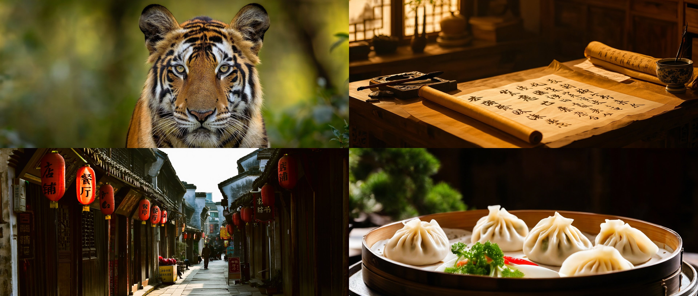
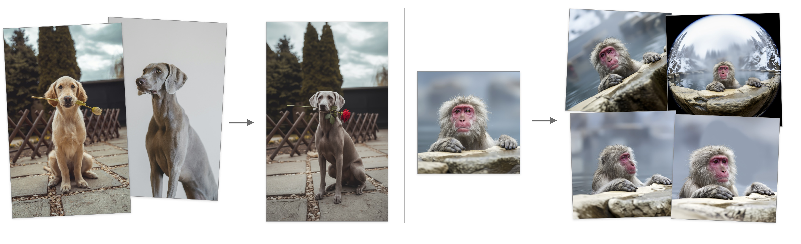

# Qwen Image
This directory contains MFLUX’s MLX implementation of the **Qwen Image** family, including both **text-to-image generation** and **natural language image editing**.

## Qwen Image (text-to-image)
**Qwen Image** is a 20B parameter text-to-image model ([technical report](https://arxiv.org/abs/2508.02324)). It uses a vision-language architecture with a 7B text encoder (Qwen2.5-VL) to understand and generate images from natural language descriptions.

The Qwen Image model has its own dedicated command `mflux-generate-qwen`. Qwen Image excels at multilingual prompts, including Chinese characters, and can render Chinese text as part of the image content (like signs, menus, and calligraphy).



### Example: Wildlife Portrait

```sh
mflux-generate-qwen \
  --prompt "Close-up portrait of a majestic tiger in its natural habitat, detailed fur texture, piercing eyes, natural forest background, soft natural lighting, wildlife photography, photorealistic, high detail, professional wildlife shot" \
  --negative-prompt "blurry, low quality, distorted, deformed, ugly, bad anatomy, bad proportions, extra limbs, duplicate, watermark, signature, text, letters, cartoon, anime, painting, drawing, illustration, 3d render, cgi, zoo, cage, artificial" \
  --width 1920 \
  --height 816 \
  --steps 30 \
  --seed 42 \
  -q 8
```

<details>
<summary><strong>Click to expand additional example commands</strong></summary>

**Chinese Calligraphy:**

```sh
mflux-generate-qwen \
  --prompt "Traditional Chinese calligraphy studio, ancient scrolls with beautiful Chinese characters, ink brushes, inkstone, traditional paper, warm natural lighting, peaceful atmosphere, photorealistic, high detail, cultural heritage" \
  --negative-prompt "blurry, low quality, distorted, deformed, ugly, bad anatomy, bad proportions, extra limbs, duplicate, watermark, signature, text, letters, cartoon, anime, painting, drawing, illustration, 3d render, cgi, modern, digital" \
  --width 1920 \
  --height 816 \
  --steps 30 \
  --seed 42 \
  -q 8
```

**Chinese Street Signs:**

```sh
mflux-generate-qwen \
  --prompt "Traditional Chinese street scene, old neighborhood with shop signs displaying Chinese characters (店铺, 餐厅, 书店), red lanterns, narrow alleys, traditional architecture, bustling street life, natural lighting, photorealistic, high detail, street photography" \
  --negative-prompt "blurry, low quality, distorted, deformed, ugly, bad anatomy, bad proportions, extra limbs, duplicate, watermark, signature, cartoon, anime, painting, drawing, illustration, 3d render, cgi, modern signs, English text only" \
  --width 1920 \
  --height 816 \
  --steps 30 \
  --seed 42 \
  -q 8
```

**Food Photography:**

```sh
mflux-generate-qwen \
  --prompt "Professional food photography, gourmet Chinese cuisine, steamed dumplings, colorful vegetables, traditional table setting, restaurant lighting, shallow depth of field, photorealistic, high detail, magazine quality" \
  --negative-prompt "blurry, low quality, distorted, deformed, ugly, bad anatomy, bad proportions, extra limbs, duplicate, watermark, signature, text, letters, cartoon, anime, painting, drawing, illustration, 3d render, cgi, fast food, unappetizing" \
  --width 1920 \
  --height 816 \
  --steps 30 \
  --seed 42 \
  -q 8
```

</details>

> [!WARNING]
> Note: The Qwen Image model requires downloading the `Qwen/Qwen-Image` model weights (~58GB for the full model, or use quantization for smaller sizes).

## Qwen Image Edit (natural language image editing)
**Qwen Image Edit** enables precise natural language image editing, allowing you to modify images using text instructions while maintaining their original structure and context. The model uses a vision-language encoder to understand both the input image and your editing instructions.

Qwen Image Edit supports natural language editing with descriptive text instructions, maintains original poses and body positions when requested, supports multiple images for complex compositions, and works seamlessly with LoRA adapters for specialized transformations like camera angles and styles. The model uses `Qwen/Qwen-Image-Edit-2509`.


*Examples showing dog replacement with two-image input and monkey camera angle transformations with LoRAs. Source images: [Golden Retriever](https://images.unsplash.com/photo-1552053831-71594a27632d), [Grey Dog](https://images.unsplash.com/photo-1566710582818-d673dc761201), and [Monkey](https://images.unsplash.com/photo-1578948610588-ffe24448f5ed).*

### Example 1: Two-Image Transformation (Dog Replacement)

```sh
mflux-generate-qwen-edit \
  --image-paths "dog1.png" "dog2.png" \
  --prompt "Replace the golden retriever (standing outside, holding white rose) in Image 1 with the grey dog from Image 2 (which is standing inside in a studio). The grey dog should hold a red rose in its mouth and stand outside in the same position as the golden retriever. Maintain the outside environment, background, lighting, and all surroundings completely unchanged." \
  --steps 30 \
  --guidance 2.5 \
  --width 624 \
  --height 1024
```

### Example 2: Single Image with LoRAs (Camera Angle Transformations)

```sh
mflux-generate-qwen-edit \
  --image-paths "monkey.png" \
  --prompt "将镜头极度拉近，使用超长焦镜头进行极端特写拍摄，主体占据画面的大部分空间，背景完全虚化，营造出强烈的视觉冲击力和亲密感。Extreme zoom in with a super telephoto lens, creating an intense close-up where the subject dominates most of the frame, with the background completely blurred, creating a strong visual impact and sense of intimacy." \
  --steps 8 \
  --guidance 2.5 \
  --width 1024 \
  --height 1024 \
  --lora-paths "lightx2v/Qwen-Image-Lightning" "dx8152/Qwen-Edit-2509-Multiple-angles" \
  --lora-scales 0.5 1.0
```

*Uses [Qwen Image Lightning LoRA](https://huggingface.co/lightx2v/Qwen-Image-Lightning) for fast generation and [Camera Angle LoRA](https://huggingface.co/dx8152/Qwen-Edit-2509-Multiple-angles) for precise camera control.*

### Tips for Qwen Image Edit
1. **Detailed Prompts**: The model works best with detailed, specific editing instructions
2. **Pose Maintenance**: Explicitly mention maintaining poses, body positions, or overall stance when you want to preserve the original structure
3. **Single Focus**: Focus on one or a few related edits at a time for more predictable results
4. **LoRA Combinations**: Combine multiple LoRAs for complex effects (e.g., fast generation + camera control)
5. **Quantization**: 6-bit or below can degrade the image a lot more compared to Flux, use with caution
6. **Seed Variation**: Qwen models typically do not vary much with seed changes. If you want more variation, vary the prompt instead
7. **Image Quality**: Qwen images come out quite soft compared to Flux models

> [!WARNING]
> Note: The Qwen Image Edit model requires downloading the `Qwen/Qwen-Image-Edit-2509` model weights (~58GB for the full model, or use quantization for smaller sizes).

