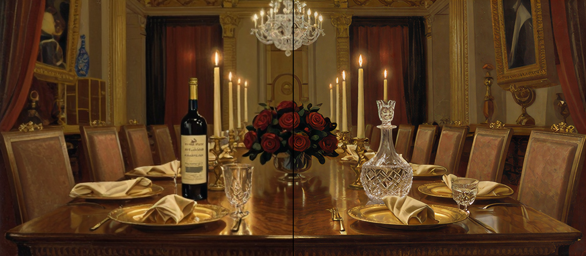

# SeedVR2
This directory contains MFLUX’s MLX implementation of the **SeedVR2** upscaler.

SeedVR2 (3B) is a dedicated diffusion-based super-resolution model based on https://github.com/numz/ComfyUI-SeedVR2_VideoUpscaler. It is designed to be fast (often 1-step) and highly faithful to the original image. Unlike the ControlNet-based upscaler, it does not require a text prompt.

SeedVR2 is more recent and the preferred method for high-fidelity upscaling and is much faster than the controlnet-based upscaler.



## Upscale

```sh
mflux-upscale-seedvr2 \
  --image-path "input.png" \
  --resolution 2160 \
  --softness 0.5
```

This will upscale the image such that the shortest side is 2160 pixels while maintaining the aspect ratio.

Instead of specifying a target resolution, you can also use `--resolution 2x` or `--resolution 3x` to upscale by a factor of 2 or 3 respectively.

You can also adjust the `--softness` parameter (0.0 to 1.0) to control input pre-downsampling, which can help achieve smoother upscaling results. A value of 0.0 (default) disables pre-downsampling, while higher values up to 1.0 increase the downsampling factor (up to 8x internally) before upscaling. A value of `0.5` is often a good starting point.

<details>
<summary>🛠️ <strong>Example: Generating and Upscaling with Z-Image Turbo</strong></summary>

The comparison image above was produced by first generating a base image using **Z-Image Turbo** and then upscaling it using **SeedVR2**.

**1. Generate the base image**

```sh
mflux-generate-z-image-turbo \
  --prompt "class1cpa1nt a prestigious candlelit banquet table in a high-ceilinged palace hall. The scene features a bottle of \"Z-Image Vintage Select\" beside a sparkling crystal decanter. The table is overflowing with luxury: golden plates, silk napkins, and a centerpiece of dark red roses. Fine details of the wood grain on the table and the reflection of a chandelier in the polished surfaces. The lighting is dramatic and warm, reminiscent of Rembrandt. Masterful oil painting with aged texture and crackle glaze." \
  -q 8 \
  --steps 9 \
  --width 768 \
  --height 336 \
  --seed 42 \
  --lora-paths renderartist/Classic-Painting-Z-Image-Turbo-LoRA \
  --lora-scales 0.5 \
  --output image.png
```

**2. Upscale 3x using SeedVR2**

```sh
mflux-upscale-seedvr2 \
  --image-path image.png \
  --resolution 3x \
  --softness 0.5
```

</details>

