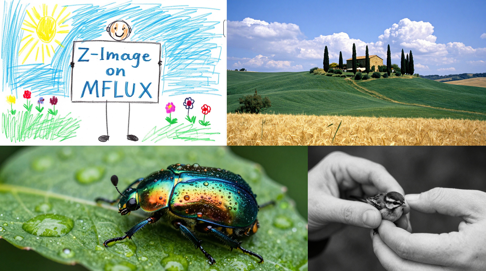

# Z-Image Turbo
This directory contains MFLUX’s MLX implementation of **Z-Image-Turbo**.

MFLUX supports [Z-Image-Turbo](https://huggingface.co/Tongyi-MAI/Z-Image-Turbo) from Tongyi Lab (Alibaba), released in November 2025. Z-Image is an efficient 6B-parameter image generation model with a single-stream DiT architecture. Z-Image-Turbo delivers high-quality images in just 9 steps, making it one of the fastest open-source models available.

All the standard modes such as img2img, LoRA and quantizations are supported for this model. See the [technical paper](https://arxiv.org/abs/2511.22699) for more details.



## Example
The following uses the pre-quantized 4-bit model from [filipstrand/Z-Image-Turbo-mflux-4bit](https://huggingface.co/filipstrand/Z-Image-Turbo-mflux-4bit) to generate a vibrant 1960s style image with a LoRA adapter [Technically Color](https://huggingface.co/renderartist/Technically-Color-Z-Image-Turbo) for enhanced film color:

```sh
mflux-generate-z-image-turbo \
  --model filipstrand/Z-Image-Turbo-mflux-4bit \
  --prompt "t3chnic4lly vibrant 1960s close-up of a woman sitting under a tree in a blue skirt and white blouse, she has blonde wavy short hair and a smile with green eyes lake scene by a garden with flowers in the foreground 1960s style film She's holding her hand out there is a small smooth frog in her palm, she's making eye contact with the toad." \
  --width 1280 \
  --height 720 \
  --seed 456 \
  --steps 9 \
  --lora-paths renderartist/Technically-Color-Z-Image-Turbo \
  --lora-scales 0.5
```

> [!WARNING]
> Note: Z-Image-Turbo requires downloading the `Tongyi-MAI/Z-Image-Turbo` model weights (~31GB), or use quantization for smaller sizes.

*Dreambooth fine-tuning for Z-Image is not yet supported in MFLUX but is planned. In the meantime, you can train Z-Image-Turbo LoRAs using [AI Toolkit](https://github.com/ostris/ai-toolkit) - see [How to Train a Z-Image-Turbo LoRA with AI Toolkit](https://www.youtube.com/watch?v=Kmve1_jiDpQ) by Ostris AI.*

*For a Swift MLX implementation of Z-Image, see [zimage.swift](https://github.com/mzbac/zimage.swift) by [@mzbac](https://github.com/mzbac).*

